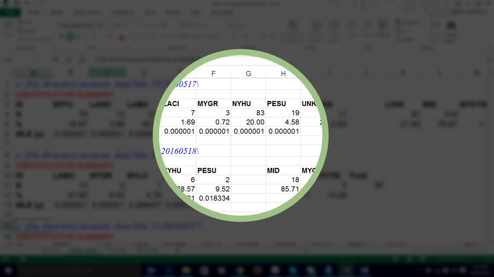

# Mystery Data

# Premise

When working with data, you'll commonly have to sift through stuff that you just don't understand. There will be columns that don't make any sense, rows that lack context, missing values... the list goes on.

The image above – stylized from a screenshot of a garbled Excel spreadsheet – is sourced from a 2016 [StackOverflow](https://en.wikipedia.org/wiki/Stack_Overflow) post, titled [*Proprietary software produces ugly excel tables...can I get them into R?*](https://stackoverflow.com/questions/39213554/proprietary-software-produces-ugly-excel-tables-can-i-get-them-into-r), facing exactly this issue.

Gesticulating wildly towards their bad data, the author asks:

> "How do I take dozens of files from excel, that look like this, and get the import to add the rows, so that every set of four rows spaced by 2 rows (i.e. rows 3-6, 9-12, 15-18, etc--it's the same spacing for every project) are imported until empty space is reached (it'll be a different number of repetitions for each project)?"

Colloquially, this process is known as [data wrangling](https://en.wikipedia.org/wiki/Data_wrangling). Notice that not only does the author need this data to look better *on principle*, but also that the solution needs to be *dynamic*; that is, it will need to fit the parameters of their specific project on a case-by-case basis.

When you encounter this kind of data – and it's not a question of *if*, but *when* – what will you do? What strategies will you use to make sense of it, tidy it, and eventually, map it?

# Activity (20 minutes)

Below, you'll find three mystery datasets. They're known only as A, B, and C.

Some of the datasets are clean, but in **unfamiliar formats**; some are in familiar formats, but have been **seriously gunked up**. Some of the data might appear in a format you don't recognize at all.

Using the "GIS friendly" principles that we discussed during lecture (the [slides are here](https://docs.google.com/presentation/d/1vhwdn8TYEQkoMMkbJwlRDE9f1fo2gRBQlPZQwoFXbdc/edit#slide=id.p)), break into groups of 2-4 and answer each of the following questions. You don't need to submit this, but someone will probably need to write stuff down in a Word or Google Doc.

1. Download the data:

   | :-----------: |
   | [![dataA]][a] |
   | [![dataB]][b] |
   | [![dataC]][c] |

2. **Open all the files and determine whether they are "GIS friendly"** (here are the data slides, for reference). If not, make a list of problems that you notice, then fix each one.

   I recommend using Microsoft Excel. I promise that the data can be wrangled using just two functions: `Find and replace` and `Text to columns`. Work together (and with the internet) to figure out how to locate and use these functions in Excel. I will be available to help.

   > **HINT:** if you aren't sure how to view one of the files, try opening the file in [Visual Studio Code](https://code.visualstudio.com/). It's a [text editor](https://en.wikipedia.org/wiki/Text_editor) that should be installed on all the Data Lab computers.

3. **What observations does this data contain?** Observations are rows (or in the case of `json` files, objects).
4. **What properties does the data encode in its observations?** Properties are columns (in the case of `json` files, they're usually listed as "properties").
5. **What kinds of properties (e.g., fields) are common across all the datasets?** Select some examples from each dataset. Why are these fields important? Beare in mind that the "common" fields might not have exactly the same field name in each dataset.
6. **Does the data contain information about where it came from?** Try to find information about the data's creation: things like author, date, and so on. As discussed in class, this "data about data" is simply called *metadata*. What metadata columns, if any, can you identify?
7. **Does the data contain geographic information?** If so, where is it, and which fields contain the information? Do you think it can be mapped? Why or why not?

Once you feel you have satisfactory answers to these questions for each dataset – or you have at least made an honest attempt at discovering them – try to figure out where each dataset originated. Feel free to try loading the data into ArcGIS Pro!

<!-------------------------------------[ Links ]
---------------------------------------->

[a]: https://github.com/itspangler/geospatial-humanities-s2024/raw/main/week/03_data/activity/data/a.xls
[b]: https://github.com/itspangler/geospatial-humanities-s2024/raw/main/week/03_data/activity/data/b.csv
[c]: https://github.com/itspangler/geospatial-humanities-s2024/raw/main/week/03_data/activity/data/c.json.zip

<!---------------------------------[ Buttons ]--------------------------------->

[dataa]: https://img.shields.io/badge/get_Data_A-red?style=for-the-badge
[datab]: https://img.shields.io/badge/get_Data_B-blue?style=for-the-badge
[datac]: https://img.shields.io/badge/get_Data_C-yellow?style=for-the-badge
