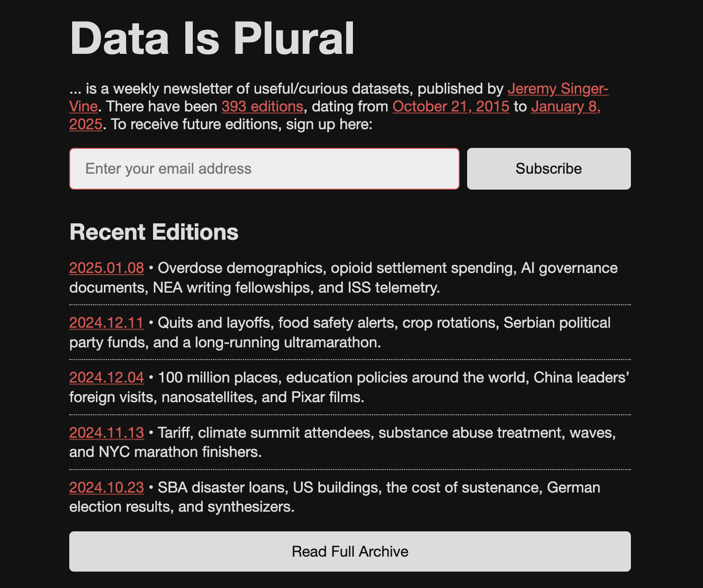

<script type="module" src="../../../assets/js/script.js"></script>

# Activity 01: Humanistic GIS and data in the humanities

##### *What do we mean, exactly, when we talk humanities "data?"*

<div class="intro">

[](https://repository.library.northeastern.edu/files/neu:bz60zj49g)


```js
import yaml from 'js-yaml';
const response = await FileAttachment("../../../data/activities.yaml").text()
const data = yaml.load(response)
const d=[data[0]]
view(Inputs.table(d, {width:{subtitle:200},disabled: "true",columns: ["subtitle","assigned","due"],header: {subtitle: "Activity",assigned: "Assigned",due: "Due"}}))
```

*In this activity, you'll engage with some ideas about what constitutes data in the humanities.*

By **Wednesday, February 2/5 at 11:59pm**, [submit to Canvas](#submit):
* answers to the questions outlined below, in `.doc` / `.docx`, `.odf`, or `.pdf` format

</div>

## Introduction & context

The "geospatial humanities" occupies a unique position in the humanities and digital humanities writ large. In this activity, you're asked to reflect on what constitutes humanistic "data" and sift through some examples of it.

What does it mean to use geographic information systems (or GIS) "humanistically?" Simply prefixing GIS with "humanistic" could imply that there are ways of doing GIS that are *not* humanistic, human, or humane. If that's the case, then we should be very careful and thoughtful about how to use GIS in a humanistic fashion—but what exactly does that entail?

## Humanistic GIS

For Bo Zhao, a professor of geography at the University of Washington and a [scholar of humanistic GIS](https://geography.washington.edu/research/publications/humanistic-gis), this process of doing GIS humanistically requires that we reckon with some pretty big questions: the essence of technology, the essence of place.

In his [article on the topic](http://doi.org/10.1080/24694452.2021.2004875), he draws on [phenomological philosophy](https://en.wikipedia.org/wiki/Phenomenology_(philosophy)) to argue that human perceptual experience is basically a process of emphasizing some things and de-emphasizing others. We experience the world through a complex process of filtering—a process that is informed by all sorts of factors; cultural, environmental, political, and more—and it's this fundamental *human experience* on which Zhao suggests we draw in order to engage in geospatial and geographical inquiry. He suggests abstracting GIS-mediated experiences into its three constitutive parts—human, GIS, and place. With this structure:

> ... a GIS is approached not in the conventional dualistic manner between human (subject) and place (object) but by the underlying mediating relations. This new structure of mediation embodies an organic whole rather than a simple combination of these three elements. In this sense, humanistic GIS adopts an organismic worldview that transcends the conventional mechanistic worldview. As an organic whole, GIS is not an entity or identity of its own. Rather, it is the product of how it is used and a mirror of its users; its functions can be revealed only when it is being used.

This is a really important point! Thinking about these things can completely structure how you approach GIS as a set of tools. For example:

1. Do you view GIS as a set of objective, scientific, explanatory tools for quantifying and analyzing human experiences?
2. Or do you view GIS as a set of subjective, place-based, context-dependent tools for explicating and enriching those relationships between people and places?

Practitioners of humanistic GIS would likely caution against #1 while encouraging towards #2—but regardless of where you fall on the spectrum of humanistic GIS, the way that you respond these two questions will invariably guide the kinds of maps you make and the nature of the arguments implicit to them.

## (Humanities) Data Is Plural

<figure>



</figure>

Since 2015, Jeremy Singer-Vine has published *[Data Is Plural](https://www.data-is-plural.com/)*, which he describes as "a weekly newsletter of useful/curious datasets." He has archived every newsletter, each of which which contains multiple datasets, for a total of 1,965 datasets so far—a number I can only tell you because he has published [a dataset about his dataset](https://docs.google.com/spreadsheets/d/1wZhPLMCHKJvwOkP4juclhjFgqIY8fQFMemwKL2c64vk/edit?gid=0#gid=0), which is to say, a metadata-set. Thanks, Jeremy!

To get started on this activity:

1. Head to the *[Data Is Plural](https://www.data-is-plural.com/)* website and poke around the archive
2. Identify <span class="key">three</span> datasets that strike you as not only interesting, but particularly relevant to the *geospatial humanities*. This means that you should choose datasets with 
3. For each dataset, answer the following questions:

   * **Temporal character.** When was the dataset published? What time frame does it represent, and how, if at all, is temporality encoded in the data?
   * **Spatial character.** What is the geographical extent of the dataset? Where do you see geographical information and how is that geographical information structured?
   * **Humanities character**. Where do you see "the humanities" in this dataset?
   * **Source**. How was the dataset derived? Who did the work of creating it?
   * **Trust**. Do you trust this dataset? Why or why not?
   * **Cartography**. Imagine that you were tasked with making a map from this dataset. What would your map look like? What questions would you want to ask and/or answer? (Feel free to mock up an illustration or two, but that's certainly not required.)

You should keep your answers for each of these to 2-3 sentences in length.

## Submit

By **Wednesday, February 2/5 at 11:59pm**, [submit to Canvas](#submit):
* answers to the questions outlined above, in `.doc` / `.docx`, `.odf`, or `.pdf` format

<a class="submit" href="https://canvas.tufts.edu/courses/63026/assignments/491655">Submit Activity 01</a>