```js
const images = document.querySelectorAll('figure img');
images.forEach(img => {
    img.style.cursor = 'pointer';
    img.addEventListener('click', () =>{
        window.open(img.src, '_blank');
    })
})

let count = 1;
const questions = document.querySelectorAll('.q');
questions.forEach(q => {
    const id = `q-${count}`;
    q.id = id;
    const header = document.createElement("h4");
    header.textContent = `QUESTION ${count}`;
    const link = document.createElement("a");
    link.href = `#${id}`;
    link.appendChild(header);
    q.insertBefore(link, q.firstChild);
    count++;
});
```

# Activity 01: Mapping ancient places

##### *Use a gazetteer of the ancient world to make sense of XY data and coordinate systems*

<figure>
    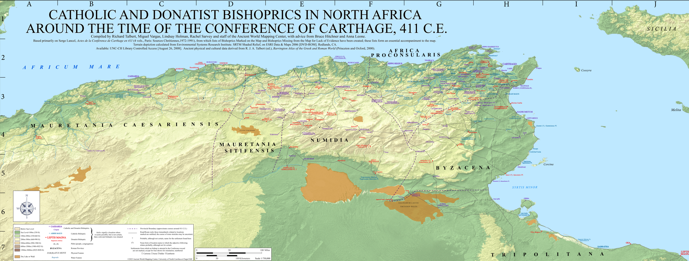
    <figcaption>

*A map of ancient places, created with help from [Pleiades](https://pleiades.stoa.org/)*.
    </figcaption>
</figure>

## Introduction

This activity will walk you through plotting XY data using the [Pleiades dataset](https://pleiades.stoa.org)—a [gazetteer](https://en.wikipedia.org/wiki/Gazetteer) of ancient place names—and then troubleshooting how that data translates into a variety of projected coordinate systems.

This activity will primarily focus on:
* formatting tabular data for GIS in Microsoft Excel
* displaying XY data
* basic attribute table queries
* geographic and projected coordinate systems

By class time on , you should have submitted a couple of screenshots from this activity to Canvas in `.docx` format (this counts towards participation).

## Setting up your workspace

Set up a workspace for this activity by using Windows File Explorer  to create a directory structure where you'll keep all your files.

Again, there are three places where you can save your work: your **H: Drive**, your **Box account**, or a **personal thumb drive**.

As discussed in class, we recommend using the **H: Drive**, but of course you can choose whichever you want. In any case, your directory structure should resemble the following:

    week02/
    ├─ activity_mapping-ancient-world/
        ├─ data/
        ├─ workspace/
        ├─ submission/

The `data` folder will contain all the data you need to download for this activity. The `workspace` folder is where you'll store your ArcGIS Pro project file, as well as the [geodatabase](https://pro.arcgis.com/en/pro-app/latest/help/data/geodatabases/overview/what-is-a-geodatabase-.htm) associated with it. Finally, the `map` folder is just for exporting drafts of the final project.

## The data

### Download it

Head over to https://pleiades.stoa.org/ and click the **Downloads** tab in the upper-right hand corner. Click the link under "Pleiades data for GIS (CSV)" and click the link on the next screen at "Download latest dataset."

Like datasets you've seen before, this one hits your `Downloads` folder as a `.zip` file. Go ahead and extract the contents with `Right-click` ➡️ `Extract all` ➡️ `Extract`. Click through the "unzipped" folders until you get to the data itself.

You'll notice that many of our source data files suffixed with `.csv`. That's short for "comma separated values," which means it's a text file containing rows (e.g., observations) and columns (e.g., variables). The rows are separated by [carriage returns](https://en.wikipedia.org/wiki/Carriage_return) and the columns are separated by – you guessed it – commas.

Although there's tons of interesting stuff in this folder, we're only going to be using the `places.csv` file today. Go ahead and move that file into your `data` folder. You can open it in an application like Microsoft Excel, which can easily parse `csv` files...

<figure>
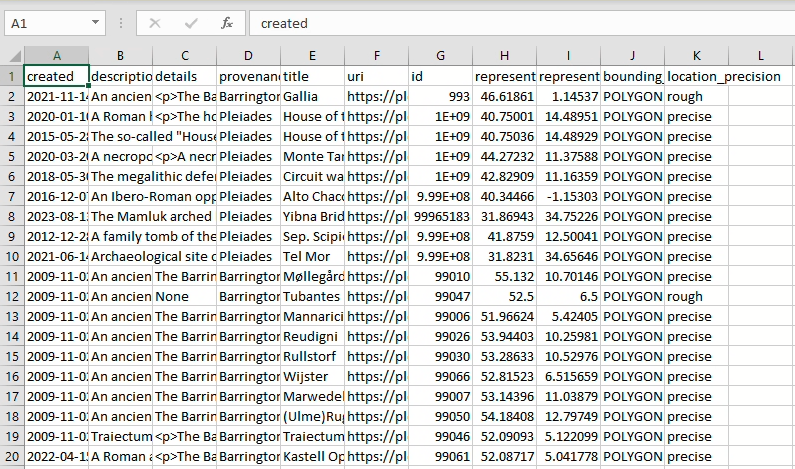
</figure>

... but if you were to look at the underlying data in a [text editing application](https://en.wikipedia.org/wiki/Text_editor) like [Notepad](https://notepad-plus-plus.org/) or [Visual Studio Code](https://code.visualstudio.com/), you'd see something a little less human-readable:

<figure>
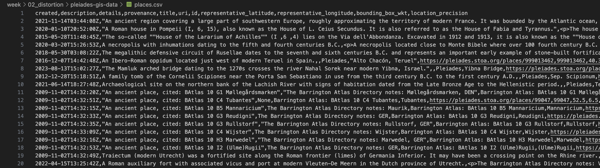
</figure>

Still, if you look carefully, you'll note that the 

Now, open up ArcGIS Pro and create a new project file. **Remember, change the location from the C: drive to your H: drive.** Save the project inside your `workspace` folder. You can leave "Create a new project folder" unchecked if you want – the ArcGIS Pro project files are the only thing you'll save inside it.

When you're done, your directory structure should resemble:

    week02/
    ├─ activity_mapping-ancient-world/
        ├─ data/
            ├─ places.csv
        ├─ workspace/
            ├─ multiple
            ├─ ArcGIS
            ├─ Pro
            ├─ folders
            ├─ and
            ├─ files
        ├─ submission/

### Check things out in Microsoft Excel

Any time you're trying to load a table into ArcGIS Pro, you want to have a quick look through its contents.

Open the `places.csv` file in Microsoft Excel by `double-clicking` the file. There are two really important fields in here that will allow us to do that: `representative_latitude` and `representative_longitude`. 

Thankfully, the dataset is really tidy, so we don't need to fuss with it a lot. However, it's best practice, when possible, to keep your field names to 10 characters or less. This specification is important because the **shapefile** format has a field name maximum character limit of 10, and shapefiles are encountered really commonly in GIS and geospatial humanities workflows.

Rename each field name so that it contains 10 characters or less. (The destination format of this file is an [ArcGIS feature class](https://pro.arcgis.com/en/pro-app/latest/help/data/geodatabases/overview/feature-class-basics.htm) which has much longer field name limits, so it's not *super* important in this case, but this is best practice notwithstanding.) The result should resemble:

<figure>
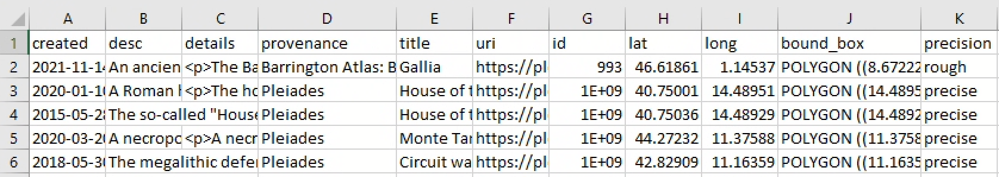
</figure>

## Loading XY data to ArcGIS Pro

Let's turn that `csv` file – an example of *tabular* data – into real-life, bona fide *spatial* data. When we're done, we'll have a feature class of vector points that displays over 40,000 ancient place names. The best part: it's super easy...

### Geodesy

... but first, we should take a moment to wrap our round heads around the round globe.

<figure>

<figcaption>

From Charles H. Deetz, *Elements of Map Projection With Applications to Map and Chart Construction* (Washington: Government Printing Office, 1921): 51. [HathiTrust/Cornell](https://babel.hathitrust.org/cgi/pt?id=coo.31924003898271&seq=59)

</figcaption>
</figure>

[Geodesy](https://support.esri.com/en-us/gis-dictionary/geodesy) is the study of the shape and size of the earth, including its gravitational and magnetic field. It's a pretty complicated science – made all the more so by the fact that the Earth is not *truly* a sphere, but in fact a [lumpy oblate spher*oid*](https://www.esa.int/ESA_Multimedia/Images/2010/04/Earth_Explorers_The_Earth_s_true_shape) – so here's a quick and dirty highlight reel of geodesy for geospatial humanists like yourself.

### Coordinates

We measure locations on the earth's surface in **coordinates**, most often described in terms of their position on an X-axis (horizontal) and Y-axis (vertical). You'll probably encounter XY data most commonly as latitudes and longitudes like the ones in the `places.csv` spreadsheet, but they can also be represented in **DMS**, or "degrees-minutes-seconds" format: `0° 0' 0"`, followed by a cardinal direction `N`, `S`, `E`, or `W`.

Sometimes you'll need to convert from one to the other. If you're ambitious, you can make those conversions [by hand](https://manoa.hawaii.edu/exploringourfluidearth/physical/world-ocean/locating-points-globe/compare-contrast-connect-converting-decimal-degrees), but in these cases I prefer to use an [online lat-long converter](https://www.latlong.net/lat-long-dms.html). Converted from lat-long to DMS, the first record in our `places.csv` would be `46° 37' 6.96" N, 1° 8' 43.08" E`.

### Coordinate systems

We're speaking in terms of coordinates because when flattened out, the world essentially becomes a big coordinate **grid**.

On the X-axis, lines of **latitude** (also known as *parallels*) wrap horizontally around the earth. The **equator** is the largest parallel at `0°`, but they become smaller as they approach +/- `90°` at either of the poles. 

On the Y-axis, lines of **longitude** (also known as *meridians*) wrap vertically around the earth, intersecting one another at the north and south poles. As a consequence of an [1884 political conference](https://en.wikipedia.org/wiki/International_Meridian_Conference), the **Greenwich Meridian** that passes through the Royal Observatory in Greenwich, England is arbitrarily designated at `0°` – a decision that Giordano Nanni has described as "[the colonization of time](https://colonialfamilies.wordpress.com/2014/03/30/review-the-colonisation-of-time-by-giordano-nanni/)."

<div class="tip">

I will be the first to admit that I still need to use a dumb little thing to remember the difference between latitude and longitude. **Remember: *lat*-itude is *flat*-itude.** Dumb little things are okay!

</div>


<figure>
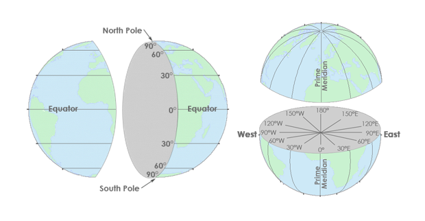
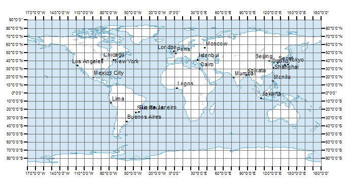
<figcaption>

*Lines of latitude (top left) and longitude (top right), which form a graticular network (bottom), from [GISGeography](https://gisgeography.com/latitude-longitude-coordinates/).*

</figcaption>
</figure>

The X and Y axes meet at the grid's **origin**, and all other locations on the grid are specified relative to that origin. This is an example of a **Cartesian coordinate system**, or a grid formed by [juxtaposing two horizontal and vertical measurement scales](https://www.e-education.psu.edu/natureofgeoinfo/c2_p10.html).

You'll most commonly encounter two kinds of coordinate systems when working with geospatial data: **geographic coordinate systems** and **projected coordinate systems**. They're closely related, but distinguishing them is really important.

#### Geographic coordinate systems


<figure>

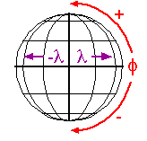
<figcaption style="text-align:left;">

A [*Geographic coordinate system*](https://www.e-education.psu.edu/natureofgeoinfo/c2_p10.html)
</figcaption>
</figure>

A **geographic coordinate systems (GCS)** defines positions on the surface of the earth. It uses concrete, measured values to define global parameters, in the literal sense of the word "global." An example is `WGS84`. Its global parameters are [defined as follows](https://www.unoosa.org/pdf/icg/2012/template/WGS_84.pdf):

| **Parameter notation value**                                            | **Notation** | **Value**                                                          |
| :---------------------------------------------------------------------- | ------------ | ------------------------------------------------------------------ |
| Semi-major Axis                                                         | a            | 6378137.0 meters                                                   |
| Flattening factor of the Earth                                          | 1/f          | 298.257223563                                                      |
| Nominal Mean Angular Velocity of the Earth                              | ω            | 7292115 x 10<sup>-11</sup> radians/second                          |
| Geocentric gravitational constant (Mass of Earth's atmosphere included) | GM           | 3.986004418 x 10<sup>14</sup> meter<sup>3</sup>/second<sup>2</sup> |

#### Projected coordinate systems

<figure>

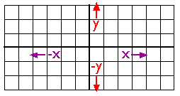
<figcaption style="text-align:left;">

A [*projected coordinate system*](https://www.e-education.psu.edu/natureofgeoinfo/c2_p10.html)
</figcaption>
</figure>

A **projected coordinate system (PCS)** defines how to display that lumpy, oblate, spheroid surface as a flat map. It uses abstract, mathematical formulas to effect cartographic transformations that show certain areas on the globe with less distortion, and other areas with more. An example PCS is `Mercator`. Its [formula](https://www.marksmath.org/classes/common/MapProjection.pdf) is:

<span class="math bigger">T(ϕ, θ) = (θ, ln(|sec(ϕ) + tan(ϕ)|))</math>

### **Managing coordinate systems in ArcGIS Pro**

I'm only throwing this fancy math at you to highlight the distinctions between the two kinds of coordinate systems – *not* because you need to know the fancy math in order to do geospatial humanistic work.

Here's a table highlighting differences:

<div class="headless">

|                                | **It represents...**                | **It uses...**                  | **Examples include...**     |
| ------------------------------ | --------------------------- | ---------------------------- | ---------------- |
| *Geographic coordinate system* | Globe (e.g., the territory) | Degree units (e.g., 40° W)   | `WGS84`, `NAD27`     |
| *Projected coordinate system*  | Places (e.g., the map)      | Linear units  (e.g., meters) | Mercator, Peters |

</div>

To view spatial data in ArcGIS Pro, you don't need to use a PCS, but you *must* use a GCS. By default, a new ArcGIS Pro project will take on the coordinate system of the first data later you add, including a base map. Often this will be `WGS 1984 Web Mercator`. When a geographic coordinate system is selected without a PCS, your map will be projected using the [pseudo-plate carrée projection](https://support.esri.com/en-us/gis-dictionary/display-projection).

You can view project-wide information about GCS and PCS by `right-clicking` the "Map" layer in your **Contents** pane ➡️ `Properties` ➡️ `Coordinate Systems`.

You can view layer-specific information about GCS and PCS by `right-clicking` an individual layer ➡️ `Properties` ➡️ `Source` ➡️ "Spatial reference."

## **Loading tabular data as points in ArcGIS Pro**

Under the **Map** tab in the banner, select `Add Data` ➡️ `XY Point Data`. This will open the **XY Table to Point** geoprocessing tool. (There are always multiple ways to do a thing in ArcGIS Pro; note that you could also access this tool by searching for it in the geoprocessing toolbox.)

In your tool, set the parameters to:

* Input Table = click the folder icon, navigate to where you saved `places.csv`, and select that file
* Output Feature Class = save the file as `pleiades_places` in your project geodatabase
* X Field = `lat`, or whatever you named the **latitude** column
* Y Field = `long`, or whatever you named the **longitude** column
* Z Field = this can stay empty (it refers to height)
* Coordinate system = You should always check the metadata to see what the data's source projection is. In our case, the right answer is in the [Pleiades metadata](https://atlantides.org/downloads/pleiades/gis/). Refer to that.

Click `Run` and you should see this:

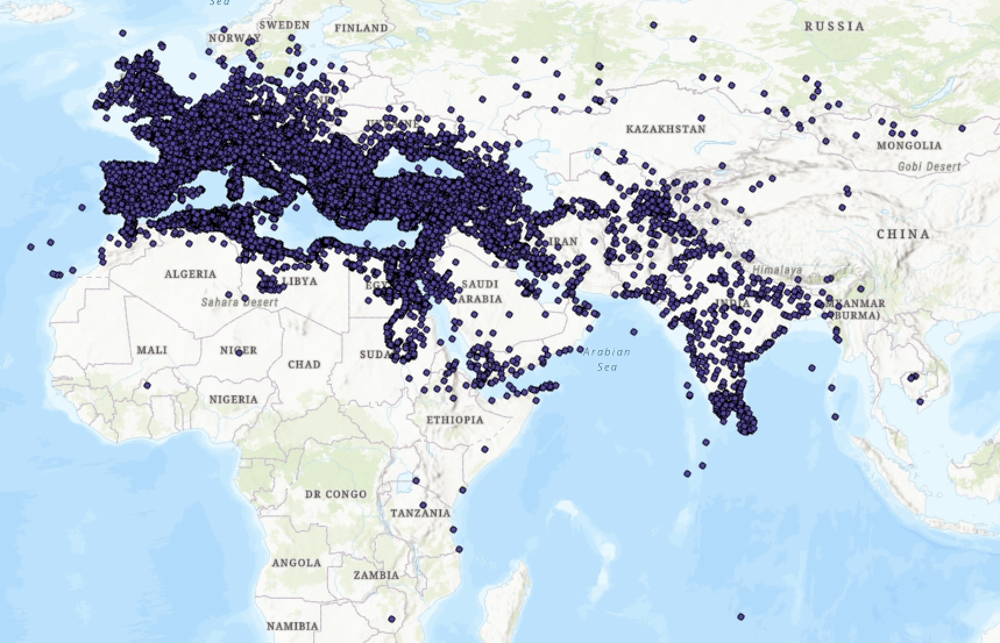

Nice!

Now we've got a full-fledged feature class containing 40,000 points of ancient places, plotted from a humble `csv`. That said, it's kind of difficult to make sense of all this...

# **Querying Pleiades data to find simple patterns**

... so let's see if we can break this data down and find any interesting patterns.

First, go ahead and open the attribute table. You can refer to the [Pleiades metadata](https://atlantides.org/downloads/pleiades/gis/) if you're confused by any of the fields (although note that the field nammes won't be exactly the same if you edited them before loading the data).

While the `title` field has the most obviously *mappable* information, the description `desc` field has got lots of fascinating information:
* "A necropolis with inhumations dating to the fifth and fourth centuries B.C." (Monte Tamburino necropolis, `OBJECTID: 4`)
* "A nuragic complex consisting of a 'megaron-type' temple and a giant's grave." (Sa Carcaredda, `OBJECTID: 248` )
* "A major settlement mound along the Orontes river in Syria with over 10,000 years of occupational history from the Pre-Pottery Neolithic to the Mamluk period." (Tell Qarqur, `OBJECTID: 192`)

What if we were able to search through the entire contents of this feature class for interesting words like "mound" and "grave" and "necropolis," selecting only those features which include such terms?

Wait a minute: we *can* do that!!!

## **Doing that**

1. At the top of the attribute table, click the **Select by Attributes** button. It will open a little dialog box.
2. You can leave the Input Rows and Selection Type parameters as they are.
3. Click the 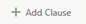 button in the middle of the dialog and then set the parameters of your new clause like so...

    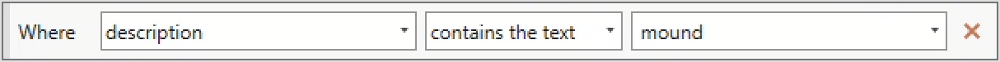

4. ... and click `Apply`. You should see a message pop up notifying you that "The input has a selection. Records to be processed: 148."
5. This message just means that if you were to run a **geoprocessing tool**, it would only apply to selected records. Also, all your selected records appear on the map in a light blue color. Neat! Click `OK`.
6. At the bottom-left hand side of the attribute table, toggle the view from "all records" to "selected records."

    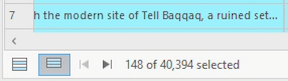

    Now the attribute table should show you only those records you selected.

7. `Right-click` on the "pleiades_places" layer in your **Contents** pane and choose "Zoom to layer." This is a really handy shortcut for snapping a data layer to full screen in your map view.
8. Just eyeballing it, do you notice any patterns in how the blue points are distributed?

## **Doing more of that**

Take a moment to do more of that. Test out a couple of other keywords in your query. Replace "mound" if you want. Once you've found a few that you like, combine them with the "Add Clause" button in the **Select by Attributes** interface. **You should choose at least 3 queries in total**. Be conscious of how you're using [boolean operators](https://researchguides.library.tufts.edu/hsl-advanced-searching); for example, if you string together multiple queries using `AND`, you'll likely end up with few or zero results.

While you're at it, toggle the SQL button 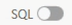 on and off to see how your queries are actually being composed behind the scenes. Eventually, you'll probably find it just as easy – if not easier – to type these kinds of queries out manually than to select them using an interface.

Note that if your attribute table is set to only "Show Selected Records," you won't see the Select by Attributes tool.

> [![q]][l] 
> 1. Paste your full SQL query, as it appears in the dialog when you toggle the SQL button on.
> 2. Describe in 2-3 sentences the geographical distribution of the selected points (e.g., where they are clustered).

# **Troubleshooting the grid**

## **Tissot's indicatrix**


[Tissot's indicatrix](https://en.wikipedia.org/wiki/Tissot%27s_indicatrix) is a grid of *equidistantly placed* and *congruently sized* lines and circles. Overlaying it on maps helps visualize local distortion of different projections, as the [gif above of Jason Davies' tool](https://www.jasondavies.com/maps/tissot/) demonstrates. Take a moment to open his tool and drag your cursor around in it.

<figure>
<iframe class="scaledown" src="https://www.jasondavies.com/maps/tissot/"></iframe>
<figcaption>Jason Davies' Tissot circles visualization tool</figcaption>
</figure>

There are four properties of cartographic distortion: **area**, **distance**, **shape**, and **direction (or azimuth)**. Different projection types account for these distortions, always minimizing some at the expense of maximizing others. See below:

| Projection type | What it preserves | Example       |
| --------------- | ----------------- | ------------- |
| Conformal       | Shape             | Mercator      |
| Equal area      | Area              | Peters        |
| Equidistant     | Distance          | Plate Carrée  |
| Azimuthal       | Direction         | Stereographic |
| Compromise      | Nothing!          | Robinson      |

Penn State has some materials that do a great job of [distinguishing between these different kinds of distortion](https://www.e-education.psu.edu/natureofgeoinfo/c2_p29.html), if you want to learn more.

Let's load Tissot's indicatrix into our project so we can ascertain how and where different projections distort maps.

1. Download the data from Canvas or the `S: drive`
2. Un-🤐 both files
3. Move the necessary folders and files into the `data` folder in your directory
4. Load the data into your ArcGIS Pro project
5. `Right-click` on the `graticules` or `caps` layer and click "Zoom to Layer"

When you're done you should see something like this (ensure that the Pleiades data is on top):

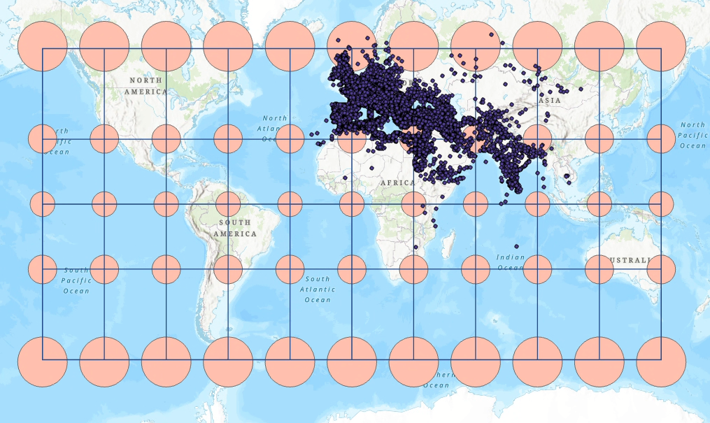

What's happening here?

As [Aileen Buckley](https://www.esri.com/arcgis-blog/products/product/mapping/tissots-indicatrix-helps-illustrate-map-projection-distortion/?rmedium=redirect&rsource=blogs.esri.com/esri/arcgis/2011/03/24/tissot-s-indicatrix-helps-illustrate-map-projection-distortion) has summarized in this Esri blog post, web mercator is an **conformal projection.** That means is preserves shape, but significantly distorts area. As a result, our Tissot circles all stay circular, but some are much bigger looking than others (hence the [Mercator projection's famous inflation of Greenland to appear as large as Africa](https://www.youtube.com/watch?v=OH1bZ0F3zVU)). 

If you wanted to measure the circumference of any of these circles – or if you ran [Calculate Geometry](https://support.esri.com/en-us/knowledge-base/how-to-calculate-geometry-in-arcgis-pro-000016157) on the "caps" layer – you'd see that the size of each cap is indeed the same, despite the differences in their appearances. Give it a try with the measure tool, if you want (but be sure to set the measurement type to "Geodesic").

> [![ec]][l]
>
> **For 5 points extra credit**: in a few sentences, explain why the "Geodesic" measurement is so different from the "Planar" measurement (for full credit, you should define each of those things).

Feel free to reset the projection by `Right-clicking` the "Map" ➡️ "Coordinate Systems" ➡️ choose a different one. What's being distorted? What's being preserved?

## **Setting locally appropriate projections**

Back to Pleiades...

If we wanted to make more specific maps of regions within this Pleiades dataset – for example, see the Ancient World Mapping Center's [map of Catholic and Donatist Bishoprics in 5th century North Africa](https://awmc.unc.edu/2023/11/02/maps-for-texts-catholic-and-donatist-bishoprics-in-north-africa-c-411-ce/) – we'd want to choose a better projection than our current, default projection of `WGS 1984 Web Mercator`.

In order to determine the "right" projection – and there is often more than one "right" answer! – try using [epsg.io](https://epsg.io/). This is a handy tool (operated by [MapTiler](https://www.maptiler.com/)) for determining ideal areas of coverage for different projections. It allows you to search by country and choose a suitable projection for each part of the world you want to depict.

When you make these changes at the **Map** level, you're not actually manipulating the underlying spatial data: ArcGIS Pro is just reprojecting it "[on the fly](https://www.esri.com/arcgis-blog/products/arcgis-pro/mapping/projection-on-the-fly-and-geographic-transformations/)." If you wanted to reproject the data itself, you'd have to use the **[Project](https://pro.arcgis.com/en/pro-app/latest/tool-reference/data-management/project.htm)** tool.

> [![q]][l] 
> 
> 3. Choose four places from the table below and imagine you're making a map in each of them. Using the **Map** properties tab, choose a suitable projection for each map. As you do, [take a screenshot](https://support.microsoft.com/en-us/windows/use-snipping-tool-to-capture-screenshots-00246869-1843-655f-f220-97299b865f6b) of ArcGIS Pro with the proper projection set and zoomed into the area of interest. Then, write down the following information:
>     * Projection name
>     * Linear unit
>     * In 1-2 sentences, describe the parts of the world (e.g., the poles, specific countries) that this projection appears to distort the most.
> 
>     | Large scale  |    Medium scale     |  Small scale   |
>     | :----------: | :-----------------: | :------------: |
>     | Vatican City |       Greece        |  North Africa  |
>     |    Cairo     |   Southern India    | Eastern Europe |
>     |  Jerusalem   |  Northern Baghdad   | Western Europe |
>     |   Baghdad    |       Algeria       |     India      |
>     |  Siem Reap   | Strait of Gibraltar |  Middle East   |
>     |   Baghdad    |        Egypt        |     Russia     |

# **Submit**

When you're finished, go ahead and submit your Word document – which should just include some screenshots and brief descriptions of your SQL queries and projection choices – to Canvas.

This activity is due before class on January 30.