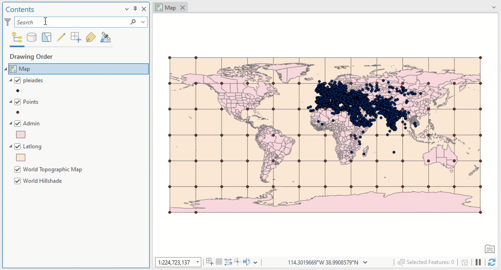
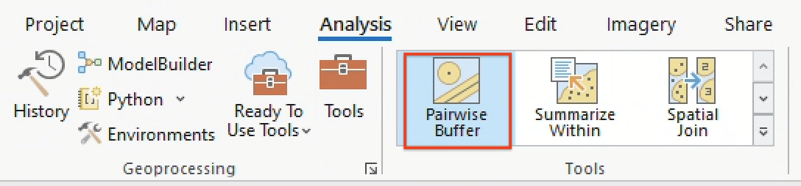
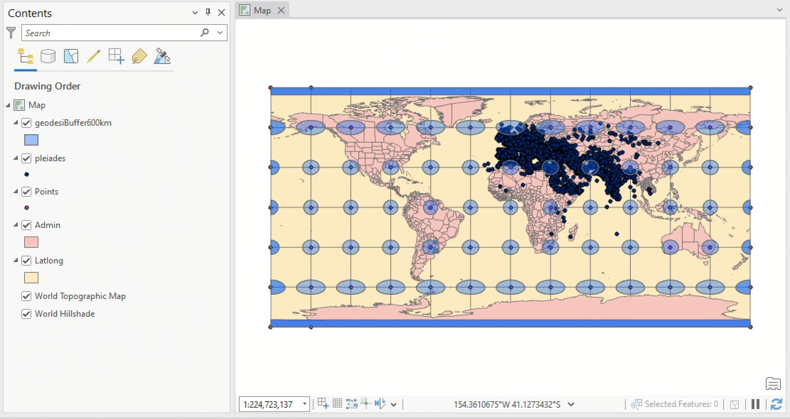
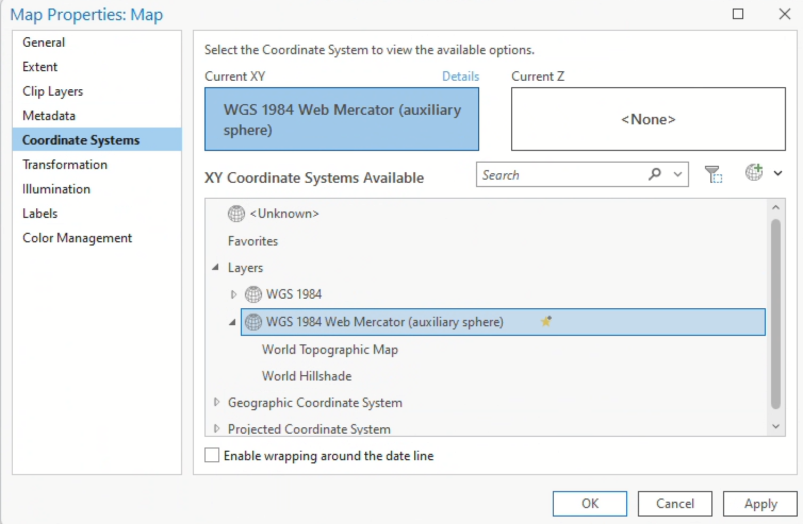
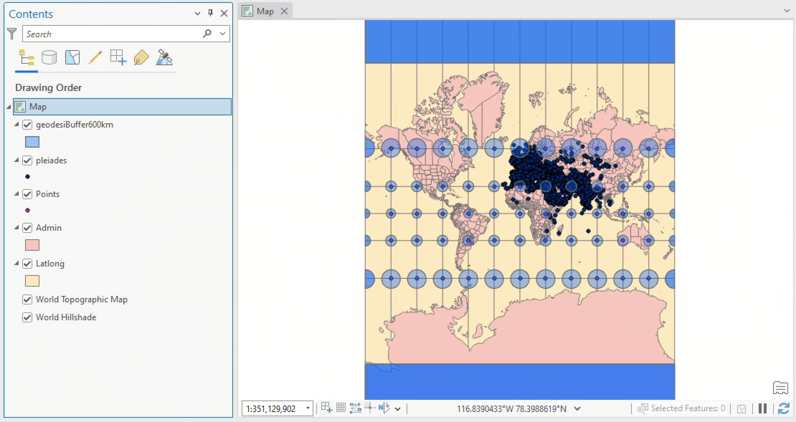

<script type="module" src="../../../assets/js/script.js"></script>
<script type="module">
  const scriptUrl = new URL('_import/assets/js/script.f6e5b1ef.js', import.meta.url).href;
  import(scriptUrl).then(module => {
    module.images();
  })
</script>

# Activity 02: Mapping ancient places <!-- omit in toc -->

##### *Use a gazetteer of the ancient world to make sense of XY data and coordinate systems* <!-- omit in toc -->

<div class="intro">

<figure>
    
    <figcaption>

*A map of ancient places, created by [AWMC](https://awmc.unc.edu/) with [Pleiades data](https://pleiades.stoa.org/)*.
    </figcaption>
</figure>

```js
import yaml from 'js-yaml';
const response = await FileAttachment("../../../data/activities.yaml").text()
const data = yaml.load(response)
const d=[data[1]]
view(Inputs.table(d, {width:{subtitle:200},disabled: "true",columns: ["subtitle","assigned","due"],header: {subtitle: "Activity",assigned: "Assigned",due: "Due"}}))
```

*This activity will walk you through plotting XY data using the [Pleiades dataset](https://pleiades.stoa.org)—a [gazetteer](https://en.wikipedia.org/wiki/Gazetteer) of ancient place names—and then troubleshooting how that data translates into a variety of projected coordinate systems. You'll primarily focus on:*

<ol class="circle-list">
<li>Formatting tabular data for GIS in Microsoft Excel
<li>Displaying XY data
<li>Basic attribute table queries
<li>Geographic and projected coordinate systems
</ol>

By **Wednesday, February 12 at 11:59pm**, [submit to Canvas](#questions-and-deliverables):

* answers to the questions in <span style="border: dotted 2px #47a954;background-color:#d8fedd;font-family:monospace;font-size:0.8em;padding:0.2em;">green boxes</span>, compiled and submitted in a `.doc`, `.odf`, or `.pdf` file

<details class="noselect">
<summary><i>Full table of contents</i></summary>

- [Preparing your workspace](#preparing-your-workspace)
- [Data](#data)
  - [Download it](#download-it)
  - [Pre-processing](#pre-processing)
- [Geodesy](#geodesy)
  - [Coordinates](#coordinates)
  - [Coordinate systems](#coordinate-systems)
  - [Geographic coordinate systems](#geographic-coordinate-systems)
  - [Projected coordinate systems](#projected-coordinate-systems)
  - [GCS vs. PCS](#gcs-vs-pcs)
- [XY data in Arcgis Pro](#xy-data-in-arcgis-pro)
  - [Loading tabular data as points](#loading-tabular-data-as-points)
- [Querying Pleiades](#querying-pleiades)
  - [Build your own query](#build-your-own-query)
- [Distortion](#distortion)
  - [Tissot circles](#tissot-circles)
  - [The buffer tool](#the-buffer-tool)
  - [Understanding distortion](#understanding-distortion)
  - [Measuring Mercator distortion](#measuring-mercator-distortion)
  - [Troubleshooting the grid](#troubleshooting-the-grid)
- [Questions and deliverables](#questions-and-deliverables)
- [Submit](#submit)


</details>

</div>

<div class="question">

## Preparing your workspace

Set up a workspace for this activity by using Windows File Explorer  to create a directory structure where you'll keep all your files.

Again, there are three places where you can save your work:
1. your `H:` Drive
2. your Box accountor 
3. a personal thumb drive

As discussed in class, I <span class="key">recommend</span> using the `H:` Drive, but of course you can choose whichever you want. In any case, your directory structure should resemble the following:

    week02/
    ├─ activity_mapping-ancient-world/
        ├─ downloaded-data/
        ├─ working-maps/
        ├─ for-submission/

The `data` folder will contain all the data you need to download for this activity. The `working` folder is where you'll store your ArcGIS Pro project file, as well as the [geodatabase](https://pro.arcgis.com/en/pro-app/latest/help/data/geodatabases/overview/what-is-a-geodatabase-.htm) associated with it. Finally, the `submission` folder is just for exporting drafts of the final project.

## Data

### Download it

1. Head over to https://pleiades.stoa.org/ and click the "Downloads" tab in the upper-right hand corner.

2. Under the header "Single Format Snapshots" > "Pleiades Data for GIS (CSV)" and click the link to download the latest version.

    <div class="tip">

    The note that Microsoft Excel doesn't reliably read the CSV format is, unfortunately, a common experience when working with spatial data in Excel.
    
    Okay, fine——it's a common experience when working with *any* data in Excel. If you have access to [LibreOffice](https://www.libreoffice.org/), an [open-source](https://en.wikipedia.org/wiki/Open-source_software) alternative to the Microsoft suite, feel free to try it out!

    </div>

3. Like datasets you've seen before, this should land in your `Downloads` folder as a `.zip` file.

4. Go ahead and extract the contents with `Right-click` > `Extract all` > `Extract`. Click through the "unzipped" folders until you get to the data itself.

5. You'll notice many data files suffixed with `.csv`. That's short for "comma separated values," which means it's a [plain text](https://en.wikipedia.org/wiki/Plain_text) file containing rows (e.g., observations) and columns (e.g., variables). If you opened this file in a text editor, you'd see that the rows are separated by [carriage returns](https://en.wikipedia.org/wiki/Carriage_return) and the columns are separated by—you guessed it—commas.

    Although there's tons of interesting stuff in this folder, we're only going to be using the `places.csv` file today. Go ahead and move that file into your `downloaded-data` folder. 

6. First, try opening the file in Excel. You should see something like this:

    <figure>
    
    </figure>

7. Now, try opening the file in a [text editing application](https://en.wikipedia.org/wiki/Text_editor) like [Notepad](https://notepad-plus-plus.org/) or [Visual Studio Code](https://code.visualstudio.com/) (both of which are installed on Data Lab computers). You should see something a little less human-readable:

    <figure>
    
    </figure>

    Still, if you look carefully, you can sort of track the structure of the data. Again: commas separate each value. In instances where a comma needs to be [escaped](https://en.wikipedia.org/wiki/Escape_sequence)—e.g., where a comma actually does need to appear in the value of the data—it must be braced in quotation marks.

    <div class="q">

    In the `.csv` file you're examining, what do two commas directly next to one another (e.g., `,,`) signify? You may need to compare the file in Excel against the file in VS Code to confirm your answer.

    </div>

8. Finally, open up ArcGIS Pro and create a new project file. **Remember to change the location from the C: drive to the H: drive when you're creating the project.** Save the project inside your `working-maps` folder. You can leave "Create a new project folder" unchecked if you want—the ArcGIS Pro project files are the only thing you'll save inside it.

    When you're done, your directory structure should resemble:

        week02/
        ├─ activity_mapping-ancient-world/
            ├─ data/
                ├─ places.csv
            ├─ workspace/
                ├─ multiple
                ├─ ArcGIS
                ├─ Pro
                ├─ folders
                ├─ and
                ├─ files
            ├─ submission/

### Pre-processing

Our goal is to load this `.csv` into ArcGIS Pro and plot the locations of each observation (e.g., row)—but first, any time you're trying to load a table into ArcGIS Pro, you want to have a quick look through its contents.

1. Open the `places.csv` file in Microsoft Excel by `double-clicking` the file. There are two really important fields in here that will allow us to do that: `representative_latitude` and `representative_longitude`. 

2. Thankfully, the dataset is really [tidy](https://vita.had.co.nz/papers/tidy-data.pdf), so we don't need to fuss with it a lot. However, it's best practice, when possible, to keep your field names to 10 characters or less. This specification is important because the **shapefile** format has a field name maximum character limit of 10, and shapefiles are encountered pretty commonly in GIS and geospatial humanities workflows.

3. Rename each field name so that it contains 10 characters or less. (The destination format of this file is an [ArcGIS feature class](https://pro.arcgis.com/en/pro-app/latest/help/data/geodatabases/overview/feature-class-basics.htm) which has much longer field name limits, so it's not *super* important in this case, but this is best practice notwithstanding.) The result should resemble:

    <figure>
    
    </figure>

4. This was a very simple example of data [preprocessing](https://en.wikipedia.org/wiki/Data_preprocessing), or getting a dataset ready for analysis. Preprocessing will often be more complex than just renaming columns... but this still counts!

## Geodesy

Let's turn that `csv` file—an example of *tabular* data—into real-life, bona fide *spatial* data. When we're done, we'll have a feature class of vector points that displays over 40,000 ancient place names. The best part? It's super easy!

Before diving in, we just need to take a moment to wrap our round heads around the round globe.

<figure>

<figcaption>

From Charles H. Deetz, *Elements of Map Projection With Applications to Map and Chart Construction* (Washington: Government Printing Office, 1921): 51. [HathiTrust/Cornell](https://babel.hathitrust.org/cgi/pt?id=coo.31924003898271&seq=59)

</figcaption>
</figure>

[Geodesy](https://support.esri.com/en-us/gis-dictionary/geodesy) is the study of the shape and size of the earth, including its gravitational and magnetic field. It's a pretty complicated science—made all the more so by the fact that the Earth is not *truly* a sphere, but in fact a [lumpy oblate spher*oid*](https://www.esa.int/ESA_Multimedia/Images/2010/04/Earth_Explorers_The_Earth_s_true_shape)—so here's a quick and dirty highlight reel of geodesy for geospatial humanists like yourself.

### Coordinates

We measure locations on the earth's surface in **coordinates**, most often described in terms of their position on an X-axis (horizontal) and Y-axis (vertical). You'll probably encounter XY data most commonly as latitudes and longitudes like the ones in the `places.csv` spreadsheet, but they can also be represented in **DMS**, or "degrees-minutes-seconds" format: `0° 0' 0"`, followed by a cardinal direction `N`, `S`, `E`, or `W`.

Sometimes you'll need to convert from one to the other. If you're ambitious, you can make those conversions [by hand](https://manoa.hawaii.edu/exploringourfluidearth/physical/world-ocean/locating-points-globe/compare-contrast-connect-converting-decimal-degrees), but in these cases I prefer to use an [online lat-long converter](https://www.latlong.net/lat-long-dms.html). Converted from lat-long to DMS, the first record in our `places.csv` would be `46° 37' 6.96" N, 1° 8' 43.08" E`.

### Coordinate systems

We're speaking in terms of coordinates because when flattened out, the world essentially becomes a big coordinate **grid**.

On the X-axis, lines of **latitude** (also known as *parallels*) wrap horizontally around the earth. The **equator** is the largest parallel at `0°`, but they become smaller as they approach +/- `90°` at either of the poles. 

On the Y-axis, lines of **longitude** (also known as *meridians*) wrap vertically around the earth, intersecting one another at the north and south poles. As a consequence of an [1884 political conference](https://en.wikipedia.org/wiki/International_Meridian_Conference), the **Greenwich Meridian** that passes through the Royal Observatory in Greenwich, England is arbitrarily designated at `0°`—a decision that Giordano Nanni has described as "[the colonization of time](https://colonialfamilies.wordpress.com/2014/03/30/review-the-colonisation-of-time-by-giordano-nanni/)."

<figure>


<figcaption>

*Lines of latitude (top left) and longitude (top right), which form a graticular network (bottom), from [GISGeography](https://gisgeography.com/latitude-longitude-coordinates/).*

</figcaption>
</figure>

The X and Y axes meet at the grid's **origin**, and all other locations on the grid are specified relative to that origin. This is an example of a **Cartesian coordinate system**, or a grid formed by [juxtaposing two horizontal and vertical measurement scales](https://www.e-education.psu.edu/natureofgeoinfo/c2_p10.html).

You'll most commonly encounter two kinds of coordinate systems when working with geospatial data: **geographic coordinate systems** and **projected coordinate systems**. They're closely related, but distinguishing them is really important.

<div class="tip">

I will be the first to admit that I still need to use a dumb little thing to remember the difference between latitude and longitude. **I like to say *lat*-itude is *flat*-itude.** Dumb little things are okay!

</div>

### Geographic coordinate systems

<figure>


<figcaption style="text-align:left;">

A [*Geographic coordinate system*](https://www.e-education.psu.edu/natureofgeoinfo/c2_p10.html)
</figcaption>
</figure>

A **geographic coordinate systems (GCS)** defines positions on the surface of the earth. It uses concrete, measured values to define global parameters, in the literal sense of the word "global." An example is `WGS84`. Its global parameters are [defined as follows](https://www.unoosa.org/pdf/icg/2012/template/WGS_84.pdf):

| **Parameter notation value**                                            | **Notation** | **Value**                                                          |
| :---------------------------------------------------------------------- | ------------ | ------------------------------------------------------------------ |
| Semi-major Axis                                                         | a            | 6378137.0 meters                                                   |
| Flattening factor of the Earth                                          | 1/f          | 298.257223563                                                      |
| Nominal Mean Angular Velocity of the Earth                              | ω            | 7292115 x 10<sup>-11</sup> radians/second                          |
| Geocentric gravitational constant (Mass of Earth's atmosphere included) | GM           | 3.986004418 x 10<sup>14</sup> meter<sup>3</sup>/second<sup>2</sup> |

Do you need to know the difference between a semi-major and semi-minor axis? No. Will you ever need to compute the flattening factor of the Earth in this class? Absolutely not.

The purpose of seeing these parameters is not for you to memorize them, but to acknowledge that they are derived from real measurements about the Earth, gathered by a person or people who were walking around in its landscapes.

### Projected coordinate systems

<figure>


<figcaption style="text-align:left;">

A [*projected coordinate system*](https://www.e-education.psu.edu/natureofgeoinfo/c2_p10.html)
</figcaption>
</figure>

A **projected coordinate system (PCS)** defines how to display that lumpy, oblate, spheroid surface as a flat map. It uses abstract, mathematical formulas to effect cartographic transformations that show certain areas on the globe with less distortion, and other areas with more. An example PCS is `Mercator`. Its [formula](https://www.marksmath.org/classes/common/MapProjection.pdf) is:

<span class="math bigger">T(ϕ, θ) = (θ, ln(|sec(ϕ) + tan(ϕ)|))</span>


### GCS vs. PCS

In short, you could think of a GCS as the data and a PCS as the algorithm. A GCS defines the globe, while a PCS defines how you flatten it. A GCS deals with the actual territory, while a PCS deals with the map (which is, quite famously, [not the territory!](https://en.wikipedia.org/wiki/Map%E2%80%93territory_relation)).

However you conceptualize these two different systems for understanding and representing the Earth, the making of maps requires both a GCS and a PCS working harmoniously with one another.

The table below highlights their differences:

<div class="headless">

|                                | **It represents...**                | **It uses...**                  | **Examples include...**     |
| ------------------------------ | --------------------------- | ---------------------------- | ---------------- |
| *Geographic coordinate system* | Globe (e.g., the territory) | Degree units (e.g., 40° W)   | WGS84, NAD27     |
| *Projected coordinate system*  | Places (e.g., the map)      | Linear units  (e.g., meters) | Mercator, Peters |

</div>

## XY data in Arcgis Pro

By "XY" data, I simply mean gridded data that has an "X" position and a "Y" position—in other words, points with a latitude and longitude.

To view XY or any other spatial data in ArcGIS Pro, you don't need to use a PCS, but you *must* use a GCS. By default, a new ArcGIS Pro project will take on the coordinate system of the first data later you add, including a base map. Often this will be `WGS 1984 Web Mercator`.

When a geographic coordinate system is selected without a PCS, your map will be arbitrarily projected using the [pseudo-plate carrée projection](https://support.esri.com/en-us/gis-dictionary/display-projection).

There are two places where you can learn information about your GCS and PCS:

1. You can view project-wide information about GCS and PCS by `right-clicking` the "Map" layer in your **Contents** pane > `Properties` > `Coordinate Systems`.

2. You can view layer-specific information about GCS and PCS by `right-clicking` an individual layer > `Properties` > `Source` > "Spatial reference."

### Loading tabular data as points

Under the **Map** tab in the banner, select `Add Data` > `XY Point Data`. This will open the **[XY Table to Point](https://pro.arcgis.com/en/pro-app/latest/tool-reference/data-management/xy-table-to-point.htm)** geoprocessing tool. (There are always multiple ways to do a thing in ArcGIS Pro; note that you could also access this tool by searching for it in the [geoprocessing toolbox](https://pro.arcgis.com/en/pro-app/latest/help/analysis/geoprocessing/basics/find-geoprocessing-tools.htm).)

In your tool, set the parameters to:

* Input Table = click the folder icon, navigate to where you saved `places.csv`, and select that file
* Output Feature Class = save the file as `pleiades_places` in your project geodatabase
* X Field = `long`, or whatever you named the **longitude** column
* Y Field = `lat`, or whatever you named the **latitude** column
* Z Field = this can stay empty (it refers to height)
* Coordinate system = You should always check the metadata to see what the data's source projection is. In our case, the right answer is in the [Pleiades metadata](https://atlantides.org/downloads/pleiades/gis/). Refer to that.

Click `Run` and you should see this:

<figure>


</figure>

Nice!

Now we've got a full-fledged feature class containing 40,000 points of ancient places, plotted from a humble `csv`. That said, it's kind of difficult to make sense of all this...

## Querying Pleiades

... so let's see if we can break this data down and find any interesting patterns.

First, go ahead and open the attribute table. You can refer to the [Pleiades metadata](https://atlantides.org/downloads/pleiades/gis/) if you're confused by any of the fields (although note that the field nammes won't be exactly the same if you edited them before loading the data).

While the `title` field has the most obviously *mappable* information, the description or `desc` field has got lots of fascinating information:
* "A necropolis with inhumations dating to the fifth and fourth centuries B.C." (Monte Tamburino necropolis, `OBJECTID: 4`)
* "A nuragic complex consisting of a 'megaron-type' temple and a giant's grave." (Sa Carcaredda, `OBJECTID: 248` )
* "A major settlement mound along the Orontes river in Syria with over 10,000 years of occupational history from the Pre-Pottery Neolithic to the Mamluk period." (Tell Qarqur, `OBJECTID: 192`)

What if we were able to search through the entire contents of this feature class for interesting words like "mound" and "grave" and "necropolis," selecting only those features which include such terms?

Wait a minute: we *can* do that!

1. At the top of the attribute table, click the **Select by Attributes** button. It will open a little dialog box.
2. You can leave the Input Rows and Selection Type parameters as they are.
3. Click the  button in the middle of the dialog and then set the parameters of your new clause like so...

    

4. ... and click `Apply`. You should see a message pop up notifying you that "The input has a selection. Records to be processed: 148."
5. This message just means that if you were to run a **geoprocessing tool**, it would only apply to selected records. Also, all your selected records appear on the map in a light blue color. Neat! Click `OK`.
6. At the bottom-left hand side of the attribute table, toggle the view from "all records" to "selected records."

    

    Now the attribute table should show you only those records you selected.

7. `Right-click` on the `pleiades_places` layer in your **Contents** pane and choose "Zoom to layer." This is a really handy shortcut for snapping a data layer to full screen in your map view.
8. Just eyeballing it, do you notice any patterns in how the blue points are distributed?

### Build your own query

Test out a couple of other keywords in your query. Replace "mound" if you want. Once you've found a few that you like, combine them with the "Add Clause" button in the **Select by Attributes** interface. **You should choose at least 3 queries in total**. Be conscious of how you're using [boolean operators](https://researchguides.library.tufts.edu/hsl-advanced-searching); for example, if you string together multiple queries using `AND`, you'll likely end up with few or zero results.

While you're at it, toggle the SQL button  on and off to see how your queries are actually being composed behind the scenes. Eventually, you'll probably find it just as easy—if not easier—to type these kinds of queries out manually than to select them using an interface.

Note that if your attribute table is set to only "Show Selected Records," you won't see the Select by Attributes tool.

<div class="q">

Paste your full SQL query, as it appears in the dialog when you toggle the SQL button on. Describe in 2-3 sentences the geographical distribution of the selected points (e.g., where they are clustered).
</div>

## Distortion

Now that you have a handle on what a GCS and PCS actually are, you can take the next step towards understanding how to use them. It all comes down to distortion: since the globe <span class="key">cannot</span> be authentically represented as a flat surface, you must choose which parts of it to stretch and distort. A big decision! And with great power comes great responsibility. Time to learn about distortion.

### Tissot circles

<figure>


</figure>

[Tissot's indicatrix](https://en.wikipedia.org/wiki/Tissot%27s_indicatrix) is a grid of *equidistantly placed* and *congruently sized* lines and circles. Overlaying it on maps helps visualize local distortion of different projections, as the [gif above of Jason Davies' tool](https://www.jasondavies.com/maps/tissot/) demonstrates.

Take a moment to open his tool and drag your cursor around in it.

There are four properties of cartographic distortion: **area**, **distance**, **shape**, and **direction (or azimuth)**. Different projection types account for these distortions, always minimizing some at the expense of maximizing others. See below:

| Projection type | What it preserves | Example       |
| --------------- | ----------------- | ------------- |
| Conformal       | Shape             | Mercator      |
| Equal area      | Area              | Peters        |
| Equidistant     | Distance          | Plate Carrée  |
| Azimuthal       | Direction         | Stereographic |
| Compromise      | Nothing!          | Robinson      |

Penn State has some excellent materials that do a great job of [distinguishing between these different kinds of distortion](https://www.e-education.psu.edu/natureofgeoinfo/c2_p29.html), if you want to learn more.

Let's load Tissot's indicatrix into our project so we can ascertain how and where different projections distort maps.

1. Download the `Tissot` data from the `S: drive` (this is a [shared drive](https://sites.tufts.edu/datalab/accounts-network-drives/) accessible via the Tufts network, containing data for specific courses. You can access it via Windows File Explorer, the same way you access the `H:` drive—just look for the folder `CLS125_GeospatialHumanities` > `week03`)
2. Move the necessary folders and files into the `downloaded-data` folder in your directory. You <span class="key">must</span> move the data into your own `H:` drive, because `S:` drive data is read-only 
3. Load the data into your ArcGIS Pro project
4. `Right-click` on one of the layers—`Points`, `Admin`, or `Latlong`—and click "Zoom to Layer"

When you're done you should see something like this (ensure that things are "stacked" appropriately in the **Contents** pane):

<figure>



<figcaption>

Tissot points on a graticular network

</figcaption>
</figure>

### The buffer tool

The points and the grid that you loaded into your map don't show us a fully-formed Tissot's indicatrix—at least, not yet.

<div class="aside">

Some of the material in this section is adapted from Matthew Gimond's [ArcMap exercise about Tissot circles](https://mgimond.github.io/ArcGIS_tutorials/Tissot_circle.htm).

</div>

The **[Buffer tool](https://pro.arcgis.com/en/pro-app/latest/tool-reference/analysis/buffer.htm)** is a classic tool in geographic information systems workflows. The tool creates buffer polygons to a specified distance around input features (either points, lines, or polygons).

Let's create some buffers around those points and get a better visualization of how distortion is distributed throughout our map.

1. Click on the **Map** tab in the **Ribbon**

2. Click on the "Pairwise Buffer" tool from the "Tools" section, like below:

    <figure>

    

    <figcaption>

    The "Pairwise Buffer" tool

    </figcaption>
    </figure>

    If you don't see the tool, you can also open the **Geoprocessing** window by clicking the **View** tab in the **Ribbon** > "Geoprocessing", or by simply searching "Pairwise Buffer" in the **Command Search Bar**. Again: there are always [many ways to find a tool in ArcGIS Pro](https://pro.arcgis.com/en/pro-app/latest/help/analysis/geoprocessing/basics/find-geoprocessing-tools.htm).

3. The "Pairwise Buffer" tool should open in the **Geoprocessing** pane on the right-hand of your interface (similar to the ["XY" tool you ran earlier](#loading-tabular-data-as-points)). Populate the parameters like so:
   * Input Features = "Points"
   * Output Feature Class = "geodesicBuffer600km"
   * Distance = 600 kilometers (Linear unit)
   * Method = "Geodesic"
   * Dissolve type = "No dissolve"
   * Maximum offset deviation = "0"

   Buffer creation is sensitive to coordinate systems used. If you want to create a perfect circle that covers a relatively large region while avoiding distortions that can accompany some projected coordinate systems, it's best to create a **geodesic buffer output**. A geodesic feature is one that is created on a sphere or ellipsoid (e.g., based on a GCS) and not on a plane (e.g., based on a PCS).

4. If you haven't already, click "Run." When the Pairwise Buffer finishes running, you should see something like this:

    <figure>

    

    <figcaption>

    Tissot circles

    </figcaption>
    </figure>

It's a bit weird that we used a standard 600 kilometer buffer for *all points*, but the circles towards the poles are squished. What's happening here?

### Understanding distortion

As I mentioned above, the default projection for "unprojected" data—which is to say, data displayed in a GCS but not a PCS—is [pseudo-plate carrée projection](https://support.esri.com/en-us/gis-dictionary/display-projection).

That's what we're looking at now. This projection preserves distance, but not shape. Just eyeballing the **Map** view, it certainly seems like the distances between circles is the same—and their shape has obviously been distorted!

Let's try a different projection. As I mentioned above, ArcGIS Pro can project data "on the fly," meaning you can set global projection details in the "Map" properties of the **Contents** pane:

1. In the **Contents** pane, right-click "Map" > "Properties"
2. Click "Coordinate Systems"
3. Select "Web Mercator" and click "OK"

    <figure>

    

    <figcaption>

    Change projection to Web Mercator

    </figcaption>
    </figure>

Now, all of the data layers in your map will project in Web Mercator, no matter how their underlying spatial data is projected. Your map, and the circles in it, should now look pretty different:

<figure>



<figcaption>

Tissot circles in Web Mercator

</figcaption>
</figure>

### Measuring Mercator distortion

As [Aileen Buckley](https://www.esri.com/arcgis-blog/products/product/mapping/tissots-indicatrix-helps-illustrate-map-projection-distortion/?rmedium=redirect&rsource=blogs.esri.com/esri/arcgis/2011/03/24/tissot-s-indicatrix-helps-illustrate-map-projection-distortion) has summarized in this Esri blog post, Web Mercator is a **conformal projection.** That means it preserves shape, but significantly distorts area. As a result, our Tissot circles all stay circular, but some are much bigger looking than others (hence the [Mercator projection's famous inflation of Greenland to appear as large as Africa](https://www.youtube.com/watch?v=OH1bZ0F3zVU)). 

If you wanted to measure the circumference of any of these circles—or if you ran [Calculate Geometry](https://support.esri.com/en-us/knowledge-base/how-to-calculate-geometry-in-arcgis-pro-000016157) on the "caps" layer—you'd see that the size of each cap is indeed the same, despite the differences in their appearances. Let's give it a try with the **Measure** tool. If true surface area is preserved, we would expect the area of each circle feature to approximate

<span class="math bigger">πr<sup>2</sup></span>

or,

<span class="math bigger">3.14 x 600<sup>2</sup> = 1,130,973 km<sup>2</sup></span>

1. In the **Map** tab of the **Ribbon**, click the drop-down arrow underneath "Measure" and choose "Measure Features"
2. Set the parameters to "Geodesic" and "Metric"
3. Click on one of the bigger buffers and then click on one of the smaller buffers

<div class="q">

In 2-3 sentences *total* (not per bullet point), answer the following:
* What are the areal values in square kilometers of the large and small buffers?
* Are they close to what you expected, e.g., based on the formula πr<sup>2</sup> listed above?
* *The measured values should be fairly close to one another. Explain why this is the case, even though the circles appear to be different sizes in the **Map** view.

</div>

### Troubleshooting the grid

To conclude, let's return to the data we downloaded: the Pleiades `places` layer.

If we wanted to make more specific maps of regions within this Pleiades dataset—for example, see the Ancient World Mapping Center's [map of Catholic and Donatist Bishoprics in 5th century North Africa](https://awmc.unc.edu/2023/11/02/maps-for-texts-catholic-and-donatist-bishoprics-in-north-africa-c-411-ce/)—we may want to choose a better projection than our current, default projection of `WGS 1984 Web Mercator`.

In order to determine the "right" local projection—and there is often more than one "right" answer!—try using [epsg.io](https://epsg.io/). This is a handy tool (operated by [MapTiler](https://www.maptiler.com/)) for determining ideal areas of coverage for different projections. It allows you to search by country and choose a suitable projection for each part of the world you want to depict.

When you make these changes at the **Map** level, you're not actually manipulating the underlying spatial data: ArcGIS Pro is just reprojecting it "[on the fly](https://www.esri.com/arcgis-blog/products/arcgis-pro/mapping/projection-on-the-fly-and-geographic-transformations/)." This is <span class="key">very</span> important! If you wanted to reproject the data itself, you'd have to use the **[Project](https://pro.arcgis.com/en/pro-app/latest/tool-reference/data-management/project.htm)** tool.

To complete this activity, use the concepts and technical skills introduced above to answer the question below.

<div class="q">

Choose three places from the table below—one from each "scale" category—and imagine you're making a map in each of them. Using the **Map** properties tab, choose a suitable projection for each map. As you do, [take a screenshot](https://support.microsoft.com/en-us/windows/use-snipping-tool-to-capture-screenshots-00246869-1843-655f-f220-97299b865f6b) of ArcGIS Pro with the proper projection set and zoomed into the area of interest. Then, write down the following information:
* Projection name
* Linear unit
* In 1-2 sentences, describe the parts of the world (e.g., the poles, specific countries) that this projection appears to distort the most.

| Large scale  |    Medium scale     |  Small scale   |
| :----------: | :-----------------: | :------------: |
| Vatican City |       Greece        |  North Africa  |
|    Cairo     |   Southern India    | Eastern Europe |
|  Jerusalem   |  Northern Baghdad   | Western Europe |
|   Baghdad    |       Algeria       |     India      |
|  Siem Reap   | Strait of Gibraltar |  Middle East   |
|   Baghdad    |        Egypt        |     Russia     |

</div>

## Questions and deliverables

* [Question 1](#q-1)
* [Question 2](#q-2)
* [Question 3](#q-3)
* [Question 4](#q-4)

## Submit

When you're finished, go ahead and submit your answers to each question, including screenshots when applicable, in `.doc` or `.pdf` format to Canvas.

This activity is due by **11:59pm on Wednesday, February 12**.

</div>

<a class="submit" href="https://canvas.tufts.edu/courses/63026/assignments/480000">Submit Activity 02</a>