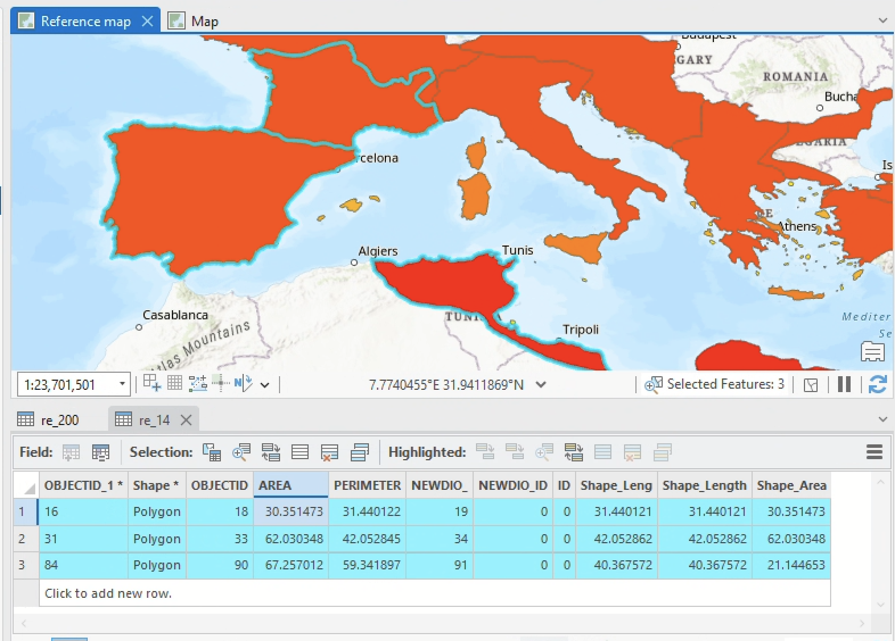
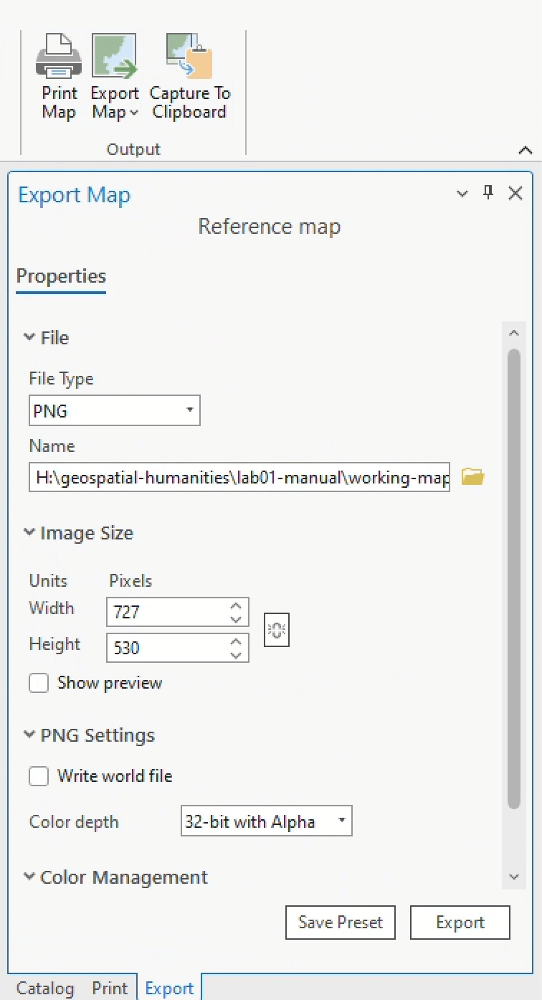

<script type="module" src="../../../assets/js/script.js"></script>
<script type="module">
  const scriptUrl = new URL('_import/assets/js/script.f6e5b1ef.js', import.meta.url).href;
  import(scriptUrl).then(module => {
    module.images();
  })
</script>

# Lab 01: Assessing the terrain <!-- omit in toc -->

<div class="intro">

[](https://credo.library.umass.edu/view/zoom/mufs001-xn-i0714)

```js
import yaml from 'js-yaml';
const response = await FileAttachment("../../../data/labs.yaml").text()
const data = yaml.load(response)
const d=[data[0]]
view(Inputs.table(d, {width:{subtitle:200},disabled: "true",columns: ["subtitle","assigned","due"],header: {subtitle: "Activity",assigned: "Assigned",due: "Due"}}))
```

*This lab walks through the process of creating a basic map using ArcGIS Pro and data from the [Ancient World Mapping Center](https://awmc.unc.edu/) (AWMC). It is broken into five sections:*

<ol class="circle-list">
<li>Preparing your workspace</li>
<li>Downloading your data</li>
<li>Understanding your interface</li>
<li>Making your map</li>
<li>Creating your layout</li>
</ol>

By **Wednesday, February 5 at 11:59pm**, [submit to Canvas](#questions-and-deliverables):

* your map, exported in `.png` format
* answers to the questions in <span style="border: dotted 2px #47a954;background-color:#d8fedd;font-family:monospace;font-size:0.8em;padding:0.2em;">green boxes</span>, compiled and submitted in a `.doc`, `.odf`, or `.pdf` file

<details class="noselect">
<summary><i>Full table of contents</i></summary>

- [Preparing your workspace](#preparing-your-workspace)
  - [Choosing a workspace location](#choosing-a-workspace-location)
  - [Option A: Manually set up a workspace](#option-a-manually-set-up-a-workspace)
  - [Option B: Let ArcGIS Pro set up your workspace](#option-b-let-arcgis-pro-set-up-your-workspace)
- [Downloading your data](#downloading-your-data)
- [Understanding your interface](#understanding-your-interface)
  - [Project tab](#project-tab)
  - [The Ribbon](#the-ribbon)
  - [Catalog pane](#catalog-pane)
  - [Contents pane](#contents-pane)
  - [Map view](#map-view)
    - [Attributes](#attributes)
    - [Symbology](#symbology)
  - [Command search box](#command-search-box)
- [Making your map](#making-your-map)
  - [Specifications](#specifications)
  - [Example map](#example-map)
- [Questions and deliverables](#questions-and-deliverables)
- [Submit](#submit)

</details>
  
</div>

<div class="question">

## Preparing your workspace

Before starting a mapping project, you <span class="key">must</span> set up a workspace. By "workspace," I mean a dedicated folder on your computer where you'll store your project files. Creating a sensible workspace structure is a love letter to your future self. By the end of the term, you will have downloaded many gigabytes of spatial data, created at least a dozen ArcGIS Pro projects, and produced hundreds—maybe even thousands—of derivative spatial data files. Practicing disciplined file organization from the start is an important part of setting yourself up for success in this course (and in any situation where you're working with lots of files).

### Choosing a workspace location

In the context of this class, there are three places where you might choose to set up your workspace:

* your personal `H: Drive`—<span class="key">recommended</span>
* your Tufts Box account—<span class="key">not recommended</span>
* a personal thumb drive
* a location on your computer's hard drive—<span class="key">only</span> if you are using a personal computer

This lab assumes—as will all activities, labs, and assignments for this course—that you are working from a computer in the Tufts Data Lab and that you are saving and storing project files to your Tufts `H: Drive`.

The `H: Drive` is recommended because it provides easily accessible, stable cloud storage that is automatically present on all Data Lab computers and can be configured for your personal computers as well. That doesn't mean you *must* use the `H: Drive`. You should choose a workspace location that makes the most sense for your situation—but if you pick one of the other methods, just make a mental note that some instructions in this lab may look different.

<div class="callout">
<p>

If you plan to use the `H: drive` on a personal computer, you have to manually connect to it.</p>
<p>

Follow [these instructions to map your `H: drive`](https://canvas.tufts.edu/courses/63026/pages/data-lab-resources?module_item_id=1589931) on your personal computer.</p></details>
</div>

Once you've chosen a workspace location, you can proceed to actually setting up the workspace structure.

With ArcGIS Pro, you can either set up a workspace manually or automatically. Let's try each one. 

### Option A: Manually set up a workspace

To manually set up a workspace:

1. Open **Windows File Explorer** (the yellow folder icon at the bottom of your screen).
2. Click on `This PC` > `H: Drive`. You'll probably see an empty folder:

    <figure>
    
    <figcaption>

    H: Drive in Windows File Explorer</figcaption>
    </figure>

3. Your directory structure should resemble the following:

        geospatial-humanities/
        ├─ lab01-manual/
            ├─ downloaded-data/
            ├─ working-maps/
            ├─ for-submission/

4. Go ahead and create a folder called `geospatial-humanities`. You can do this by clicking "New" > "Folder", or right-clicking in the empty space and choosing "New Folder."

5. Then, click into the `geospatial-humanities` folder and make another folder called `lab01-manual`.

6. Finally, inside of *that* folder, create three folders: `downloaded-data`, `working-maps`, and `for-submission`. You'll save all data files to the `downloaded-data` folder; you'll store your ArcGIS Pro project files in the `working-maps` folder; and you'll put all your exported final maps—as well as any other graded content—in the `for-submission` folder. 

    <figure>
    
    <figcaption>
    
    Workspace folder structure</figcaption>
    </figure>

7.  Now, in the **Search Bar** at the bottom of your desktop screen, type "ArcGIS Pro" and double-click the application to open it. 
8.  Click `Map`.
9.  When it's open, you should see something like this:

    <figure>
    
    <figcaption>
    
    The landing page for ArcGIS Pro</figcaption>
    </figure>

10. Click `Map`.
11. When the dialog box appears, uncheck "Create a folder for this project" and then click the yellow folder icon:

    <figure>
    
    <figcaption>
    
    Creating a new project</figcaption>
    </figure>

12. A window titled "New Project Location" will appear. Navigate to the workspace you just made, click *on* the `working-maps` folder—not *into* it—and then click `OK`:
    
    <figure>
    
    </figure>

    <div class="callout">
    <p>

    Note that the default save location is the `C: drive`. If you keep your work here, it <span class="key">will not</span> be saved, as the `C: drive` of Data Lab computers is wiped every night.</p>
    <p>

    </div>

    When you've done this, the "Location" of your new project should update to something like `H:\geospatial-humanities\lab01-manual\working-maps`.

    Click `OK` again.

13. ArcGIS Pro will start to boot up. It might think for a minute or two as part of its sundry geospatial ablutions ("Creating geoprocessing cache..."). When it's done, you'll see this:

    <figure>
    
    <figcaption>
    
    The ArcGIS Pro application</figcaption>
    </figure>

14. By default, ArcGIS Pro projects load two "base map" layers: the `World Topographic Map` and the `World Hillshade`. You don't have to keep these on, but they can be a helpful reference as you orient yourself to the application. As a reference for these two default layers:

    * A [topographic map](https://en.wikipedia.org/wiki/Topographic_map) is a kind of reference map displaying qualitative features like place names alongside quantitative features like elevation (usually in contour lines)
    * A [hillshade](https://earthquake.usgs.gov/education/geologicmaps/hillshades.php) is a cartographic technique that uses elevation data to simulate the effects of the sun (e.g., shadows) in a 2-D map

15. Open your workspace by clicking Windows File Explorer and navigate to your `working-maps` folder. Now, a bunch of files and folders should appear:

    <figure>
    
    </figure>

You <span class="key">must not</span> delete, change location of, futz with, or otherwise disturb these files. They are required for your ArcGIS project to function. The exception is the file `lab01.aprx`, which is your ArcGIS Project file. You can double-click this to open your project... but that's it!

### Option B: Let ArcGIS Pro set up your workspace

Alternatively, you can let ArcGIS Pro set up your workspace for you. The upside of this is that it's easier; the downside is that the workspace it produces is not as configurable. It can be harder to extract the contents of your project for use in a software environment other than ArcGIS Pro.

1. In the ArcGIS Pro application, click `Project` > `New` > `Map`. The "New Project" dialog box will appear again. 
2. Name your project `lab01-automatic`. **Make sure the box that says "Create a folder for this project" is checked**. 
3. Click the yellow folder icon to "Browse" your File Explorer.
4. Navigate to your `H: drive` and click on the `geospatial-humanities` folder...
   
    <figure>
    
    </figure>

    ... and click `OK`. Now the location of your new project should read `H:\geospatial-humanities`.

5. Click `OK` again. After a little bit of thinking, you should see a new ArcGIS Pro.
6. Open Windows File Explorer again and take a look at your `geospatial-humanities` directory. You should now have two folders—one called `lab01-manual` and one called `lab01-automatic`—each containing different project files.

Now that you've set up your workspaces, pick one of them to actually continue working in for the rest of the lab. **The rest of this tutorial will assume you are using the `lab01-manual` workspace.**

<div class="q">
Why is defining a workspace important for geospatial projects? In this class, what are three possible locations where you can set up a workspace?
</div>

## Downloading your data

The map you'll make in this lab is a [general purpose reference map](https://www.e-education.psu.edu/geog486/node/641), or a map that displays features of interest to your desired audience. In this case, we're imagining an audience who is interested in the geography of the ancient world. Your reference map of features in the ancient world will use data provided by the [Ancient World Mapping Center](https://awmc.unc.edu/) (AWMC).

<div class="aside">
<p>

[GitHub](https://github.com/) is a popular web application for version control. It's used by digital humanities scholars, computer programmers, and much more. Check out [Dan Shiffman's videos about GitHub](https://www.youtube.com/watch?v=BCQHnlnPusY) if you want to learn how it works.</p>
</div>

To download your data:

1. Navigate to the AWMC's GIS data page (<https://awmc.unc.edu/gis-data/>), and then click "AWMC Geodata Github Repository."

2. The Geodata Repository is basically an annotated file directory. On the home page, AWMC provides [some context](https://github.com/AWMC/geodata/tree/master?tab=readme-ov-file#directory-format) for the file formats in which they publish their data: GeoJSON (`.geojson`) and shapefile (`.shp`). These are two of most common spatial data file formats that you will encounter in this class, and we'll talk a lot more about them in Week 4. For now, suffice to say that each format provides a different approach to encoding features about the world as one of three geometries: *points*, *lines*, and *polygons*. Shapefiles are a [proprietary format developed and maintained by Esri](https://pro.arcgis.com/en/pro-app/latest/help/data/shapefiles/working-with-shapefiles-in-arcgis-pro.htm), the makers of ArcGIS software. GeoJSON is an [open-source spatial data format](https://geojson.org/).

3. Because ArcGIS Pro does not provide inherent support the GeoJSON format (🙄), we are going to download the shapfile folders. Click on the file `Cultural Shapefiles for Apr 2024.zip`. This is a "zipped" or compressed folder. To initiate the download, click the download icon at the upper-right hand side of the new page:

    <figure>
    
    </figure>

4. The file should end up in the `Downloads` folder of your `C: Drive` (`This PC` > `Users` > `yourUserName` > `Downloads`). Locate it, and then move it into the `downloaded-data` folder in your workspace.

    I recommend opening two Windows File Explorer windows and manually dragging the zipped file from `Downloads` to `downloaded-data`, like so:

    <figure>
    
    </figure>

5. Unzip the data by right-clicking on the file `Cultural Shapefiles for Apr 2024.zip` > `Extract all...`. Double-check that the folder where files will be extracted resembles...

        H:\geospatial-humanities\lab01-manual\downloaded-data\Cultural Shapefiles Apr 2024
    
    ... then, click `Extract`. It may take a minute or two, but when the extraction is complete, you should see a new "unzipped" folder containing folders like `aqueducts`, `dams`, `mines_quarries`, and more.

6. Repeat steps 3-5 for the folder `Physical Shapefiles for Apr 2024.zip`.

When you are done, you should have 4 folders in your `downloaded-data` directory: 2 zipped files containing cultural and physical shapefiles, and 2 extracted or "unzipped" folders containing the same.

<div class="q">
What are the two geospatial data formats that you downloaded?
</div>

## Understanding your interface

The ArcGIS Pro interface is pretty complex. It could take you a while to wrap your head around it. Here's the basic idea:

<ol class="circle-list">
  <li><b>Project tab:</b> Provides access to application settings and other configurable properties</li>
  <li><b>The Ribbon:</b> Organizes commands on a series of tabs, like "Map", "Insert", "Analyze", and more</li>
  <li><b>Command Search box:</b> Helps you find and open geoprocessing tools</li>
  <li><b>Contents pane:</b> Displays all layers in the current project</li>
  <li><b>Map view:</b> Your window into visualizing and editing spatial data</li>
  <li><b>Catalog pane:</b> A simulation of your Windows File Explorer, but with geospatial functionality</li>
</ol>

<figure>

<figcaption>

The ArcGIS Pro application (image adapted from [Esri docs](https://pro.arcgis.com/en/pro-app/latest/get-started/user-interface.htm))</figcaption>
</figure>

Let's take a tour through these components.

### Project tab

Click the **Project tab**. Your ArcGIS Pro project should momentarily disappear, hidden by a list of application settings.

In this tab, you can do standard things like "Save Project" and "Save Project As", but you can also click the "Options" button to fiddle with a variety of settings in your project environment.

Don't mess with any of it right now, but you may choose to customize some of these settings once you get a handle on the software.

<div class="tip">
<p>

If you hover your cursor over almost anything in ArcGIS Pro and let it linger for a second, the name of the tool and a short description of it will appear.</p>
</div>

### The Ribbon

Close the "Options" window and click the back arrow at the top-left hand corner of the screen to return to your project. The horizontal gallery of buttons stretching across the top of your application window is **the Ribbon**:

<figure>

<figcaption>

The ribbon in ArcGIS Pro</figcaption>
</figure>

Each **tab** in the Ribbon provides access to a variety of different **groups**, each of which contains **tools** for interacting with spatial data. For example, the **Map tab**, which should be active by default, contains a **Navigation group** with features that allow you to pan, zoon, and create bookmarks around your project:

<figure>

</figure>

Try a couple of them out:

1. Make sure the "Explore" button is active

2. Click on the map and drag around

3. Scroll in and out of the map

4. Now try zooming into Alexandria, Egypt (along the northern coast)

5. Once you're there, click `Bookmarks` > `New Bookmark...`:

    <figure>
    
    <figcaption>

    The bookmark tool in the Navigation group of the Map tab</figcaption>
    </figure>

6. Name it "Alexandria" and click `OK`.

7. Now, in the **Navigation group**, click the `Previous Extent` button a few times. This button looks like a back arrow: 

8. Click it until you're pretty far away from Alexandria. As named, this button returns you to the previous extent of the **Map view**. It's particularly useful if you ever get "lost" in your map, like scrolling too deep in or out.

9. Once you've scooted yourself sufficiently far from Alexandria, click the `Bookmarks` button again. Now, you should see a little card that says "Alexandria." Click it to instantly return there.

Other features in the Ribbon will become more useful when you add data to the project. There are a few ways to add data, and one of them is in the Ribbon itself, in the **Layer** group of the **Map** tab:

10. Click the "Add Data" button (). It will open a new "Add Data" window.

11. Navigate to the folder where you saved your spatial data (it should be in something like `Folders` > `gisusers$ (H:)` > `geospatial-humanities` > `lab01_manual` > `downloaded-data`)

12. Click into `Cultural Shapefiles Apr 2024` > `political_shading` > `roman_empire_ad_14_extent`

13. In that folder, you should see one file: `roman_empire_ad_14_extent.shp`. Select it and click `OK` to add it to the project.

14. When the data is added, your **Map** view should automatically reset to the data's extent. In this case, you are looking at the extent of the Roman Empire in the year CE (AD) 14:

    <figure>
    
    </figure>

    Nice! You've just added your first spatial data layer to an geospatial project. But what can you actually *do* with it?

15. With the "Explore" tool active, click on one of the spatial data features in the **Map** view. You can always use the "Explore" tool to quickly inspect the characteristics of a spatial data feature. When clicked, a pop-up window should appear:

    <figure>
    
    </figure>

    The pop-up window displays this feature's **attributes**, including fields like `AREA`, `PERIMETER`, `NEWDIO_`, and more. It's not immediately clear what some of these fields actually mean (like `NEWDIO_`), and even in cases where you *can* tell what a field means (like `AREA`), the units of measurement may not be clear. This is a common experience when working with spatial data.

16. Now, in the **Selection** group of the **Map** tab, click "Select."

    <figure>
    
    </figure>

17. Try selecting a few features from the **Map view**. You can click on features individually; hold down `shift+click` to select multiple features; or drag a box to select by area.

18. Once your features are selected, click the "Attributes" button in the **Selection** group. A new **Attributes** pane will appear in the same spot as the **Catalog** pane.

19. Click through different features in the layer `roman_empire_ad_14_extent`—each one is identified by a numerical ID—to reveal their attributes:

    <figure>
    
    </figure>

20. Finally, if you right-click on any of the features in the **Attributes** pane, you'll see more options for interacting with the features. Select a feature and click "Zoom To":

    <figure>
    
    </figure>

    It will instantly zoom you to that feature in the **Map view**. When you're done inspecting the feature, click the "Previous Extent" button to return to your view of the full data layer.

<div class="q">
<p>

Using the "Select" tool and the **Attributes** pane, what is the area and perimeter of feature `7`, feature `50`, and feature `113`?</p>

(Make sure to click the "Clear" button in the **Selection** group when you're done; this will get rid of those blue lines in your **Map view**.)
</div>

### Catalog pane

When you opened the **Attributes** pane, the **Catalog** pane may have mysteriously disappeared. If it did, you can reopen it by clicking on the "Catalog" tab at the bottom right-hand side of the application:

<figure>

</figure>

This is a good moment to observe that the whole ArcGIS Pro project interface is visually reconfigurable. Try clicking the thumbtack button at the top right-hand corner of the **Catalog** pane:

<figure>

</figure>

Both your **Catalog** and **Attributes** panes should collapse onto the sidebar. You can also click the little v-shaped button to its left to "float" the pane, and if you prefer your panes to be docked in a different part of the screen, you can click and hold that top bar to reorganize them. If you want to dispose of a pane altogether, you can close it by clicking the `ｘ`.

<div class="callout">

If you ever close a pane (perhaps by accident) and you need to find it again, open the **View** tab and look at the "Windows" group. It has a variety of options for restoring panes.

<figure>

<figcaption>

The "Windows" group in the View tab
</figcaption>
</figure>
</div>

But let's return to the **Catalog** itself.

The **Catalog** essentially functions as a view into your computer's files. You can use it to navigate and traverse file directories in the same way you would use Windows File Explorer. This means you can use it to add data to the project:

1. In the `Folders` directory of the Catalog pane, navigate to your data (if you don't see your `H: drive`, you may need to right-click on `Folders` > `Add Folder Connection` and find your `H: drive`)

2. Click into `Cultural Shapfiles` > `political_shading`

3. Load the following spatial data by dragging the `extent` shapefile from its folder in Catalog and releasing it in the **Map view**:

   * `roman_empire_ad_69_extent`
   * `roman_empire_ad_117_extent`
   * `roman_empire_ad_200_extent`

    As you drag and drop each of these files into the map, notice how they cascade into the **Contents** pane.

    Once you've done so, the project should resemble:

    <figure>
    
    </figure>

    This "drag and drop" method can be a little quicker than the "point and click" method that you used by clicking the "Add Data" button in the **Ribbon**.

4. The **Catalog** pane, in addition to providing a view into the files on your computer via the "Folders" tab, also provides options for you to view "Maps" and "Databases".

5. You can use the **Catalog** to interact with maps inside your ArcGIS Pro Project. First, unfold the "Maps" tab, and you'll see an object titled "Map." Right-click it, choose "Rename," and give it a new name—maybe something like "Reference map." (You can also rename a file by clicking it once while it's already highlighted, just like most other file explorer applications.)

    Now, right-click on "Maps" and choose "New map." This will create a new, empty map view, titled "Map" by default. You can rename this one too, if you want. You should now see something like this, with two tabs in your **Map** pane corresponding to two map objects in your **Catalog** pane:

    <figure>
    
    </figure>

6. You can also use the **Catalog** to interact with your project's *[geodatabase](https://pro.arcgis.com/en/pro-app/latest/help/data/geodatabases/overview/fundamentals-of-the-geodatabase.htm)*.

    Since my project is named `lab01`, you should see a geodatabase named `lab01` under "Databases" in the **Catalog** pane:

    <figure>
    
    </figure>

    A geodatabase can store various types of geographic datasets. You can import the shapefiles you've loaded in your project as "Feature classes" in the `lab01` geodatabase.

    To do so, right-click `lab01` > `Import` > `Feature Class(es)`. This will open a tool called "Feature Class To Geodatabase." From the "Input Features" drop-down menu, select the four data layers you're already loaded into your map:
    
    <figure>
    
    </figure>
    
    Then, click "Run." A little green bar will appear at the bottom of the screen letting you know when the tool has finished running.

7. When it's done, click the "Back" button at the top left-hand corner of the tool panel. This will return you to a **Catalog** pane and geodatabase that contains four new "Feature Classes," each bearing the same name as the layers in your map:

    <figure>
    
    </figure>

8. Currently, the feature class inside your geodatabase is a separate file from the layers in your map. Let's confirm this by examining their file paths, or the strings of text that specify where these files are stored on your computer.

<div class="q">

On the layer `roman_empire_ad_14_extent` in your **Contents** pane, right-click > "Properties" > "Source". What is the **data type** and **file path** of the layer `roman_empire_ad_14_extent` in your **Contents** pane?

Now, on the similarly-named feature in the **Catalog** pane, right-click > "Properties" > "Source". What is its **data type** and **file path**?

</div>

When you work with spatial data files in a software like ArcGIS Pro, it's important to remember that your project—the `lab01.aprx` file in which you're currently working—doesn't save "data" directly to the project. All of the geographic features that you create, edit, and analyze are representations of *other data objects* saved in various places, such as:

* the `Downloads` folder on your `C:` drive (<span class="key">very bad</span>, never do this)
* a specified `data` folder in the project workspace of your `H:` drive (much better, <span class="key">nice!</span>)
* a `gdb` associated with your current ArcGIS Pro project (much better, <span class="key">nice!</span>)

The **Catalog** pane gives you one view into the inner workings of your `.aprx` file. In this sense, a standard ArcGIS Pro project structure kind of resembles that meme of Charlie from *It's Always Sunny* standing in front of the conspiracy board. An `.aprx` is a big, complicated pile of fragile file paths—and if you move any of the actual files themselves, the `.aprx` will break.


### Contents pane

You've interacted with the **Contents** pane on the left-hand side of your project interface a lot already.

You can use it to perform basic spatial data organization tasks like...

* changing the render order of layers by clicking and dragging
* toggling layers on and off by clicking the checked box
* renaming layers by right-clicking > `Rename`

Try each of these. Drag the layers around so that they are ordered differently. Toggle some layers on and off by checking the box. Rename a layer or two.

You can also use the **Contents** pane to access, examine, and edit critical layer properties like...

* a layer's attribute table
* a layer's symbology
* a layer's metadata

Right now, the **Contents** pane lists all of the data layers that you've added to your project. This should include four layers showing the historical extent of Roman Empire at four different years.

Let's add a few more.

1. Using the **Catalog** pane, go ahead and add the four layers from `lab01.gdb` to the map as well. You can do so by dragging and dropping them into the **Map** view, or right-click > "Add to Current Map".

2. Now 10 layers should appear in your map:
   * Your base map layers, `World Topographic Map` and `Hillshade`
   * Two layers each of Roman Empire extent at various years

3. At the top of the **Contents** pane—that is, below the "Search" bar and above the "Drawing Order" label—you should see several icons in a horizontal row. When clicked, each of them allows you to filter layers in the **Contents** pane by different parameters.

4. Click the cylinder (if you hover your cursor over it, it'll read "List By Data Source").

    <figure>
    
    <figcaption>

    List layers in contents pane by their data source
    </figcaption>
    </figure>

5. Once clicked, the organization of the layers in your **Contents** pane will change. If you drag the **Contents** pane so that it's a little wider—and collapse all entries so that only the data *source* is showing—you should see something like this:

    <figure>
    
    <figcaption>

    List layers in contents pane by their data source
    </figcaption>
    </figure>

6. There are two important takeaways to glean from sorting the layers in this way.
   * First, the four layers in your `lab01.gdb`—or more appropriately, the *feature classes*—all share the same source; that is, `lab01.gdb`
   * Second, the four layers from your `downloaded-data` folder—or more appropriately, the *shapefiles*—all share a different source; that is, their parent folder
   * Third, the two base map layers have sources that resemble URL structures, e.g., beginning with `https://`. These data layers are stored on Esri "cloud" servers and delivered via two file transfer services, respectively called [content delivery networks](https://en.wikipedia.org/wiki/Content_delivery_network) and [REST services](https://developers.arcgis.com/rest/services-reference/enterprise/get-started-with-the-services-directory/), and you don't need to know how these work but it's good to know that they exist

It matters a lot that these data layers have different sources. That I'm asking you to recognize their difference might feel pedantic, but it's actually pretty critical to keeping your projects and workflows organized.

When you're working on mapping projects, you <span class="key">must</span> always understand where your data layers are sourced. If you don't know this, you could make huge mistakes that waste you lots of time, progress, and even money. 

Of course, we don't need two of every Roman Empire extent layer in our working map, so let's cut out one of the groups. The layers in the `downloaded-data` <span class="key">should</span> be reserved as clean copies of the original dataset; following that logic, we can remove them following this simple workflow.

1. Click the top layer in the "stack" of layers sourced from `downloaded-data`

2. While holding down the `shift` key, select the bottom layer in the stack (this will select all the layers in between as well)

    <figure>
    
    <figcaption>

    List layers in contents pane by their data source
    </figcaption>
    </figure>

3. On any of the layers you just selected, right-click > "Remove"

4. Your layers should disappear from the **Contents** pane.

5. Toggle the filter of your **Contents** pane back to "List By Drawing Order" (the icon directly to the left of the "List By Source" cylinder)

Before proceeding to the next section, simplify your four data layer names. For each layer, right-click > "Rename" (or click the layer when it's already selected) and give it a simpler name, e.g., `roman_empire_ad_14_extent` > `re_14`

### Map view

The **Map** view is where the magic happens: this view, in the center of your project interface, displays the position of your spatial data layers on a dynamic coordinate system. You can interact with the map, and its contents, by using different commands in the "Map" tab that we discussed above (such as "Add Data" or "Explore").

Two of the most important features displayed in the **Map** view are actually accessed through the **Contents** pane: *attributes*, or the descriptive information associated with geographic features, and *symbology*, or the cartographic choices associated with attributes. Let's look at each of them in turn.

#### Attributes

Earlier, I mentioned the "attribute table." This is one of the most important features of any geographic information system. The attribute table ties geographic features to descriptive information, allowing you to connect qualitative and quantitative observations about the world with their real-life locations. Thanks, attribute table!

You can open the attribute table by interacting with layers in the **Contents** pane. The attribute table itself will open in the **Map** view.

1. The **Attribute Table** displays all of the qualitative and quantitative information associated with a given layer. To open it, you can right-click a layer > "Attribute Table" or click on a layer and press `ctrl+T`.

2. Open the attribute table for the layer `re_200`. Make sure it's sorted at the top of your "stack" of layers.

3. You should see something like this:

    <figure>
    
    <figcaption>

    The attribute table
    </figcaption>
    </figure>

4. The attribute table stores important qualitative and quantitative details about the geometric features represented on the map. Each feature in the map corresponds to a row in the attribute table. Let me say that again: **each feature in the map corresponds to a row in the attribute table**. Very important to recognize this!

5. In the attribute table, columns are called "fields" or "attributes," while rows are called "records" or "features."

6. You can "Select" a record by clicking the **record number**, or the leftmost cell in the row (the one to the left of the `OBJECTID_1` column).

7. Select the record with an `OBJECTID_1` value of `1`. It should be at the very top of your attribute table. If it isn't, you can double-click on `OBJECTID_1` and toggle the sort order of the attribute table (e.g., between low-to-high and high-to-low).

    <div class="extra">
    
    Note that there are two fields with similar names in this attribute table: `OBJECTID_1` and `OBJECTID`. Looks kind of weird, right? For 3.75 points of extra credit (5% of your grade on this lab), explain in no more than 2 sentences why this happened. (To accomplish this, you may have to do some snooping; e.g., compare the attribute table of your `lab01.gdb` feature classes against those of your `downloaded-data` shapefiles.)

    </div>

8. Selecting a cell will highlight the whole row, as well as the corresponding geographic feature on the **Map** view, in light blue.

9.  However, depending on the scale and region of your **Map** view, it may be hard to see the row that you've selected in the **Map** view.

10. You can right-click on the row number to zoom to a specific feature; that is, right-click > "Zoom To", or the keystroke `ctrl+=`.

11. Try zooming to the feature with a an `OBJECTID_1` value of `1` (you can also zoom to a feature by double-clicking the record number). Your screen should resemble:

    <figure>
    
    <figcaption>

    Zoomed-in view of a selected feature
    </figcaption>
    </figure>

    <div class='q'>
    
    Use the attribute table to determine the following for the layer `re_200`:
    * In total, how many features does the attribute table contain?
    * What is the `OBJECTID` value of the feature with the **largest `area`**?
    * What is the **name** of the feature with an `OBJECTID_1` value of `1`? Since there's no attribute for "Feature name," you may have to toggle your layers on and off.

    </div>

If this feels like a familiar process, that's because, it is! You did something similar to this already when answering [Question 3](#q-3). In the section of this lab on the [Ribbon](#the-ribbon), you used the "Selection" group of the **Map** tab to query and filter attribute data:

<figure>

<figcaption>

The selection group in the "Map" tab of the Ribbon
</figcaption>
</figure>

When you're using ArcGIS Pro---and really, when you're doing *any* geospatial project, whether using this software or not---there are almost always multiple ways to answer the same question.

Before proceeding to the next section:

1. Right-click on any of the layers in your **Contents** pane and choose "Zoom to Layer." This will snap your **Map** view to that data layer's geographic extent.
2. In the "Selection" group of the **Map** tab, click "Clear"

#### Symbology

In ArcGIS Pro, **symbology** entails all aspects of cartographic representation. The color of a polygon, the thickness of a line, and the icon used for a point are all determined in the "Symbology" tab of a layer's properties.

1. To access a layer's symbology, simply right-click > "Symbology". Try it out on the layer `re_14` (just make sure that layer is at the top of the "stack" in your **Contents** pane).

2. A new **Symbology** window should replace your **Catalog** pane:

    <figure>
    
    <figcaption>

    The attribute table
    </figcaption>
    </figure>

3. Click the color swatch next to the word "Symbol":

    <figure>
    
    </figure>

4. Choose a new color for the feature.

5. First, click a design from the "Gallery" of preset colors. These come off the shelf of ArcGIS Pro. When you click one of the options, the feature will automatically update in the **Map** view.

6. Next, click the "Properties" tab and try defining your own color, outline, and outline width. When you've made your choices, you need to click "Apply" to apply them to the **Map** view. Then, click the `<-` arrow to return to the main **Symbology** pane.

    <figure>
    
    </figure>

7. You can also symbolize features based on attributes in the attribute table. Click the drop-down bar under the "Primary Symbology" header and select "Graduated Colors". This will automatically redraw your `re_14` layer, likely using the `OBJECTID_1` field. You should see something like this:

    <figure>
    
    </figure>

8. The `OBJECTID_1` field isn't very useful to symbolize. Because it's just an metadata value, it doesn't show us meaningful data or spatial patterns. Unforunately, there aren't many meaningful fields baked into the `re_14` layer, but go ahead and try setting the value of "Field" to `AREA`. Feel free to play around with the "Color scheme" as well.

9. Now choose the "Select" tool from the **Map** tab.

10. Open the attribute table for `re_14`. If you never closed your attribute table for `re_200`, you'll see this second one appear in a new tab. Click the "Show Selected Records" button as indicated in the screenshot below:

     <figure>
    
    </figure>

11. This view of the attribute table allows you to view only records that are currently selected in the **Map** view. Try selecting a few features and you'll see that the view of the attribute table dynamically populated based on what you've selected:

    <figure>
    
    </figure>

12. Try selecting the 3 features that overlap modern-day Tunisia, Algiers, Spain, and France. You'll have to hold down the `shift` key while you're clicking each one.
    
    <figure>
    
    </figure>

13. Now, in the attribute table, right-click the `AREA` header and select "Summarize". This will open the handy [Summary Statistics](https://pro.arcgis.com/en/pro-app/latest/tool-reference/analysis/summary-statistics.htm) tool, which you can use to calculate summary statistics for fields in an attribute table.

    Complete the form so that it resembles the following, and then click "OK":

    <figure>
    
    </figure>

14. Once the tool has finished running, a new table titled `re_14_Statistics` should appear under a new header called "Standalone tables" in your **Contents** pane.

15. Right-click in the `Area` column of the table and select "Visualize Statistics".

16. A chart titled `Distribution of AREA` should appear under a header called "Charts" in your **Contents** pane. Double-click on the `Distribution of AREA` layer, and a chart should appear on the right-hand side of your screen:

    <figure>
    
    </figure>

    <div class="q">

    Examine the "Statistics" section of the "Chart Properties" for `re_14`. What is the **sum** of:
    * the whole dataset?
    * your selection?

    </div>

Once you've answered this question, you can:

* Remove the `Distribution of AREA` layer from the **Contents** pane
* Close out of the "Chart Properties" dialog box
* Click the **Map** tab in the **Ribbon** to return to a more familiar interface

### Command search box

If you ever get lost searching for something in ArcGIS Pro—e.g., any of the many things that have been discussed so far in this lab—try typing it out in the **Command Search Box** at the top of the screen, just to the right your `.aprx` file name:

<figure>

<figcaption>

The command search box

</figcaption>
</figure>

## Making your map

Although this was far from an exhaustive tour of the ArcGIS Pro interface, it's given you a basic overview of how to:

* Organize your project and project files using **Windows File Explorer** and the **Catalog** pane
* Interact with ArcGIS Pro's interface
* Load and remove spatial data layers using things like the **Catalog** and **Contents** pane
* Query and filter spatial data attributes using the "attribute table"
* Basic symbolization via the **Symbology** pane

Believe it or not, this is enough for you to make a basic map! So go forth and do that.

You've downloaded a bunch of data from the Ancient World Mapping Center. (AWMC) Right now, it's saved in your `downloaded-data` folder.

To finish this lab, add **at least 5 more AWMC data layers** to your project, not including one of the Roman Empire extent layers. Try to use a combination of data from the `Physical Shapefiles` folder and the `Cultural Shapefiles` folder.

### Specifications

Your final map should include, at minimum:
* 1 of the Roman Empire extent layers
* 5 additional physical and cultural layers
* Some kind of symbology applied to all your layers
* All layers must be clearly visible at the scale of your exported map

Most importantly, your map:
* Does not need to look pretty or fancy!
* This is an exercise in working with ArcGIS Pro and spatial data—<span class="key">NOT</span> an exercise in cartographic design

A few tips:
* If you load a dataset but can't determine its geographic extent, try right-clicking on the layer and selecting "Zoom To Layer"
* <span class="key">IMPORTANT:</span> To export your map as a `png` file, click the "Share" tab of the **Ribbon**, Click "Export Map", select `PNG` as the "File Type", choose a suitable file path for export, and click "OK"

<figure>

</figure>

### Example map

Here is a sample map containing 6 layers:
1. the Roman Empire extent in 14 AD
2. inland water
3. urban footprint
4. forts
5. mines & quarries
6. rivers

<figure>

</figure>

## Questions and deliverables

* [Question 1](#q-1)
* [Question 2](#q-2)
* [Question 3](#q-3)
* [Question 4](#q-4)
* [Question 5](#q-5)
* [Question 6](#q-6)
* [Instructions on submitting your map](#specifications)

## Submit

<a class="submit" target="blank" href="https://canvas.tufts.edu/courses/63026/assignments/480017">Submit Lab 01</a>

</div>