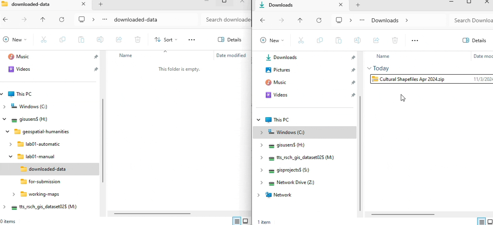

# Lab 01: Assessing the terrain

```js
const images = document.querySelectorAll('figure img');
images.forEach(img => {
    img.style.cursor = 'pointer';
    img.addEventListener('click', () =>{
        window.open(img.src, '_blank');
    })
})

let count = 1;
const questions = document.querySelectorAll('.q');
questions.forEach(q => {
    const id = `q-${count}`;
    q.id = id;
    const header = document.createElement("h4");
    header.textContent = `QUESTION ${count}`;
    const link = document.createElement("a");
    link.href = `#${id}`;
    link.appendChild(header);
    q.insertBefore(link, q.firstChild);
    count++;
});
```

[](https://credo.library.umass.edu/view/zoom/mufs001-xn-i0714)

This lab walks through the process of creating a basic map using ArcGIS Pro and data from the [Ancient World Mapping Center](https://awmc.unc.edu/) (AWMC). It is broken into five sections:

<ol class="circle-list">
<li>Preparing your workspace</li>
<li>Downloading your data</li>
<li>Understanding your interface</li>
<li>Making your map</li>
<li>Creating your layout</li>
</ol>

By the end of the lab, you'll produce a map that resembles...

By **Tuesday, January 28 at 11:59pm**, submit to Canvas:

* your map, exported in `.png` format
* answers to the questions in <span style="border: dotted 2px #47a954;background-color:#d8fedd;font-family:monospace;font-size:0.8em;padding:0.2em;">green boxes</span>, compiled and submitted in a `.doc`, `.odf`, or `.pdf` file

<div class="question">

## 1. Preparing your workspace

Before starting a mapping project, you <span class="key">must</span> set up a workspace. By "workspace," I mean a dedicated folder on your computer where you'll store your project files. Creating a sensible workspace structure is a love letter to your future self. By the end of the term, you will have downloaded many gigabytes of spatial data, created at least a dozen ArcGIS Pro projects, and produced hundreds—maybe even thousands—of derivative spatial data files. Practicing disciplined file organization from the start is an important part of setting yourself up for success in this course (and in any situation where you're working with lots of files).

### Choosing a workspace location

In the context of this class, there are three places where you might choose to set up your workspace:

* your personal `H: Drive`—<span class="key">recommended</span>
* your Tufts Box account—<span class="key">not recommended</span>
* a personal thumb drive
* a location on your computer's hard drive—<span class="key">only</span> if you are using a personal computer

This lab assumes—as will all activities, labs, and assignments for this course—that you are working from a computer in the Tufts Data Lab and that you are saving and storing project files to your Tufts `H: Drive`.

The `H: Drive` is recommended because it provides easily accessible, stable cloud storage that is automatically present on all Data Lab computers and can be configured for your personal computers as well. That doesn't mean you *must* use the `H: Drive`. You should choose a workspace location that makes the most sense for your situation—but if you pick one of the other methods, just make a mental note that some instructions in this lab may look different.

<div class="callout">
<p>

If you plan to use the `H: drive` on a personal computer, you have to manually connect to it.</p>
<p>

Follow [these instructions to map your `H: drive`](https://sites.tufts.edu/datalab/accounts-network-drives-windows10/) on your personal computer.</p></details>
</div>

Once you've chosen a workspace location, you can proceed to actually setting up the workspace structure.

With ArcGIS Pro, you can either set up a workspace manually or automatically. Let's try each one. 

### Option A: Manually set up a workspace

To manually set up a workspace:

1. Open **Windows File Explorer** (the yellow folder icon at the bottom of your screen).
2. Click on `This PC` > `H: Drive`. You'll probably see an empty folder:

    <figure>
    
    <figcaption>

    H: Drive in Windows File Explorer</figcaption>
    </figure>

3. Your directory structure should resemble the following:

        geospatial-humanities/
        ├─ lab01-manual/
            ├─ downloaded-data/
            ├─ working-maps/
            ├─ for-submission/

4. Go ahead and create a folder called `geospatial-humanities`. You can do this by clicking "New" > "Folder", or right-clicking in the empty space and choosing "New Folder."

5. Then, click into the `geospatial-humanities` folder and make another folder called `lab01-manual`.

6. Finally, inside of *that* folder, create three folders: `downloaded-data`, `working-maps`, and `for-submission`. You'll save all data files to the `downloaded-data` folder; you'll store your ArcGIS Pro project files in the `working-maps` folder; and you'll put all your exported final maps—as well as any other graded content—in the `for-submission` folder. 

    <figure>
    
    <figcaption>
    
    Workspace folder structure</figcaption>
    </figure>

7.  Now, in the **Search Bar** at the bottom of your desktop screen, type "ArcGIS Pro" and double-click the application to open it. 
8.  Click `Map`.
9.  When it's open, you should see something like this:

    <figure>
    
    <figcaption>
    
    The landing page for ArcGIS Pro</figcaption>
    </figure>

10. Click `Map`.
11. When the dialog box appears, uncheck "Create a folder for this project" and then click the yellow folder icon:

    <figure>
    
    <figcaption>
    
    Creating a new project</figcaption>
    </figure>

12. A window titled "New Project Location" will appear. Navigate to the workspace you just made, click *on* the `working-maps` folder—not *into* it—and then click `OK`:
    
    <figure>
    
    </figure>

    <div class="callout">
    <p>

    Note that the default save location is the `C: drive`. If you keep your work here, it <span class="key">will not</span> be saved, as the `C: drive` of Data Lab computers is wiped every night.</p>
    <p>

    </div>

    When you've done this, the "Location" of your new project should update to something like `H:\geospatial-humanities\lab01-manual\working-maps`.

    Click `OK` again.

13. ArcGIS Pro will start to boot up. It might think for a minute or two as part of its sundry geospatial ablutions ("Creating geoprocessing cache..."). When it's done, you'll see this:

    <figure>
    
    <figcaption>
    
    The ArcGIS Pro application</figcaption>
    </figure>

14. Open your workspace by clicking Windows File Explorer and navigate to your `working-maps` folder. Now, a bunch of files and folders should appear:

    <figure>
    
    </figure>

You <span class="key">must not</span> delete, change location of, futz with, or otherwise disturb these files. They are required for your ArcGIS project to function. The exception is the file `lab01.aprx`, which is your ArcGIS Project file. You can double-click this to open your project... but that's it!

### Option B: Let ArcGIS Pro set up your workspace

Alternatively, you can let ArcGIS Pro set up your workspace for you. The upside of this is that it's easier; the downside is that the workspace it produces is not as configurable. It can be harder to extract the contents of your project for use in a software environment other than ArcGIS Pro.

1. In the ArcGIS Pro application, click `Project` > `New` > `Map`. The "New Project" dialog box will appear again. 
2. Name your project `lab01-automatic`. **Make sure the box that says "Create a folder for this project" is checked**. 
3. Click the yellow folder icon to "Browse" your File Explorer.
4. Navigate to your `H: drive` and click on the `geospatial-humanities` folder...
   
    <figure>
    
    </figure>

    ... and click `OK`. Now the location of your new project should read `H:\geospatial-humanities`.

5. Click `OK` again. After a little bit of thinking, you should see a new ArcGIS Pro.
6. Open Windows File Explorer again and take a look at your `geospatial-humanities` directory. You should now have two folders—one called `lab01-manual` and one called `lab01-automatic`—each containing different project files.

Now that you've set up your workspaces, pick one of them to actually continue working in for the rest of the lab. **The rest of this tutorial will assume you are using the `lab01-manual` workspace.**

<div class="q">
Why is defining a workspace important for geospatial projects? In this class, what are three possible locations where you can set up a workspace?
</div>

## 2. Downloading your data

The map you'll make in this lab is a [general purpose reference map](https://www.e-education.psu.edu/geog486/node/641), or a map that displays features of interest to your desired audience. In this case, we're imagining an audience who is interested in the geography of the ancient world. Your reference map of features in the ancient world will use data provided by the [Ancient World Mapping Center](https://awmc.unc.edu/) (AWMC).

<div class="aside">
<p>

[GitHub](https://github.com/) is a popular web application for version control. It's used by digital humanities scholars, computer programmers, and much more. Check out [Dan Shiffman's videos about GitHub](https://www.youtube.com/watch?v=BCQHnlnPusY) if you want to learn how it works.</p>
</div>

To download your data:

1. Navigate to the AWMC's GIS data page (<https://awmc.unc.edu/gis-data/>), and then click "AWMC Geodata Github Repository."

2. The Geodata Repository is basically an annotated file directory. On the home page, AWMC provides [some context](https://github.com/AWMC/geodata/tree/master?tab=readme-ov-file#directory-format) for the file formats in which they publish their data: GeoJSON (`.geojson`) and shapefile (`.shp`). These are two of most common spatial data file formats that you will encounter in this class, and we'll talk a lot more about them in Week 4. For now, suffice to say that each format provides a different approach to encoding features about the world as one of three geometries: *points*, *lines*, and *polygons*. Shapefiles are a [proprietary format developed and maintained by Esri](https://pro.arcgis.com/en/pro-app/latest/help/data/shapefiles/working-with-shapefiles-in-arcgis-pro.htm), the makers of ArcGIS software. GeoJSON is an [open-source spatial data format](https://geojson.org/).

3. Because ArcGIS Pro does not provide inherent support the GeoJSON format (🙄), we are going to download the shapfile folders. Click on the file `Cultural Shapefiles for Apr 2024.zip`. This is a "zipped" or compressed folder. To initiate the download, click the download icon at the upper-right hand side of the new page:

    <figure>
    
    </figure>

4. The file should end up in the `Downloads` folder of your `C: Drive` (`This PC` > `Users` > `yourUserName` > `Downloads`). Locate it, and then move it into the `downloaded-data` folder in your workspace.

    I recommend opening two Windows File Explorer windows and manually dragging the zipped file from `Downloads` to `downloaded-data`, like so:

    <figure>
    
    </figure>

5. Unzip the data by right-clicking on the file `Cultural Shapefiles for Apr 2024.zip` > `Extract all...`. Double-check that the folder where files will be extracted resembles...

        H:\geospatial-humanities\lab01-manual\downloaded-data\Cultural Shapefiles Apr 2024
    
    ... then, click `Extract`. It may take a minute or two, but when the extraction is complete, you should see a new "unzipped" folder containing folders like `aqueducts`, `dams`, `mines_quarries`, and more.

6. Repeat steps 3-5 for the folder `Physical Shapefiles for Apr 2024.zip`.

When you are done, you should have 4 folders in your `downloaded-data` directory: 2 zipped files containing cultural and physical shapefiles, and 2 extracted or "unzipped" folders containing the same.

<div class="q">
What are the two geospatial data formats that you downloaded?
</div>

## 3. Understanding your interface

The ArcGIS Pro interface is pretty complex. It could take you a while to wrap your head around it. Here's the basic idea:

<ol class="circle-list">
  <li><b>Project tab:</b> Provides access to application settings and other configurable properties</li>
  <li><b>The Ribbon:</b> Organizes commands on a series of tabs, like "Map", "Insert", "Analyze", and more</li>
  <li><b>Command Search box:</b> Helps you find and open geoprocessing tools</li>
  <li><b>Contents pane:</b> Displays all layers in the current project</li>
  <li><b>Map view:</b> Your window into visualizing and editing spatial data</li>
  <li><b>Catalog pane:</b> A simulation of your Windows File Explorer, but with geospatial functionality</li>
</ol>

<figure>

<figcaption>

The ArcGIS Pro application (image adapted from [Esri docs](https://pro.arcgis.com/en/pro-app/latest/get-started/user-interface.htm))</figcaption>
</figure>

Let's take a tour through these components.

### Project tab

Click the **Project tab**. Your ArcGIS Pro project should momentarily disappear, hidden by a list of application settings.

In this tab, you can do standard things like "Save Project" and "Save Project As", but you can also click the "Options" button to fiddle with a variety of settings in your project environment.

Don't mess with any of it right now, but you may choose to customize some of these settings once you get a handle on the software.

<div class="tip">
<p>

If you hover your cursor over almost anything in ArcGIS Pro and let it linger for a second, the name of the tool and a short description of it will appear.</p>
</div>

### The Ribbon

Close the "Options" window and click the back arrow at the top-left hand corner of the screen to return to your project. The horizontal gallery of buttons stretching across the top of your application window is **the Ribbon**:

<figure>

<figcaption>

The ribbon in ArcGIS Pro</figcaption>
</figure>

Each **tab** in the Ribbon provides access to a variety of different **groups**, each of which contains **tools** for interacting with spatial data. For example, the **Map tab**, which should be active by default, contains a **Navigation group** with features that allow you to pan, zoon, and create bookmarks around your project:

<figure>

</figure>

Try a couple of them out:

1. Make sure the "Explore" button is active

2. Click on the map and drag around

3. Scroll in and out of the map

4. Now try zooming into Alexandria, Egypt (along the northern coast)

5. Once you're there, click `Bookmarks` > `New Bookmark...`:

    <figure>
    
    <figcaption>

    The bookmark tool in the Navigation group of the Map tab</figcaption>
    </figure>

6. Name it "Alexandria" and click `OK`.

7. Now, in the **Navigation group**, click the `Previous Extent` button a few times. This button looks like a back arrow: 

8. Click it until you're pretty far away from Alexandria. As named, this button returns you to the previous extent of the **Map view**. It's particularly useful if you ever get "lost" in your map, like scrolling too deep in or out.

9. Once you've scooted yourself sufficiently far from Alexandria, click the `Bookmarks` button again. Now, you should see a little card that says "Alexandria." Click it to instantly return there.

Other features in the Ribbon will become more useful when you add data to the project. There are a few ways to add data, and one of them is in the Ribbon itself, in the **Layer** group of the **Map** tab:

10. Click the "Add Data" button (). It will open a new "Add Data" window.

11. Navigate to the folder where you saved your spatial data (it should be in something like `Folders` > `gisusers$ (H:)` > `geospatial-humanities` > `lab01_manual` > `downloaded-data`)

12. Click into `Cultural Shapefiles Apr 2024` > `political_shading` > `roman_empire_ad_14_extent`

13. In that folder, you should see one file: `roman_empire_ad_14_extent.shp`. Select it and click `OK` to add it to the project.

14. When the data is added, your **Map view** should automatically reset to the data's extent. In this case, you are looking at the extent of the Roman Empire in the year CE (AD) 14:

    <figure>
    
    </figure>

    Nice! You've just added your first spatial data layer to an geospatial project. But what can you actually *do* with it?

15. With the "Explore" tool active, click on one of the spatial data features in the **Map view**. You can always use the "Explore" tool to quickly inspect the characteristics of a spatial data feature. When clicked, a pop-up window should appear:

    <figure>
    
    </figure>

    The pop-up window displays this feature's **attributes**, including fields like `AREA`, `PERIMETER`, `NEWDIO_`, and more. It's not immediately clear what some of these fields actually mean (like `NEWDIO_`), and even in cases where you *can* tell what a field means (like `AREA`), the units of measurement may not be clear. This is a common experience when working with spatial data.

16. Now, in the **Selection** group of the **Map** tab, click "Select."

    <figure>
    
    </figure>

17. Try selecting a few features from the **Map view**. You can click on features individually; hold down `shift+click` to select multiple features; or drag a box to select by area.

18. Once your features are selected, click the "Attributes" button in the **Selection** group. A new **Attributes** pane will appear in the same spot as the **Catalog** pane.

19. Click through different features in the layer `roman_empire_ad_14_extent`—each one is identified by a numerical ID—to reveal their attributes:

    <figure>
    
    </figure>

20. Finally, if you right-click on any of the features in the **Attributes** pane, you'll see more options for interacting with the features. Select a feature and click "Zoom To":

    <figure>
    
    </figure>

    It will instantly zoom you to that feature in the **Map view**. When you're done inspecting the feature, click the "Previous Extent" button to return to your view of the full data layer.

<div class="q">
<p>

Using the "Select" tool and the **Attributes** pane, what is the area and perimeter of feature `7`, feature `50`, and feature `113`?</p>

(Make sure to click the "Clear" button in the **Selection** group when you're done; this will get rid of those blue lines in your **Map view**.)
</div>

### Catalog pane

When you opened the **Attributes** pane, the **Catalog** pane may have mysteriously disappeared. If it did, you can reopen it by clicking on the "Catalog" tab at the bottom right-hand side of the application:

<figure>

</figure>

This is a good moment to observe that the whole ArcGIS Pro project interface is visually reconfigurable. Try clicking the thumbtack button at the top right-hand corner of the **Catalog** pane:

<figure>

</figure>

Both your **Catalog** and **Attributes** panes should collapse onto the sidebar. You can also click the little v-shaped button to its left to "float" the pane, and if you prefer your panes to be docked in a different part of the screen, you can click and hold that top bar to reorganize them. If you want to dispose of a pane altogether, you can close it by clicking the `ｘ`.

<div class="callout">

If you ever close a pane (perhaps by accident) and you need to find it again, open the **View** tab and look at the "Windows" group. It has a variety of options for restoring panes.

<figure>

<figcaption>

The "Windows" group in the View tab
</figcaption>
</figure>
</div>

But let's return to the **Catalog** itself.

The **Catalog** essentially functions as a view into your computer's files. You can use it to navigate and traverse file directories in the same way you would use Windows File Explorer. This means you can use it to add data to the project:

1. In the `Folders` directory of the Catalog pane, navigate to your data (if you don't see your `H: drive`, you may need to right-click on `Folders` > `Add Folder Connection` and find your `H: drive`)

2. Click into `Cultural Shapfiles` > `political_shading`

3. Load the following spatial data by dragging the `extent` shapefile from its folder in Catalog and releasing it in the **Map view**:

   * `roman_empire_ad_69_extent`
   * `roman_empire_ad_117_extent`
   * `roman_empire_ad_200_extent`

    As you drag and drop each of these files into the map, notice how they cascade into the **Contents** pane. You may have to reorder them 

    Once you've done so, the project should resemble:

    <figure>
    
    </figure>

    This "drag and drop" method can be a little quicker than the "point and click" method that you used by clicking the "Add Data" button in the **Ribbon**.

4. The **Catalog** pane, in addition to providing a view into the files on your computer via the "Folders" tab, also provides options for you to view "Maps" and "Databases".

5. You can use the **Catalog** to interact with maps inside your ArcGIS Pro Project. First, unfold the "Maps" tab, and you'll see an object titled "Map." Right-click it, choose "Rename," and give it a new name—maybe something like "Reference map." (You can also rename a file by clicking it once while it's already highlighted, just like most other file explorer applications.)

    Now, right click on "Maps" and choose "New map." This will create a new, empty map view, titled "Map" by default. You can rename this one too, if you want. You should now see something like this, with two tabs in your **Map** pane corresponding to two map objects in your **Catalog** pane:

    <figure>
    
    </figure>

6. You can also use the **Catalog** to interact with your project's *[geodatabase](https://pro.arcgis.com/en/pro-app/latest/help/data/geodatabases/overview/fundamentals-of-the-geodatabase.htm)*.

    Since my project is named `lab01`, you should see a geodatabase named `lab01` under "Databases" in the **Catalog** pane:

    <figure>
    
    </figure>

    A geodatabase can store various types of geographic datasets. You can import the shapefiles you've loaded in your project as "Feature classes" in the `lab01` geodatabase.

    To do so, right-click `lab01` > `Import` > `Feature Class(es)`. This will open a tool called "Feature Class To Geodatabase." From the "Input Features" drop-down menu, select the four data layers you're already loaded into your map:
    
    <figure>
    
    </figure>
    
    Then, click "Run." A little green bar will appear at the bottom of the screen letting you know when the tool has finished running.

7. When it's done, click the "Back" button at the top left-hand corner of the tool panel. This will return you to a **Catalog** pane and geodatabase that contains four new "Feature Classes," each bearing the same name as the layers in your map:

    <figure>
    
    </figure>

8. Currently, the feature class inside your geodatabase is a separate file from the layers in your map. Let's confirm this by examining their file paths, or the string of text that specifies where these files are stored on your computer.

    On the layer `roman_empire_ad_14_extent` in your **Contents** pane, right-click > `Properties` > `Source`. Make note of the file path—it should begin with `H:/`—and then do the same for the feature class `roman_empire_ad_14_extent` in your `lab01` geodatabase.

<div class="q">

What is the data type and file path of the layer `roman_empire_ad_14_extent` in your **Contents** pane? What is the data type and file path of the similarly titled feature class in your `lab01` geodatabase?

</div>

### Contents pane

You've interacted with the **Contents** pane on the left-hand side of your project interface a lot already. It lists all of the data layers that you've added to your project. Right now, this should include four layers showing the historical extent of Roman Empire at four different years.

In the **Contents** pane, you can perform basic spatial data organization tasks like...

* changing the render order of layers by clicking and dragging
* toggling layers on and off by clicking the checked box
* renaming layers by right-clicking > `Rename`

You can also use it to access, examine, and edit critical layer properties like...

* a layer's attribute table
* a layer's symbology
* a layer's metadata

Let's dwell for a moment in these layer properties.

1. The **Attribute Table** displays all of the qualitative and quantitative information associated with a given layer. To open it, you can right-click a layer > `Attribute Table` or select a layer and press `ctrl+T`.

2. Open the attribute table for the layer `roman_empire_ad_200_extent` (make sure it's at the top of your "stack" of layers). You should see something like this:

    <figure>
    
    <figcaption>

    The attribute table
    </figcaption>
    </figure>

3. You can use the attribute table to store important qualitative and quantitative details about the geometric features represented on the map. Each feature in the map corresponds to a row in the attribute table. You can "Select" an entire row by clicking the empty white spot on the left of the row. This will highlight the whole row in blue as well as the corresponding geographic feature on the **Map** view. You can do the same in reverse: clicking on a feature on the **Map** will highlight its corresponding attribute table record in blue.

## 4. Making your map

## 5. Creating your layout

## 6. Questions & deliverables


</div>