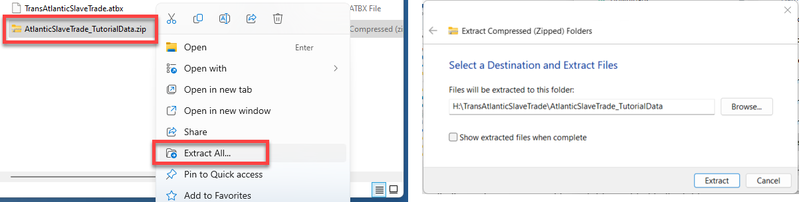

# **Lab 02: *SlaveVoyages* data and the Transatlantic Slave Trade**
*Tutorial written by Carolyn Talmadge on January 3, 2024 for ArcGIS Pro 3.1.4. Updated by Ian Spangler on February 6, 2024.*

|  |
| :------------------------------------------------------------------------------------------------------------: |
| *A new and correct map of the coast of Africa, from Sta. Cruz lat. 30 north. to the coast of Angola lat 11. S. with explanatory notes of all the forts and settlements belonging to the several European powers* (1771), from [Leventhal Map & Education Center collections](https://collections.leventhalmap.org/search/commonwealth:3f462v55b). |

## What you should submit
Before **6:30pm on Tuesday, 2/13**, submit to Canvas:
* A document in `pdf` or `docx` format, answering all the questions that are tagged with ![q], and which are summarized in the [lab deliverables](#lab-deliverables) section
* A map in `png` format, exported at 300 DPI, as directed at the end of the lab

# Introduction and context

## The Middle Passage

The Transatlantic Slave Trade, or Middle Passage, was undoubtedly a history-defining moment. We understand a great deal of contemporary problems and processes, from capitalism to colonialism, in relation to it. While the Middle Passage can be quantified in a technical sense—and thus, it can be represented—it also exists beyond representation. How can we understand the violence of those numbers, those visualizations? To what extent are we bound by the violence of those numbers when we use them? And what can we do to use them strategically, to make the most out them and move from a mere *accounting of disposession* towards a *diagram of reparation*?

Obviously, this lab won't give you the answers to those big questions. What it *will* do is introduce you to a major dataset that helps us bear witness to the Middle Passage, and lead you through the steps of using ArcGIS Pro to visualize and contextualize some of its geographies. Your final map will display the number of enslaved people transported from Africa to Antigua during between 1676 and 1805.

From a technical perspective, the lab covers adding data to ArcGIS Pro, symbolizing categorical and quantitative data, select by attributes and select by location, attribute table tools, and composing a final map layout. However, as you proceed through the lab, you should bear in mind the words of Katherine McKittrick (2014:19), a geographer and Black studies scholar who has written extensively on anti-Black violence, erasure, and place (it's a long quote, but it's well worth reading in full):

> While... black dispossession reveals the limits of our present geographic order and opens up a way to imagine new modes of black geographic thought, it is challenging to think outside the interlocking data of black erasure, unfreedom, and anti-black violence. Putting pressure on archive numbers that, particularly in the case of the middle passage and plantation life, are the only documents that tell us about the ways in which the practice of slavery set the stage for our present struggles with racism, is difficult. So, what do we do with the archival documentation that displays this unfree and violated body as both naturally dispossessed and as the origin of new world black lives? How do we come to terms with the inventory of numbers and the certain economic brutalities that introduce blackness—the mathematics of the unliving, the certification of unfreedom—and give shape to how we now live our lives? And what does it mean that, when confronting these numbers and economic descriptors and stories of murder and commonsense instances of anti-black violence, some of us are pulled into that Fanonian moment, where our neurological synapses and our motor-sensory replies do not result in relieved gasps of nostalgia or knowing gasps of present emancipation (look how far we have come/slavery is over/get over slavery/post-race/look how far) but instead dwell in the awfulness of seeing ourselves and our communities in those numbers now? This is the future the archives have given me.

Take a moment to carefully consider what she is saying here before you move on to the next section.

## Understanding the Slave Voyages Database

Anytime you work with a new dataset, it is important to research the data to have a thorough understanding of what records and attributes are included, the time period the data represents, how the data was created, limitations of the dataset, along with much more.

The [SlaveVoyages website](https://www.slavevoyages.org/) is an excellent and vast resource that allows users to explore the origins and forced relocations of enslaved Africans across the Atlantic. The SlaveVoyages website is a collaborative digital initiative that compiles and makes publicly accessible records of the largest slave trades in history. It includes a number of different databases including the Trans-Atlantic Slave Trade database, the Intra-American Slave Trade database, and the Enslaved Databases.

This activity will specifically focus on data from the Trans-Atlantic Slave Trade database. Therefore, it is important to read about the database on their website, along with any metadata that is provided.

1. Go to the Slave Voyages website at <https://www.slavevoyages.org/>
2. Explore the landing page and the information provided about the different databases.
3. Click on the drop down for Trans-Atlantic and go to "Understanding the Database."

    |  |
    | :---------------------------------: |
    |    *Understanding the database*     |

4.  Look through the information provided on this page. There is significant information provided from the sources, to dates, names, geographic data, and much more.
5.  Click on the **Data Variables** link on the left. This is an important page to look through, as it provides the key variables and data that can be mapped in the database.

    |  |
    | :---------------------------------: |
    |          *Data variables*           |

6.  Go back up to the top drop down and under Trans-Atlantic, select Database. You will now see a database that has over 36,000 records (e.g., voyages). Notice how on the blue bar you can filter the data by fields such as year range, ship, itinerary, enslaved people, dates and more.

    |  |
    | :---------------------------------: |
    |      *Filtering the database*       |

7.  Try **filtering** the data by one or more variables and see how it **changes the results**. You can view the results in many different ways.
    - The **results** tab shows all individual records of each voyage
    - The **summary statistics** provides summary information at a high level
    - The **tables** tab allows you to create your own table using variables and outcomes of your choice
    - The **data visualization tab** shows the data by 3 different graph types
    - The **timeline** provides a line graph over time
    - The **maps** tab allows us to visualize the data in an interacvtive map. Note that as you zoom in, the map becomes more detailed and as you zoom out, it becomes more generalized. This is a popular mapping technique to not overwhelm the viewer with too much detailed info when zoomed out.
    - The **Timelapse** shows the data as an animated map by date, with additional visualizations embedded in the map.

8.  Click through the different results tab to see the data visualized in different ways.

9.  Notice how on any of the results tabs that are tables, you can download the data at the top right of the table. You can also configure the columns and fields. On the data visualization tab, you can download the graphics or raw data. In the rest of the tutorial, we will use data that has been previously filtered, configured, and downloaded.

    |  |
    | :---------------------------------: |
    |   *Download graphics or raw data*   |

Now that you've actually examined the data, a moment to reflect on this data using the McKittrick quote from earlier, as well as the [Jamelle Bouie piece you read before class](https://www.nytimes.com/2022/01/28/opinion/slavery-voyages-data-sets.html).

|![q]
|:-
|1. In a few sentences (no more than 5), describe what you think McKittrick is saying in that excerpt you read above. How does her point relate to the argument that Bouie made in his article about the SlaveVoyages database? What impact should their arguments have on the way you approach making a map or doing research with this data?

# Start an ArcGIS Pro Project File and Folder

As always, when starting a new ArcGIS Project, it is very important to determine <u>where</u> you will be saving all GIS data and project files before you start, since Pro makes you choose a <u>home folder</u> when opening the software.

Options for where you can save include:
* **your `H: Drive` (recommended)**
* Tufts Box
* your `Desktop` or `Documents` folders (ONLY if it’s a personal computer – not if you are using the Engineering Lab VDI)
* an external drive (USB or external hard drive)

This tutorial will go through the process of saving and storing data in a GIS folder in Tufts `H: Drive`, but you can choose a location that works best for your situation. If you plan to use the `H: drive`, the folder must be mapped and connected under `This PC` in files explorer. Follow the [instructions to map your `H: drive`](https://sites.tufts.edu/datalab/accounts-network-drives-windows10/) on your personal computer (it maps automatically in the Data lab or TTS Engineering VDI).

>[![imp]][l]
> 
> Where you save your project files, please follow best practices in file nomenclature, directory structure, and organization, as discussed in class. I recommend setting up a directory structure that resembles the following:
> 
>     ├─ week03/   
>        ├─ lab02_slave-trade/
>           ├─ workspace/
>           ├─ submission/

1. Search for ArcGIS Pro in the windows search bar and open it.
2. Sign in using your Tufts credentials. You can sign in at the top right-hand corner.
    1.  Click on **Sign in with Your ArcGIS organization’s URL**. <u>Do NOT click sign in with ArcGIS login</u>
    2.  Enter "tuftsgis" as the organization’s URL. If this is your personal computer, you can check remember this URL and it will be faster next time.
    3.  You will then be prompted to log in with Tufts University. Press the blue Tufts button.
    4.  Log in with your Tufts UTLN and password. You will also need to go through Duo authentication. Press `Login`. Now you should see your username at the top right of ArcGIS Pro, as shown below.

        |  |
        | :---------------------------------: |
        | *Login with Tufts UTLN and password* |

3.  To start a new project, click on **Map,** as shown above.
4.  A “Create a New Project" box will open with the option to name your project file and choose where to save it. This is important to not rush through. What you name and where you save the project is very important for good data management and organization. It is much harder to change this name/location down the line if you don’t do it properly from the start!

    1. Name your project `TransAtlanticSlaveTrade`.
    2. Under ***Location***, click on the **folder** **icon**  and navigate to where you want to save your project (this tutorial will use the `H: drive`).
    3. Click on your `H: drive` ➡️ `week03` ➡️ `workspace`. **Don't double-click into `workspace`** – just click it, and select **OK**. 
    4. Make sure **Create a new folder for this project** is checked so that it creates a folder within your `workspace` directory for this project and data. Press **OK**.

5.  A new blank map will open. On the *left*, you will see your **Contents** pane. That shows all layers currently in the map (nothing other than the 2 basemaps).

6.  On the right, you will see the **Catalog** pane. This is where you can access everything associated with this **project**, including *GIS data, saved maps, toolboxes, layouts, etc.*

7.  Under **Catalog**, double click on **Folders** and you will see your connection to the `home` folder **TransAtlanticSlaveTrade** Folder (notice the little house icon indicating it’s your home folder). If you hover over the folder, it will show you the path (aka the folder location) where the project is saved.

    |               |
    | :---------------------------------------------: |
    | *Find your workspace in the ArcGIS Pro Catalog* |

> ![imp]
> 
> When you unfold the `TransAtlanticSlaveTrade` home folder, you'll see a file called `TransAtlanticSlaveTrade.gdb`. This is a **geodatabase**. The data that you'll use for this lab also comes in geodatabase format. We will discuss the geodatabase object in greater detail later in the term. For now, think of it as a special folder from which ArcGIS Pro projects can interpret spatial data. Any tools that you run will automatically save the new GIS files into the geodatabase. ArcGIS Pro will often encourage you to save other spatial data in it – just note that they'll be saved as **feature classes** instead of **shapefiles**. Esri has written about both [geodatabases](https://pro.arcgis.com/en/pro-app/latest/help/data/geodatabases/overview/fundamentals-of-the-geodatabase.htm) and [features classes](https://pro.arcgis.com/en/pro-app/latest/help/data/geodatabases/overview/feature-class-basics.htm) if you want to learn more right now.

## Downloading the data

1. The data for this lab has been pre-processed for you. Download it here: <https://tufts.box.com/v/AtlanticSlaveTrade>

2.  Download this entire zip folder called `AtlanticSlaveTrade_TutorialData.zip` by clicking on **Download** at the top right. Depending on the browser you are using, it might ask if you want to save, put it in the downloads bar at the bottom, or save it directly into your Downloads folder.

    

3.  In the Windows **File Explorer**, navigate to your **Downloads** folder. **Copy** this zip folder and paste it into your `TransAtlanticSlaveTrade` folder. Make sure to paste it INSIDE your project folder. This will ensure that the data for the tutorial is WITHIN the ArcGIS Project home folder, making it easier to access in Pro and for better project data management.

    

4. After pasting the zip drive in your `TransAtlanticSlaveTrade` folder, right click on the `AtlanticSlaveTrade_TutorialData.zip` file Extract All. Confirm the location where it is extracting is correct and press **Extract**.

    

    This process **unzips or extracts** all the components of this zipped folder. In your folder, you should now see an unzipped file also called `AtlanticSlaveTrade_TutorialData`. *The zipped file will still be there, which is useful to keep as a backup in case the unzipped data somehow becomes corrupted.*

5.  Now that you’ve unzipped the data, we can work with it in ArcGIS Pro. You cannot see data inside folders that are zipped up in ArcGIS Pro. You must always unzip it first to be able to work with it.

6.  **Go back to your ArcGIS Pro project** and on the right side in **Catalog**, right click on your home folder “TransAtlanticSlaveTrade" and press **Refresh.** This will allow us to see any new files or folders added to this folder.

    

    > ![imp]
    > 
    > Whenever you add new files to a folder whose project is *already open in ArcGIS Pro*, you must **refresh** the folder in order to see what has been added.

7.  Double click on your home **TransAtlanticSlaveTrade** folder and then double click on the **AtlanticSlaveTrade_TutorialData.** You should now see 3 *shapefiles* with the extension `.shp` that will be used for this activity, and one *geodatabase* *with the extension `.gdb` containing the preprocessed data.
    
    

8.  Double-click on the `SlaveVoyagesDatabase.gdb` to expand it and you will see another file called `AfricanPortsAntiguaEmbarkments_1676_1805`. This is a **feature class.** *Feature classes are very similar to shapefiles, but just live within geodatabases and are a newer file type.*

9.  Pull this **AfricanPortsAntiguaEmbarkments_1676_1805** feature class into the map by dragging and dropping the file in the map. The map will zoom to the **extent** of the data.

10. One by one, drag the other three shapefiles onto the basemap. Take note of what each shapefile looks like when you add it to the map. Are they points, lines or polygons? Look at the icons in **Catalog**, that will give you a hint!

    **You should now have 4 layers in the map, plus 2 basemaps.**

11. To the left of the screen in the **Contents** pane, underneath “**Drawing Order",** order the layers by dragging them into place. You want the largest polygon layer, the **continents** layer, on the bottom and the points on top so we can see them.

    They should be in this order as shown below. **Also, notice your colors are probably different than mine. That is because there is no default color when you first bring data in... it’s totally random until you set the colors with symbology.**

    

12. Turn all the layers off by **unchecking** the box next to the layer name. Then, one at a time, turn each layer on again so you can see what it looks like. When you’re done looking at them, make sure you turn all the layers on.

    

# Exploring the Map

1.  Switch to the **Map** tab at the top of ArcGIS Pro

    

2. Remember, the **Explore** button allows you to move (or **pan**) the map by left clicking on your mouse. You can also zoom in and out using the mouse scroll wheel.

3. You can click on any of the data in the map to pull up **their attributes** and to learn more about that particular point or polygon.

4. Just so they're easier to distinguish, update the **symbology** for the `AfricanPortsAntiguaEmbarkments_1676_1805` layer. To do this, click on the point underneath the layer name in the Contents Pane. (This is a quick way to open the symbology pane, but you can also right-click on the layer name and click "Symbology.") Click the large black circle 1, for quick and easy distinguishing.

    

5. Now, click on one of the points from the `AfricanPortsAntiguaEmbarkments_1676_1805` layer. What information do you see in the pop up? What do we think is being mapped based on the layer name and attribute names?

    

    These variables in the pop up are called **attributes** and provide us information stored in each layer's **attribute table**. The attribute table shows descriptive information about feature data. 

    In this `AfricanPortsAntiguaEmbarkments_1676_1805` layer, the points (features) represent the location of the **ports that had voyages embark specifically to Antigua during 1676 – 1805**.

   |![q]
   |:- 
   |2. What are three attributes, along with their values, associated with the feature you clicked?

6.  Zoom into a part of Africa using mouse scroll wheel and hovering your cursor over the continent. A helpful trick is to hold down **shift** and with your mouse, draw a box around where you want to zoom in. Then it will zoom to that *extent*.

7.  Additionally, you can *Zoom In* and *Zoom Out* using the **fixed zoom in and fixed zoom out** tools on the map pane.

    

8.  Use the *Zoom to Full Extent* tool to go back to the full view of your largest dataset (in this case it zooms to the world, since we have a layer with all continents in our contents).

    

    **Pro Tip**: In ArcGIS, you can place the cursor over each tool in the menu without clicking to see a description of what it does. Hover over the **Explore** icon and try out some of the shortcuts.

9. Right click on `AfricanPortsAntiguaEmbarkments_1676_1805` and select *Zoom to Layer*. This is another way of zooming into a specific layer’s extent.

10. Turn off the Continents layer.

11. One cool thing is ArcGIS Pro makes it really easy to quickly change the standard basemap. Try out different basemaps to see which you like most. Note some you can turn on and off labels, which is nice! **I am using the Modern Antique Basemap.**

    |  |
    | :---------------------------------: |
    | *Base map menu* |

12. Now choose **Project Save**. You have already created a project file name for this (`TransAtlanticSlaveTrade.aprx`). A project file is a very small file that contains ***pointers*** to your datasets (it does not actually save the datasets, but we did already save those in this folder as well!).

    |  |
    | :---------------------------------: |

    The `aprx` project file remembers what you had displayed in your map session and how you had it styled, along with how far you were zoomed in/out. If you quit ArcGIS Pro at this point, you can reopen this map by re-opening the `aprx` file.

    > ![imp] 
    > 
    > **Beware** – since **project files do not actually contain data layers**, and only have **pointers** to where the data is saved, if you copied your `TransAtlanticSlaveTrade` project file and tried to open it on a home computer without also saving the **data**, the ArcGIS Pro session would start and list the data in the table of contents, but nothing would appear because it would not be able to find the where the data is stored. A little red exclamation point would appear in the table of contents, informing you that it has lost the connection to the data.

# The Attribute Table

Before we get started, we need to understand what each of these layers represent and look at the data contained in the database (aka attribute table). It is important to examine and understand the data in the **attribute table**, as that is where the bulk of the data is stored.

*Vector data* (points, lines, and polygons) have a database attached to their geographic features: the **attribute table**.

Each row represents a *feature*, like a point, and each column contains additional information – or "attribute" – about the feature. These attributes can be qualitative data (e.g., categorical data) or quantitative data (e.g., numerical data). The data in the attribute table can be mapped (e.g., **symbolized**) so it shows more than just the location of the port itself.

1.  There are 4 layers that we brought into this map. Right click on the `AfricanPortsAntiguaEmbarkments_1676_1805` layer and click "Attribute Table".

    

    The `AfricanPortsAntiguaEmbarkments_1676_1805` are points (features) that represent the ports that had voyages embark specifically to Antigua between 1676 and 1805.

    The attribute table contains additional information about the ports, including the total number of enslaved people who embarked, per port, for Antigua, in 25 year increments between 1676 and 1805.

    Each port is represented by a row in the table which is connected to a point in the map, and each column is a variable (aka **attribute**) about the ports showing the **name** of the port, the **country** each port is located in at the time, and **the total number of embarked enslaved people between different 25 year time frames**.

2. Look at the bottom of the table and you will see that there is a total of 33 different points (ports) included in this layer. This is **summarized data**, where each port is only listed one time and has data on the total or *sum* of embarked people at that port during each time frame. It doesn't show individual voyages from these ports.

    |                    |
    | :---------------------------------------------------: |
    | The attribute table for the Antigua embarkments layer |

3. Now, right click and open the attribute table for the `EmbarkmentPorts`.

    These points represent the departure port of every transatlantic slave trade voyage made between 1619 and 1808. **This data is very different than the `Antigua` layer we just looked at**: it is not a summary of the embarked slaves leaving each port, and it actually shows a lot of details about each individual voyage.

4.  Look at the different attribute fields and all the data that is contained in this attribute table: vessel name, the first and second leg of the voyage, year of arrival, number of enslaved people that arrived, captain’s name, date, and latitude and longitude.

    |                  |
    | :-------------------------------------------------: |
    | *The attribute data for the embarkment ports layer* |

5.  This is a very large dataset. You might notice it’s a bit slow. That’s because unlike the port data with 33 points, this voyage layer has over 20,000 points. However, look at the map: it certainly doesn't *look* like 20,000 voyages. What's happening?

    Since many of these voyages departed from the same port, there are actually many many different points on top of each other at the departure ports, so its hard to visualize the depth and breadth of the Middle Passage using this data in its current form.

    That's something you'll change as you work through the lab.

6.  Now, open the Attribute Table for the `AfricaSourceRegions`. This polygon data represents the *approximate* administrative regions on the west coast of Africa around the 18th century, based on today’s country borders. We can see that there are a total of 7 polygons, along with 3 main attributes about the polygon regions:

    1.  **Name** shows the contemporary name of the country today

    2.  **Region** is categorical data that provides **the historical name of the region around the late18th century**

    3.  **ANT_Embark** is quantitative data that has the total number of enslaved people embarked between 1676 and 1805 departing from each of these regions.

7.  Lastly, the **Continents** layer is a layer showing the global continents. This was included for background data but still has very basic data such as the area of each continent and the name.

> **Pro Tip**: Notice how when you have multiple attribute tables open, they actually all stay open, and it is easy to flip back and forth between them by clicking on the tabs.
> 
> 

Close the attribute tables for now. We will get back to them soon.

# Assigning Proper Layer Names

Now that we understand what each of these layers represent, we should give the data layers better names than what they have now. We’ll remove any "data speak" by taking away underscores and making the layer name more comprehendible.

1.  Right click on the `AfricanPortsAntiguaEmbarkments_1676_1805` layer and choose **Properties**.

    > **Pro Tip:** You can also get to the Properties window by double-clicking on the layer name.

2.  When you see the Properties dialog box, click on the **General** tab and under **Name**, type in "Embarkment Ports to Antigua: 1676 - 1805". Press **OK** when finished. (Because this is just a layer name, and not an actual file path, spaces and dashes are allowed – even encouraged!)

3. Follow the same steps to rename all the layers as shown below so they do not have any "data speak" and the layer names make sense. In the future, points will be deducted on assignments when these kinds of "data speak" names appear on your final map.

    > **Pro Tip**: For a quick way to change the name, **click the layer once and then press F2**. Now you can change the name without going into the properties. You can also click on the layer name, then wait a few seconds while hovering over the name. It will change into a typing view to let you type. Hit Enter or click off when finished to save the name.

4.  Change the names of all layers to what is seen below:

    

    Again, note that changing the name of the layers in the table of contents does not change the original shapefile or feature class name in **Catalog**. It is just an alias and is connected to the legend when you are creating a final map layout.

# Attribute Table Tools

## Sorting, Statistics, and Fields

There are a lot of functions within the attribute table, from sorting each field to adding new fields and creating field calculations. This section will give you an overview of using them.

1.  Turn off the `Voyage Points` layer and make sure the `Embarkment Ports to Antigua: 1676 – 1805` layer is on. Right-click on the layer and open attribute table.

2.  Double click on the **Name** column header. This sorts the names *alphabetically from A-Z*.

    Alternatively, right click on the Name field. There are a ton of options for organizing the field in addition to **Sort Ascending and Sort Descending.**

    > **Pro Tip:** ArcGIS Pro is all about the right-click. When in doubt, right click on something you care about and there will be options.

    

3.  Now, right click on the **yr1801_1825** field header and press **Statistics**. This provides statistical summaries about this one attribute field.

    

4.  Look through the information presented in the pane on the right. We see statistics about those embarked from 1801 – 1825 such as the mean (average) number, Min, Max, Sum, Standard Deviation, and more. A [histogram](https://pro.arcgis.com/en/pro-app/latest/help/analysis/geoprocessing/charts/histogram.htm) of the data is also provided and if we click on one of the bars in the histogram, it selects the data in the map too.

    

    If data is selected in the map or attribute table, in the statistics we see 2 columns. The first one shows the statistics for the entire column, while the second shows the statistics for only the selected records.

5.  We can also **create new fields in an Attribute table** and **build formulas** (just like if we were working in Excel). For example, right now we have the number of embarked slaves in 25-year time increments between 1676 and 1825. We *don't* have the **total number of embarked slaves** from each port over that entire 150 year time span – but we can easily calculate it.

6. In the attribute table, locate the **Add** button and click it.

> 

7.  This will bring us to a new table view showing **all the fields in the attribute table**, along with any aliases (this allows you to type out the full variable without data speak) and the data type and number format (optional).

    **In the last row, there is now a blank row for you to add the new field we want to create**. Unlike Excel, there are not just endless cells for us to type into. Each time we want to create a new column that’s part of the table, we have to first add the column to the table.

    Type in the Field Name as `Total_1676_1825`. No spaces or any characters other than underscores (`_`) allowed in field names. You can give it an alias though where spaces and dashes are allowed. Set the **Data type** to `double`. `double` types allow for decimal places and are a type of number field. `long` and `short` are also number fields, but do not allow decimal places – only integers – so unless you're certain that your field won't require decimals (e.g., a date field), choose `double` by default. (You can leave the "Number Format" column empty or set it to numeric, which is its default setting. There are also options to set it as things such as currency, angle, percentage, etc.)

    Lastly, you must saves any edit you make to the table before they are visible in the attribute table. Click **Save** at the top (not project save, but save under the **Fields** Tab as shown in the picture below).

    

8.  Switch back to the `Embarkment Ports to Antigua` attribute table by either clicking on the tab for it by the tables, or right-clicking on the layer and attribute table. Now you will see there is a new column added to the end that is full of `Nulls` but has the name you gave it.

    

9.  Either right click on the new column and click **Calculate** **Field, or click on "Calculate" at the top left of the table.** This will open the Field calculator, which allows us to build a formula for this column. We want to calculate the total number of embarked slaves, which means we need to add all 6 time frames together with simple addition.

    > **Pro Tip:** This calculator uses Python 3 to build the formula, so the syntax is very particular. When you're getting started, always use the fields and operators lists to build queries. Double-click on the fields to add them to the calculation, and then click once on the `+` sign to add it to the expression. Do not attempt to type in the expression unless you know Python.

    

    The new column should populate with the results showing us the total number of embarkments to Antigua between 1676 and 1805 per port.

    Note that you might receive a warning about `Null` values. This is just because two of the ports have no data, or `Null` values for their values and it’s just warning us it couldn’t come up with an answer for those two ports. No big deal.

    

| ![q] |
| :- |
| 3. Which port saw the greatest number of embarkments for Antigua bewteen 1676 and 1825? |

# Selection Methods

## Selecting Manually 

1.  If necessary, click back on the tab for the Embarkment Ports to Antigua attribute table. Now click on the row for **Alampo** by clicking on the 1 as shown below. You might want to resort by the Name field by double-clicking on it to quickly sort it. Notice how when you click the row in the Attribute Table, it also selects the point in the map, and it shows us at the bottom that 1 out of 33 points are selected. This is called **manual selection**.

    You can manually select features in the **attribute table**, and you can also manually select features by clicking on them in the **data frame** (or the *map view*) with the select tool.

    

2.  Select a different row/feature in the attribute table. Double-click on the row this time and it will zoom you to the selected feature in the map.

3.  In addition to selecting a feature by clicking on in it the **attribute table**, you can also **select a point by clicking on it in the map**. On the **Map** tab, look at the options under **selection**. There are several options for selecting features in layers.

    

4.  If you click on the drop down next to select, you see many different ways you are able to select points, lines, or polygons (aka features). If you just press the button **Select** at the top, it defaults to selecting by click. **Click Select and then click a point in the map.**  
    
    

5.  Once you click the point in the map, it will also show it selected in the attribute table. If you hold down shift and continue clicking/selecting points in the map, it will add them to your selection so you can select multiple at once.

6.  Now under **Select** at the top, click the drop down and select **rectangle**. Draw a square in the map and see how all the ports within the square are selected in the map and attribute table. In fact, any layer that intersects your square was selected including the polygons in the source regions layer.

    

    As usual with ArcGIS Pro, there are lots of ways to do a single thing. In this case, you can select features by interacting with the attribute table, or by interacting with the map itself.

7. Now, clear your selection by pressing on the **Clear** button on the top **Map** tab.

    

## Select by Attributes

Another extremely powerful tool in GIS is the ability to select features in the Attribute table by building a selection query. When you select features using information provided in the attribute tables, you write an expression to query and select features that match your selection criteria. This is extremely helpful when there are large numbers of features and you are unable to manually select (or you want to select by multiple criteria).

1.  If it is not already, open the attribute table by right clicking on the `Embarkment Ports to Antigua: 1676 – 1805` layer and click **Attribute Table**.

2.  Make sure that you currently do not have anything selected by looking up at the top **Map** bar under the selections and clicking **Clear**.

    |  |
    | :---------------------------------: |
    | *The **clear** button* |

3.  Perhaps now we want to investigate the ports that had 0 embarkments to Antigua between 1676 – 1700. We will do this with a **Select by Attributes** query. In the Attribute table, **click on the Select by Attributes button.**

    |    |
    | :-----------------------------------: |
    | *The **Select by Attributes** button in the attribute table* |

    Note that you can also get to **Select by Attributes** from the **Map** tab, where you selected manually.

    |                     |
    | :----------------------------------------------------: |
    | *The **Select by Attributes** button in the **Map** tab* |

4.  When you open **Select by Attributes**, a pop-up box appears. Here, we will build an expression that will show us how many ports had no embarkments between 1676 and 1700:
    1.  Field = `yr1676_1700`
    2.  Operator = "is equal to"
    3.  Value = `0`

    

    Press **OK**. You should see that 26 of the 33 ports had 0 embarkments to Antigua between 1676 – 1700. (You can see the total number selected out of all the rows at the bottom right of the table.)

    

5.  Clear your selection by pressing **Clear** at the top of the attribute table. Now, change the expression and toggle through all of the different 25-year time frames to answer the questions below.

   |![q]|
   |:- |
   |4. Which 25 year period had the *greatest* number of embarkments equal zero (e.g., had the fewest actual embarkments overall) and what was that value? By comparison, which 25 year period had the *lowest* number of embarkments equal zero (e.g., had the highest actual embarkments overall) and what was that value?|

6. We can also make more complicated expressions that include multiple clauses. Perhaps we wanted to see **how many ports during the years 1751 – 1775 had greater than 300 but less than 1,000 embarkments.**

   |![q]|
   |:- |
   |5. How many ports during the years 1751-1775 had greater than 300 but less than 1,000 embarkments? You'll have to change your current expression including the field, operator, and value - as well as make use of the "Add Clause" button - in order to answer this.|

7.  Now, let’s move on to more complicated data and expressions. Open the Attribute table for `Voyage Departure Ports: 1619 – 1808`. Remember, these points represent the *departure port of every transatlantic slave trade voyage made between 1619 and 1808* – not just locations to Antigua, but *all destinations*.

8.  Let’s start by building a **Select by Attributes** expression to select all voyages that arrived in 1777. Click on **Select by Attributes.** Set the expression as follows:

    

9.  You should have 157 voyages selected.

    > **Pro Tip**: You might not notice many selected rows until you start to scroll through. If you click on the second icon in the image above, this is a way to see ONLY THE SELECTED points. This is very helpful when the data set is quite large.

10.  Now, let’s look at some statistics about the data selected vs the entire dataset. Perhaps we want to see the **total number of enslaved people that arrived in the year 1777 vs. all years**: since we already have the voyages that arrived in 1777 selected, right-click on the `Slaves_Arr` (short for Slaves_Arrived) field and click **Statistics**. 

11.  Under the **Statistics** section, the left column has the statistics about the number of enslaved person in the entire dataset (all years) on the left and only the selected voyages on the right. We see that in 1777, there was a total (sum) of 20,797 enslaved person who arrived.
    
        

        2,881,243 enslaved people arrived in Antigua across all available voyage year records.

## Narrative at the intersection of qualitative and quantitative data

We have been looking at numbers – or "abstractions," as McKittrick and Bouie might have us call them – for a while now. Let's take a moment to consider what they are abstracted from.

Here are three other data points or sources that, while harder to format as a spreadsheet or table, provide an important *qualitative* glimpse into the geopolitical context for the abstractions that we've been reading and querying. Click through each of these - you don't need to read them in great detail, but open them and skim a few sentences here and there to get an idea of what they contain:
* In 1736, enslaved people who had been brought to Antigua [plotted to overthrow the white planters who bought them](https://www.jstor.org/stable/1921837). It's possible that the plot was overblown by white planters, but regardless, 
* In 1789, [Olaudah Equiano published a narrative about his life](https://books.google.com/books?id=FXVkAAAAMAAJ&pg=PA1&source=kp_read_button&hl=en&newbks=1&newbks_redir=0#v=onepage&q&f=false), beginning with birth in the kingdom of Benin in 1745 and following his journey from enslavement to freedom, which he eventually purchased in 1766.
* In 1831, [Mary Prince dictated a narrative of her life](https://web.english.upenn.edu/~cavitch/pdf-library/Prince_History.pdf). Not only did this provide a glimpse into the brutality of (her) enslavement at a time when these narratives were not common, but she was the first *woman* to widely tell the story of her enslavement.
* Northeastern University's [Early Caribbean Digital Archive](https://ecda.northeastern.edu/) is an excellent resource for exploring other examples of these kinds of texts. They help illuminate the social and political contexts from which the data we're working with was abstracted. Try searching `antigua` – what comes up?
* Digital map collections, like those at the [Leventhal Center](https://collections.leventhalmap.org/), are also great resources for qualitative data. The [map of "Antego" or Antigua](https://collections.leventhalmap.org/search/commonwealth:6t053r30b) shown below, created around 1736 by geographer Herman Moll and held in Leventhal Center collections, shows dangerous water features, towns, churches, forts, mills, and important plantations at the time.

  |  |
  | :--------------------------------------------------------------------------------------------------: |
  | *[The island of Antego](https://collections.leventhalmap.org/search/commonwealth:6t053r30b)* ([1736]), by Herman Moll  |

  We can derive a lot of information from this map to qualitatively contextualize the quantitative data from SlaveVoyages. For instance, zooming into the top of the map, we can see the names of planters who owned sugar or rum plantations. One is "Royal," who had a windmill, as indicated by the single dot by the name:

  

  This likely refers to a sugar mill once owned by Isaac *Royall*, who immigrated to Boston in 1700 before traveling to Antigua and setting up an extremely profitable slave plantation operation. In fact, the historic [Royall House and Slave Quarters](https://royallhouse.org/) sits just up the road from the Tufts campus, while the location of the sugar mill in Antigua still bears his family name today in the form of "Royal Gardens":

  |                      |
  | :----------------------------------------------------------------------------------: |
  | *The Royall House in Medford (top) and the old "Royal" sugar mill in Antigua (bottom)* |

  In 2019, Gaston Browne – the Prime Minister of Antigua and Barbuda – [wrote a letter to Lawrence Bacow](https://www.washingtonpost.com/nation/2019/11/06/harvard-law-school-antigua-barbados-reparations/), then-president of Harvard University, demanding reparations on account of Harvard Law School's 1817 establishment depending on a bequest from Isaac Royall. In Browne's words, "We consider Harvard’s failure to acknowledge its obligations to Antigua and the stain it bears from benefiting from the blood of our people as shocking if not immoral."

  In 2022, Harvard established a [$100 million endowment fund for slavery reparations](https://www.reuters.com/world/us/harvard-sets-up-100-million-endowment-fund-slavery-reparations-2022-04-26/).

   |![q]|
   |:-|
   |6. Look through the quantitative data in the **attribute table** of the `Embarkment Ports` layer, including its fields and data values. In a few sentences (no more than 5), compare and contrast the qualitative data described above to the quantitative data in the `Embarkment Ports` table. How are they similar and different? How might you take some of that unstructured qualitative data and turn it into structured spatial data? From a narrative perspective, how could you bring together the qualitative and quantitative data to tell a cohesive story – in other words, *what's a spatial question you could answer by combining these datasets*? Feel free to give a concrete example, if you can think of one.|

## Saving selected data as new layers

Bearing in mind these important points about context for the data, let's pivot back into some GIS stuff: selections and queries. 

1. Since our first point dataset of ports is only showing enslaved persons embarked for Antigua between 1676 and 1805, let’s select all the voyages between 1676 and 1805. **You should have 19,528 voyages selected**.

    

2. Now, let’s create a new layer containing *only the voyages between 1676 and 1805*. One you have the voyages selected, **right-click** on `Voyage Departure Ports` ➡️ "Data" ➡️ "Export Features." This is the “Save As" of spatial data: we are saving the selected points as a new feature class and layer in the map.

3. You want to give the new layer (and resulting feature class) a smart name and make sure it’s saving in the right place. Click in the **output feature class field**. It will expand to show you the full *path* to where it’s being saved. It will default into *this project's geodatabase* (`TransAtlanticSlaveTrade.gdb`), which is why it was important to save the project in a smart place when you started. Change the last part of the path to give it a better name, such as `VoyageDeparturePorts_1676_1805`. Press **OK**.

    

    > ![imp] 
    > 
    > ***Never* use spaces or dashes in your file names *– always, always underscores*. Naming things well is a very important part of GIS and data management.**

4.  The result will be a new layer that is added to your map at the top of your contents pane with your new name.

    More importantly, the new feature class was saved in your project geodatabase so that you can use it in the future. **This is how we create new datasets as a subset of a larger datasets for projects, and is a very common workflow in GIS.**

    

5. Clear your selection on the **Map** tab, pull down the new layer under your Embarkment Ports layer, and turn off the original Voyage layer. **Rename your new layer to remove any “data speak", but make sure to keep the dates.**

    > **Pro Tip:** It’s useful to rename layers because what it says in the contents is what it will say in the legend when you make a final map. It’s worth the time!

6.  Save your project by clicking the **Save** icon at the top.

## Select by Location

The last selection method we'll discuss here is called **Select by Location**. Unlike **Select by Attributes**, which only requires one layer for the selection, **Select by Location** requires two layers because you are *selecting features in one layer based on it’s relationship to another layer*.

1. The first select by location we will practice will be selecting all features in the `Embarkment Ports to Antigua` layer that **intersect** features in the `Africa Source Regions` layer. (You might assume that all the ports would intersect the source regions by default, but this is a good way to examine the idiosyncracies of data and understand how these selections work.)

2. Go up to the **Map** tab and find **Select by Location**. Make sure you have nothing selected first by pressing **Clear**. Remember, if it’s grayed out, nothing is selected in any layer.

    

3. The **Select by Location** interface is a bit more complicated because it requires two layers:
   1. **Input Features**, aka the layer that you want to select
   2. **Selecting Features**, aka the one the relationship will be based on

    In this case, we want to select **all the Embarkment PORTS (our input features) that intersect the Africa Source Regions (our selecting features).** Fill out the tool as such, but also click the **Relationship drop down** to see all the options for relationships between the two layers. Press **Apply** when you’ve filled out the tool.

    > **Pro Tip:** You can press **Apply**, which will do the selection but keep the tool open for quick edits. If you press **OK**, it will also run the selection but the tool will close. If you plan on tweaking or creating more selections, it’s easier to press **Apply** so you don't have to keep reopening the tool.

    |  |
    | :---------------------------------: |
    | *Switching records in the attribute table* |

4. If we open up the **attribute table** once again for the `Embarkment Ports to Antigua` layer, we should see that only 20 of the 33 ports are inside the Historic Regions of Africa.

    Let's use the selection tools to figure out why some ports are not located within the boundaries of these historic regions.

5. Open the **attribute table** for the `Embarkment Ports to Antigua` layer and click the **Switch Selected Rows**  button. This will invert your current selection – you should now have 13 of 33 rows selected.

    I recommend that you also click the **Show selected rows** button on the bottom left-hand corner of the **attribute table**. This displays only those attributes you've currently selected, and will prevent you from losing that selection (e.g., by accidentally clicking on an individual record).

    |  |
    | :----------------------------------: |
    | *Showing only selected records in the attribute table* |

    At this point it might also be helpful to **right-click** ➡️ "Zoom to Layer" on your `Embarkment Ports to Antigua` layer, as well as temporarily turn off the full `Embarkment Points` layer, just so you can see this selection more clearly. (You could also zoom to your current selection by clicking **Zoom to selection**  in the **Navigate** tab.)
    
6. Zoom into one of the currently selected ports and see if you can figure out why it wasn't included in the original selection query. Just as an example, I'm choosing Cape Coast Castle.

    You can right-click on a record in the attribute table to zoom to it, or hold down the `shift` key while dragging on the map to select a box around your area of interest.

    When I zoom into Cape Coast Castle, here's what I see:

    

    Ah! Here's what happened... the historic regions polygon is heavily generalized (or simplified), and therefore it doesn't closely match the coastline at this fine-grained a scale.
    
    This is a good example of how datasets are produced for use at different scales, and when you try to make them talk to each other across those scales, things can be lost in translation.

   |![q]|
   |:-|
   |7. Reflecting on the **Select by Location** issue that you just troubleshooted, which data – the `Embarkment Points for Antigua` layer or `Source Regions` layer – is right, and which one is wrong? Why?|
    
Let’s try a new selection. Clear your selection up top or in the attribute table. Now let’s select the voyages, specifically from `VoyageDeparturePorts_1676_1805`, that are *within 1 international nautical mile of all embarkment ports*.

This will hopefully select all the voyages that departed from these ports (and likely more, since we selected everything within 1 nautical mile).

Right now, we know how many total embarked slaves for Antigua were sent during this time period in 25 year increments, but we know nothing about the number of **individual voyages** or **details about these voyages**. This query will help answer that.

1. Set up the **Select by Location** query like so:

    

    If we now open the attribute table for the `VoyageDeparturePorts_1676_1805` layer, we can see that 2,797 voyages out of 19,528 total voyages were selected. Move this layer in the contents pane above the ports layer to better see the selection. Also, in the Attribute Table, click the "Show only selected rows."

    In the map, it doesn't *look* like that many voyages were selected. Plus, if you pan around, many ports have voyages on top of them that don’t look selected. Why is this?
    
    **Zoomed out to the scale of the entire region, it looks like the points are on top of eachother – but, zoomed in, it becomes clear that those points are indeed more than than 1 mile from those ports.**

2.  Don’t trust the GIS? See for yourself. On the **Map** tab, click on the **Meausure** tool and set the distance to `miles` (or to be more precise, you could set it to `meters`, of which there are 1,852 in 1 nautical mile).

    Zoom into a point you’re side eyeing and click once on the port and measure to the closest voyage to see the distance.

    

3.  Perhaps we want to expand our selection search radius to get more voyages included. Simply go back to the select by location and let’s set the distance to 2 international nautical miles this time.

4.  Look at only the selected voyages. Let’s combine this selection with an **attribute query** to find *only voyages whose first destination is Antigua*.

    Click on the **select by attributes** icon in the `VoyageDeparturePorts_1676_1805` attribute table. We are now going to change the selection method to **Select subset from the Current Selection** so that are we not creating a totally fresh selection, but *selecting from within our current selection*.

    |  |
    | :---------------------------------: |
    | *Selecting within your current selection* |

5.  It turns out 20 of the 19,528 voyages in the same time frame that were within 2 international nautical miles of a port had their first stop as Antigua. We could explore the details about each of those individual voyages now, but first, let’s look at the map to see where they are coming from.

    Zoom out and find the selected points. It looks like the voyages matching our selection are all clustered on the coast of current day Ghana.

    

Let’s do two more complicated selections that combine multiple types of selections. Our selection will answer the question: how many voyages departed from the Bight of Benin in 1704?

Clear your current selection and then let's get started.

1. First, we need to figure out the first part of this, which could be finding the Bight of Benin. That sounds like it would be part of our `Africa's Source Regions` layer. Open up the Attribute table for `Africa’s Source Regions`. Let’s run a **Select by Attributes** query to select Bight of Benin. (If you already know where it is, feel free to manually select it by clicking its location on the map).

    

2.  Once Bight of Benin is selected, open up the **select by location** tool. We will select the `VoyageDeparturePorts_1676_1805` layer that **intersect** Bight of Benin. Make sure to change the selection type from "New Selection" to "Select subset from the current selection".

    

    Open up the attribute table for `VoyageDeparturePorts_1676_1805` and confirm that there are 3,069 records selected.

3. The last part of our selection criteria is to select the voyages specifically in 1704. Click **Select by Attributes**. If you have an expression still in there from before, you can press the  button. Set this last expression and be sure to change the **Selection Type** to "Select subset from the current selection":

    

4. If you look at the attribute table for the `VoyageDeparturePorts_1676_1805`, there should now be 16 voyages selected. If we look at the map, it only looks like there are 2 points selected, but we know now that it’s actually many points on top of each other at those departing ports.

    

5. Which of these two ports was more active in 1704? There are a few ways to figure that out; one is to use the **attribute table**.

    First, sort the **latitude** field by double-clicking it. Notice how one point has a latitude starting with `4.4333` and the rest of the points have the exact same lat/long values. If I double-click on the row (e.g., where it says `1` on the left-hand side of the attribute table) for the first point, your map will zoom into it. This is the point on the southeasternmost port, meaning that the other port on the west had 15 voyages in 1704 leave from that location within Bight of Benin.

    

    Before moving to the next section, clear your selection.

# Symbology

The default setting for how our data is displayed in ArcGIS Pro can be deceiving. Because these points are stacked on top of one another, as you've seen, it can be hard to discern patterns (e.g., density) at a glance. In order to meaningfully display this data on a map, we need a new representational technique.

That's where **symbology** comes in.

Setting the symbology of a layer is one of the most basic and important functions of GIS. This is how we set the color, size, and style of each dataset. You will set the symbology for every single dataset you bring into ArcGIS Pro. This is how we bring coherence to the map and make it more intuitive.

## "Single symbol" symbology

1. Turn on the `Africa’s Source Regions` layer and click the layer name to select it. Notice when you select the layer, three more tabs appear on the top menu panel.

   Like all software, ArcGIS Pro is contextual – the interface will dynamically change in repsonse to what you're doing. When you select a layer, more options to **work with that layer appear at the top**: namely, **Feature Layer**, **Labeling**, and **Data**.

2. Click on the Layer `Africa’s Source Regions` and then click on the **Feature Layer** tab.

    

3. When you are in the **Feature Layer** tab, there are lots of options for styling the layer, including transparency, layer blending, and most importantly *symbology*. Click on the down arrow under symbology and choose **Single Symbol.**

    

    Single Symbol allows us to set the color for the layer to *one single color*. All polygons will be the same exact color and style.

4.  When you click on Single Symbol, on the right side of your screen, you will see the **Symbology Pane** appear. Click on the square symbol to get to color options.

    

5.  You will now see a selection of pre-made colors for specific layer types. Scroll through to see the color options. Click some to see how it changes the symbology (style) of your layer. Some colors and outline styles are more appropriate than others – and you as the expert need to choose what’s best for your map design.

6.  The colors you pick will depend on things like how well it goes along with a basemap you are using or base layer (like the continents, if you do not wish to use a standard basemap). In this example, I am using the "Modern Antique" basemap, and I think the "Building Footprint" option complements it well.

    

7.  To adjust the symbology further, or select our own color, click on **Properties** tab.

    

8.  Once you click on the **Properties** tab, you will see options under *Appearance* that allow you to set the color, outline color and width, and more. You can pick whatever you want, whether preset or custom-designed, but whatever you choose should preserve the lines (e.g., boundaries) between source regions.

    **In this map, I am going to set the outline width to 1pt but leave the colors the same.** It is a nice touch that the outline is a similar color to the map – black outlines can often feel too strong or forceful. Make sure to click **Apply** at the bottom to update the layer.

    

## "Graduated symbol" symbology

One of the most powerful aspects of GIS is the ability to symbolize your data (by color or by size) based on the different fields in the attribute table. That's one reason it is so important to open the Attribute Table and understand the data and attribute fields that exist within the layer first, because we will use symbology to map those fields to visualize all that additional information.

1.  Start by opening the attribute table for the `Embarkment Ports to Antigua: 1676 – 1805` layer once more and refresh yourself on the different fields.

    The goal here is to *show the different ports as different sizes based on the total number of all embarked slaves to Antigua per port*. We can do this by using a symbology style called **graduated symbols**.

2.  Make sure that the `Embarkment Ports to Antigua: 1676 – 1805` layer is selected in the contents pane by clicking on it. **You can close all the attribute tables to maximize the map size.** Then, click on the **Feature layer** tab again and select the arrow under **Symbology** ➡️ "Graduated symbols."

    Graduated colors is an option only for *quantitative* (e.g., numerical) data, such as the total number of all embarked slaves to Antigua.

    

    You can also change the symbolization technique in the **symbology** panne itself, in the drop-down bar under "Primary symbology."

3. Since we are working with a point layer, this is the best choice to have points of different sizes. When you click it, the **symbology** pane will appear and automatically select the first numerical field to map, so we need to go through each option and make sure it’s set up correctly.

4. Under **Field**, select the new field you created in a [previous step](#sorting-statistics-and-fields) for the total number of embarked slaves between 1676 and 1805. The map should now be updated to visualize this data with 5 different size points. Notice how the layer contents pane updates too.

    

5.  The data is grouped into 5 different ranges of values called "classes" observed in this field. You can adjust the number of classes to have smaller or larger ranges, but **ideally you should have between 4-7 classes.** Too few and there isn’t enough detail; too many, and it’s hard to distinguish between them.

    There are many different "methods" for how to calculate the ranges of values. ArcGIS Pro usually defaults to “natural breaks", which breaks up the data based on natural jumps in the data’s histogram. But there are other methods as well such as quantile and equal interval that you will explore in a later assignment. **For now, leave it on natural breaks.**

6.  Click on the "template" point. This allows us to set the default color and symbol (circle, square, triangle, etc.) for the points. Look through the gallery of point styles.

    I selected `diamond 3`, but you can select any point you like.

7.  Then click **Properties** for more options. I want a different color, so will set it to a bluish-purple that provides nice contrast to the muted water and tan colors. I also added a "Halo" below, which gives it an extra white glow. Again, feel free to customize all of this to your preference, following your instincts on what looks good.

    

8.  To get back to the main **symbology** page, click the back arrow in the circle at the top left of symbology. Now that the points are styled, you can also adjust their **minimum and maximum size**.

    It’s important to be zoomed into the extent that your map will actually be exported at so you can accurately assess how large or small the points should be. Since the diamonds are quite small, I set the min to 8 and the max to 25. You want **variation between the sizes**, with neither end too small or too large.

9.  The most confusing thing about these ranges are the numbers. How are they being calculated? We'll cover that in another week, but for now, let's manually adjust the ranges so that the breaks land on even values.

    You can adjust the ranges manually by double-clicking into the "upper value" number. This adjusts the second number in the range, and then the map automatically updates the data.
    
    You can also click in the "label" text to the right, which allows you to set the label how you want it to appear in your map layout. Remove all decimal places and add commas as appropriate.

    

## "Heat Map" symbology

Another style of symbology is called the "heat map". This shows the density or magnitude of points (and data in the attribute table) with a graduated color gradient surface rather than changing the size of the points. It’s useful to use heat map symbology when you have many points that are close together/on top of each other and cannot be easily distinguished.

Again, since there are about 20,000 records – many of which are on top of each other – we can’t tell by looking at the map if it is 1 voyage or 300 starting at that origin. A heat map would help visualize this data by creating a density surface.

1.  If it’s not already on, turn on the layer you exported during the section on [saving selected data as new layers](#saving-selected-data-as-new-layers) – it should be called something like `Voyage Departure Ports 1676 – 1805`. For now, you can also turn off the `Antigua Embarkments` layer.

    Remember, we selected from the original voyages layer *only the voyages in this time frame*, since it matches the time frame of the port data.

2.  Open the attribute field for this your `Voyage Departure Ports` layer. If you're into keystroke shortcuts, you can do so using `ctrl`+`T`. There is a lot of useful information here including a field on `Slaves_arr`, which shows the number of enslaved persons on the voyage.

3. Try using graduated symbols to visualize this column. Select the layer by clicking on it in the **contents** pane, and then right-click ➡️ **Symbology**. Set the "Field" parameter to `Slaves_arr`, and you should see something like this in your data frame:

    

   |![q]|
   |:-|
   |8. Do you think this is an ideal representational technique for this dataset? Why or why not?|

4.  In symbology, change the drop down to **Heat Map.** Notice how immediately the map changes to have a “heat map" surface, instead of seeing individual points. Currently, this map is only showing the density or magnitude of how many voyages originated at various locations.

6.  Change the color ramp to something else that contrasts with the basemap a bit more so the data pops, but still looks good with your graduated points. Then try adjusting the radius and see how that impacts the point heat map. Adjust the other settings as well including the **Method** and the **rendering quality** which impacts resolution. Lastly, **move the arrows** in the color ramp to see how that changes the message.

    Pick a color scheme that makes sense to you, and **be sure to select a semitransparent color ramp** – otherwise, the coast will be crowded out by "sparse" values. 

    

## Labeling Countries using the Attribute Table Data

Labels are an extremely important part of map creation, especially with historical data and locations people might not know well. They are also very helpful when you discuss your maps so you can identify and point out specific locations to the viewer.

1.  It’s very easy to label features in your map, if the information exists within the **attribute table**.

    In the contents pane, select the `Africa's Source Regions` layer. Just like more options popped up under **Feature Layer**, notice how there is a new tab for **Labeling**! Click it and examine the different options.

    |  |
    | :---------------------------------: |
    | *The labeling tab* |

2.  All the way to the left, there is a button that says "label". Click **Label** to turn on the labels. It automatically uses the attribute table's `Name` field to populate the "Field" parameter. **However, note that these are contemporary names – NOT the historic region names we know to also exist in the attribute table.**

    

3.  Using the attribute table, update the "Field" parameter to `Region` so that we are seeing historical region names instead of modern ones.

    

4.  Test out different premade font styles and placement of labels further to the right in the label tab. You can further adjust them with the font, size, color, and emphasis.

    

5.  Now that we have some labels in the map, take a few minutes to look at the map and understand some key takeaways. Turn on the top layer on and off to see how it compares to the heat map of all voyages. Select the layer for `Embarkment Ports to Antigua: 1676 – 1805` and click on the **Feature Layer** tab. Use the "Swipe" tool to swipe in the map between the two layers for easy comparison. When you are done swiping, go back to the **Map tab** and click the explore button to get off the swipe.

    

   |![q]|
   |:-| 
   |9. What is the map and data telling us about the number of embarked enslaved persons bound for Antigua at each port vs the number of voyages departing from these locations. What is one insight you can gather from comparing these datasets?|

# Lab Deliverables

[⮐ Go back to the beginning](#introduction-and-context)

Before **6:30pm on Tuesday, 2/13**, submit two things to Canvas:

* A document in `pdf` or `docx` format, answering all the questions that are tagged with ![q], and which are summarized below:

> ![qs]
>
> 1. In a few sentences (no more than 5), describe what you think McKittrick is saying in that excerpt you read above. How does her point relate to the argument that Bouie made in his article about the SlaveVoyages database? What impact should their arguments have on the way you approach making a map or doing research with this data?
> 
> 2. What are three attributes, along with their values, associated with the feature you clicked?
> 
> 3. Which port saw the greatest number of embarkments for Antigua bewteen 1676 and 1825?
> 
> 4. Which 25 year period had the *greatest* number of embarkments equal zero (e.g., had the fewest actual embarkments overall) and what was that value? By comparison, which 25 year period had the *lowest* number of embarkments equal zero (e.g., had the highest actual embarkments overall) and what was that value?
> 
> 5. How many ports during the years 1751-1775 had greater than 300 but less than 1,000 embarkments? You'll have to change your current expression including the field, operator, and value - as well as make use of the "Add Clause" button - in order to answer this.
> 
> 6. Look through the quantitative data in the **attribute table** of the `Embarkment Ports` layer, including its fields and data values. In a few sentences (no more than 5), compare and contrast the qualitative data described above to the quantitative data in the `Embarkment Ports` table. How are they similar and different? If you were working on a longer project about these topics, how might you combine the qualitative and quantitative data to tell a cohesive story – in other words, *what's a spatial question you could answer by combining these data, qualitative and quantitative*? Feel free to give a concrete example, if you can think of one.
>
> 7. Reflecting on the **Select by Location** issue that you just troubleshooted, which data – the `Embarkment Points for Antigua` layer or `Source Regions` layer – is right, and which one is wrong? Why?
>
> 8. Do you think this is an ideal representational technique for this dataset? Why or why not?
>
> 9. What is the map and data telling us about the number of embarked enslaved persons bound for Antigua at each port vs the number of voyages departing from these locations. What is one insight you can gather from comparing these datasets?

* A screenshot of your ArcGIS Pro interface showing your symbolized data. Optionally, for 5 points of extra credit, you can follow the instructions below and submit a proper, laid-out map, exported in `png` format at 300 DPI, as shown below:

    

# Creating a Final Map Layout for Print or Graphic Export 

Now that all our data is mapped and symbolized, it’s time to make a map.

In order to create a printable map, you will insert a new **layout.** This is a "paper" view of your data, much like viewing the page layout when you are working in a word processing software. Every time you want to create a new paper map, you will insert a new **Layout**. You can have as many layouts in one project as you like.

Here's a list of things you could include on your map, with things you *must* include **highlighted in bold**:

- **The map itself**
- **A Descriptive Title**, including key location and dates
- **A legend** – NO data speak. All colors and numbers formatted nicely
- **Cartographer information (name, date, class)**
- **Data Sources**
- A scale bar (with appropriate units and sized well)
- A North Arrow
- Any context or annotation you might want to include about the map
- Labels
- Locator/Inset map

## Setting up a Map Layout

1.  Before you start a map layout, it is important to think through what you want to do and how you want your map to look. What do you want to show? How large do you want your final map to be? Portrait or landscape orientation? Do you need space for additional text or graphics?

2.  This tutorial example will **assume a printer paper size (8.5x11 inch) map** but often you are making map for publications where they must be smaller, or for PowerPoint where they need to be a certain size (e.g., 7.5x10 inches), or for posters where they may be much larger than 8.5x11.

3.  In the Main Menu Bar, choose **Insert New Layout**.

    

4.  In the dropdown menu, select **Letter (8.5"X11")** underneath *ANSI- Portrait*.

    

5.  This should open up a new window called “Layout" on a new tab. To get back to your map, you can click the Map tab. But for now, you’ll want to work in this Layout tab. **Notice how the top toolbar now is different and has new options for adding map elements.

    **Note:** if your layout opens in a split screen view with your map, you can click on the title tab that says "layout" (highlighted in red below) and drag it up to the map tab. When the map tab is highlighted in blue, release and your layout tab will be next to your map tab, as shown below.
    
    

    > **Tip:** If you accidentally close either your map or your layout view, you can re-open them via the Catalog pane. They will appear under the ‘Map’ and ‘Layout’ folders. Double-click or right click and choose ‘Open’ to open them.

6.  Now, we need to place our **Map** on this piece of paper. To do so, click on the **Insert tab** and then **Map Frame** and **select the image of your map.**

    

7.  Now, draw a box where you want the map to be placed on the paper. You can make it the same size as the page or ALMOST as big as the paper, **leaving a little border for printable margins**. You can adjust the size of the Map Frame using the vertices on the corners of the map.

    

8. On the left under **Contents**, click the down arrow to expand the Map Frame. Now you can see all the layers in this map and turn them on and off. You can continue to symbolize and style the map when you are in layout view.

## The Layout Toolbar

It is very important to understand the difference between being in a **Layout** vs just a regular **Map**. When you are in a Layout, there are a lot of similar tools in the Layout (zoom in and out, pan) but the **Layout tools** work on the layout as if you **were zooming in and out of the *paper itself***, while the same tools on the **Map** toolbar work on the data inside the data frame (e.g., zoom into Africa).  

1.  Take a minute to look at the **Layout** Tab to see the tools, hovering over tools to see what they do.

    |  |  |
    | :---------------------------- | -------------------------------- |
    | The map toolbar               | The layout toolbar               |

2.  The **navigate** icon... 

     

    ... allows you to move the piece of paper. The **full extent** icon zooms so the whole page is in view. The **1:1 tool** is particularly useful to see what the map features and text looks like at actual print size (100%).

3.  See what the other tools in the **Layout** tab do as well. Orientation would allow you to change the page orientation quickly and painlessly.
4. Moving and re-sizing the map or any map element works similarly to most other programs. The key is **selecting** the element first. Once you do that, you can use the vertices to resize anything or move the map element.

5.  Make sure your map is taking up pretty much the whole piece of paper, with very small margins or no margins at all!

6.  **Now it’s time to position the actual data within our Map**. At the moment, we are too zoomed out from Africa or its not centered, or perhaps its half on the page. **We want to zoom in as much as possible to our data in Africa so it takes up most of the map frame**. The more we zoom in, the more detail we can see!

7.  In order to change the position of the data ***within*** the map, we need to **Activate** the data frame. In the **Layout Tab,** click **Activate** to be able to interact with the map again and adjust the zoom and position.
    **Note:** You can also right click to **activate** the map.

    

8.  Notice how the toolbar switches back to look like the map tabs used for mapping and analysis.

9.  Now, you can use the Explore tools to zoom into Africa. **At this point, it’s easiest to hold down `shift` and draw a tight box around Africa to ensure it is as zoomed in as possible without any part of the continent getting cut off.** Once it’s zoomed in, use the pan hand/explore button to readjust the positioning in the map.

    

10. Once Africa is in position, you can deactivate the map by clicking on the *Layout* tab and then **Close Activation**. This will lock the data in place and bring us back to the layout tools. See examples below for Africa Map.

    

## Inserting a Title

1.  To insert various map elements (like the title, legend, North Arrow, Scale bar, etc), click on the **Insert** Tab. Look over all the icons to see what you can insert here. There are lots of options. Note: if you don’t see this tab, make sure you have closed out of the map activation.

    

2.  Let’s start with the **Title**. In the Graphics and Text box, there are lots of ways to add text. Click the big A to add straight text and click in the map where you want the title to go.  
    

3.  Type in a title that is descriptive of what we are mapping. Tip: Sometimes it’s helpful to insert two textboxes. One for the main title and one for a subtitle with locations and date. This introduces **[visual hierarchy](https://www.axismaps.com/guide/visual-hierarchy)** into our map title.

    

4.  To adjust the size and alignment, click on the title and a **Text Format** box will appear. You can adjust the font, color and size of the text. If you need to adjust where the text breaks onto the next line, there are further text options on the right side. In this text box, you can adjust the text breaks. You can also click on Text Symbol for more font options.

    

5.  Make the title pretty large so it catches the readers eye first (visual hierarchy). The title should be the largest text on your paper. Take time picking appropriate fonts and stylizing it nicely.

6.  You might notice that things are appearing in the contents pane/Drawing Order. Just like with data layers in the map, the map elements are layered in the order they are listed in the **Contents** pane. So if things are covered, re-order them here!  
    
    

7.  Now, our title is looking good. Notice how I made the location and date a little smaller and not bold underneath. Gives it a little bit more visual hierarchy and acts as a “subtitle". **It’s the small details like this that really elevate the map design!**

## Inserting a North Arrow and Scale Bar

1.  Click on the **North Arrow** dropdown. Select one that you like. Put it in the bottom right corner, out of the way. You can adjust the size, but don’t make it too big. If you don’t like the style you picked, simply click once on it and press delete. Then reinsert a different one.

2.  Click on the dropdown options and pick a **Scale bar** that you like. Put it in the bottom corner next to the north arrow, out of the way. If you don’t like it, simply click once on it and press delete. Then reinsert a different one.

3.  In the upper menu, click on the **Scale Bar Design tab,** change the **Number of divisions** to `1` and **Number of subdivisions** to `2`.This takes away all the junky numbers inside the scale bar and makes it cleaner. Also, since we are working in *Africa*, the units should be in **KM** not **miles**. Change the **Division Units to Kilometers.**

4.  You can also adjust the **label position**, whether you want Kilometers on the right, below, above, etc. I like it on the bottom to make it even cleaner and easier to align.

5.  Lastly, you can also change the font and size and color of the scale bar on the “scale bar" tab. These small details also help elevate your map and make the design very cohesive. I chose the same font as my title.

6.  Make sure the scale bar doesn’t cross over onto your data. Use the edge vertices to change the size. Also, make sure it ends on a number that makes sense (e.g., `1000KM`, `500KM`, but not `1320KM`).

7. Now you should see "layers" for Text, North Arrow and Scalebar. You can now turn them on and off, like they are a layer. You can also click on the little lock, to lock the style in place so they can’t accidentally be moved, edited, or deleted.

## Inserting a Legend

Now, onto the legend, which is the trickiest and most frustrating part.

1.  Click on the **Insert** tab and then **Legend**. Draw a box where you want the legend to be placed. Click on the corner vertices to adjust the size and placement.

2.  Click on the new **Legend** tab and choose a font and play with the text sizes. I’m going to use my same matching font.

3.  Notice how whatever layers are on in your map (even if not visible bc they’re covered by another layer) are in the legend! Turn off layers that are not being mapped right now.Also, make sure there is no data speak and if there is, change in under the Layers!

    

4.  Now we need to adjust the style of each layer in the legend one by one. In the **Contents** window under the **Legend**, click on **Emarbkment Ports…**. Notice how on the right, the **Element** Item box appears. We are now editing the legend details for the <u>point layer</u> specifically. This on looks ok.

5. We should also adjust the font sizes for the layer names and labels and the other general legend properties. Click on **Legend** in the Contents. This will edit the properties for all the legend contents.  

    

6.  On the right, click on the 3rd icon “Display". Here, we can assign a background color and border style to the legend if you would like. I am going to choose a white background, no border, and I’m going to make the X gap and Y gap .1 inches to give it a little extra room around the sides  
    
    

7.  Next, while Legend is highlighted, click on **Text Symbol** and then change the drop down to **Layer Names.** Expand **Appearance.** Now, we can adjust the size and fonts for the layer names (not the layer labels). I am going to choose the matching font from my title and make them bold and size 14. Click Apply to see changes.

    

8.  Now, on the right, change the drop down to just “labels". This will edit the style of the text next to the symbols. I’m going to make this regular and size 12. That way, the titles are a little bigger and with different emphasis. Again: [visual hierarchy](https://www.axismaps.com/guide/visual-hierarchy).

Play around in the other legend options to see what happens. Adjust the placement so it doesn’t overlap any of the important data!

## Insert Cartographer Information

1.  You will use the **Insert** tab again to insert your cartographer information. Click the **A** to insert a text box.

2.  Add your name, class info and today’s date (the publication date) and put it somewhere that is out of the way but makes sense.

3.  Again, click on the **Text** tab to adjust the style of your name.

4.  Add another text box for Data Sources.

5.  You could also use this to add any annotation for the map, such as an explanation of what the map is showing or defining terms

6.  If you want, put a background behind the text like we did for the title.

## Exporting your Paper Map

You will need to export your map to a digital graphic format like pdf or png, jpeg, or gif.

1.  When you have your layout the way you want it, on the top menu, choose **Share** tab **Layout Export.**

    

2.  In the *Export* dialog box that appears on the right, make sure it is saving it the correct spot. Examine the path and make sure it is saving into the project folder. Also, double check the name of the file and make sure it’s appropriate. Since we bothered to change the name of the layout, it is assuming that layout name – which works well. If you did not give it a good name, set it here! You’ll hate yourself if at the end of the semester, all your maps are called “layout".

3.  For *Save as Type*, choose a format. `png`, `jpg`, and `pdf` are all suitable formats. Go ahead and select `png`, and if you're keen to learn the differences between those formats, [Adobe has a handy guide](https://www.adobe.com/creativecloud/file-types/image/comparison/jpeg-vs-png.html).

4.  Before you export, adjust resolution under the **Resolution (DPI)** area. Digital images meant to be seen on a computer screen do not need high resolution. Make sure the resolution is set to `300`. That's the standard resolution for printed materials, and is more than enough for a computer screen.

5.  Press **Export** when you are ready to go. The process will take a minute.

6.  Check your results. You can do so by clicking on the view exported file text under the export completed notification. You can also navigate to the windows file explorer folder outside of ArcGIS and open the graphic - if you’re not pleased, experiment with different resolutions and compare file sizes.

7.  Once you have created one map in a layout you like, save the project file. That way you can return to it later if you need to change something.

<!-------------------------------------[ Links ]
---------------------------------------->

[l]: #

<!---------------------------------[ Buttons ]--------------------------------->

[imp]: https://img.shields.io/badge/IMPORTANT!-red?style=plastic
[q]: https://img.shields.io/badge/Question-blue?style=plastic
[qs]: https://img.shields.io/badge/All_Questions-blue?style=plastic