# **Lab 03: Lighthouses, shipwrecks, and the architecture of maritime empire** <!-- omit in toc -->
*Tutorial written by Ian Spangler on January 3, 2024 for ArcGIS Pro 3.1.4.*

|  |
| :------------------------------------------------------------------------------------------------------------: |
| *Map of the world showing the extent of the British Empire in 1886, from [Leventhal Map & Education Center collections](https://collections.leventhalmap.org/search/commonwealth:x633f896s).* |

# **Table of contents** <!-- omit in toc -->

- [**Introduction and context**](#introduction-and-context)
  - [**The Royal Navy**](#the-royal-navy)
  - [**Guarding the guardians**](#guarding-the-guardians)
- [**Setting up your workspace**](#setting-up-your-workspace)
- [**Preparing the data**](#preparing-the-data)
  - [**Download and unzip**](#download-and-unzip)
  - [**Find your spatial data**](#find-your-spatial-data)
  - [**Directory organization**](#directory-organization)
  - [**Loading data into your project**](#loading-data-into-your-project)
- [**Making sense of the data**](#making-sense-of-the-data)
- [**A light density risk surface**](#a-light-density-risk-surface)
  - [**Displaying data as proportional symbols**](#displaying-data-as-proportional-symbols)
    - [**Introduction to layer blending**](#introduction-to-layer-blending)
  - [**Calculating `REACH` with the buffer tool**](#calculating-reach-with-the-buffer-tool)
    - [**Buffering by distance**](#buffering-by-distance)
    - [**Data snooping**](#data-snooping)
    - [**Buffering by variable**](#buffering-by-variable)
    - [**Enter, the Field Calculator**](#enter-the-field-calculator)
    - [**Field Calculator and Buffer *redux***](#field-calculator-and-buffer-redux)
- [**Counting shipwrecks**](#counting-shipwrecks)
  - [**Download the data**](#download-the-data)
  - [**Clip-wreck data**](#clip-wreck-data)
  - [**Associate stuff with other stuff: A method**](#associate-stuff-with-other-stuff-a-method)
    - [**The logic**](#the-logic)
    - [**Select by Attributes**](#select-by-attributes)
    - [**Spatial joins**](#spatial-joins)
    - [**Run it back**](#run-it-back)
- [**Designing our light density risk surface**](#designing-our-light-density-risk-surface)
  - [**Finishing touches in ArcGIS Online**](#finishing-touches-in-arcgis-online)
    - [**Share as web map**](#share-as-web-map)
    - [**Add blur (and other stuff, if you want)**](#add-blur-and-other-stuff-if-you-want)
- [**Submit**](#submit)
- [**Bibliography**](#bibliography)

## What you should submit <!-- omit in toc -->

During this lab, you'll review and/or learn about:

* Layer blending modes
* Field calculation
* Basic geoprocessing workflows (buffer, clip, spatial join)
* Some principles of cartographic design
* Migrating an ArcGIS Pro project to ArcGIS Online

Before **6:30pm on Tuesday, March 5**, submit to Canvas:

* A Word document containing answers to the questions posed throughout the lab. This document marks questions that you should answer with a [![q]][l] tag
* A map, according to the instructions
  
Be sure to export your map in `PNG` format!

# **Introduction and context**

## **The Royal Navy**

In the mid-1720s, an English carpenter and self-taught horologist named John Harrison puzzled out [the "longitude problem,"](https://www.rmg.co.uk/stories/topics/harrisons-clocks-longitude-problem) effectively making it possible to determine the precise location of a ship at sea. This technical innovation would foreshadow nearly two-hundred years during which the British Navy enjoyed [near hegemonic power](https://en.wikipedia.org/wiki/Pax_Britannica) over the maritime world. They enforced this missive to "rule the waves," as it were, through a combination of hard and soft power known as "gunboat diplomacy" (Spence 2015, Introduction):

> "The Royal Navy was a key psychological weapon to sway sovereign states into signing deals weighted towards British commerce and strategy. This tactic would become known as 'gunboat diplomacy,' and it was built upon the impressions of British prestige which allowed the Royal Navy to wield both the carrot and the stick of intimidation and friendship." 

Between the 17th century and early 19th centuries, the British Navy also acted as "[the handmaiden of the slave trade](https://www.tandfonline.com/doi/abs/10.1080/03086534.2013.779098?casa_token=MBnZZ5mGBgQAAAAA:497LPGgIAL616aBU5dSXs-UB8XeOb4STN7mtb9eZDlG5UHP08PE0Uq0i0o9hN278mYTYP8oLBlBA)." When the passage of the [Slave Trade Act in 1807](https://en.wikipedia.org/wiki/Slave_Trade_Act_1807) reversed the Navy's course and ushered in an era of anti-slavery, they continued to reap material and geopolitical benefits in the form of establishing British imperial influence in Zanzibar, for example, or "liberating" the captives of slaving ships into 14-year long "apprentice programs" that were, essentially, systems of indentured servitude (Spence 2015, Ch. 2)

Clearly, the Royal Navy guarded British imperial interests at home and abroad, but who – or rather, *what* – guarded the Royal Navy?

## **Guarding the guardians**

From [Virginia Woolf](http://www.woolfonline.com/) to [Robert Eggers](https://opus.cloud1.lib.uts.edu.au/bitstream/10453/171135/2/shima.111.pdf), lighthouses are regarded as the stuff of symbolism. Former commissioner of the U.S. lighthouse service [George Rockwell Putnam](https://archives-manuscripts.dartmouth.edu/agents/people/2331) once said that lighthouses "appeal to the interest and better instinct of man because they are symbolic of never-ceasing watchfulness, of steadfast endurance in every exposure, of widespread helpfulness" (Putnam 1917).

Perhaps they do. In a very real sense, however, these beacons of watchfulness also constituted the architecture of the Britain's maritime empire. By signaling areas for ships to avoid, they ensured that the British fleet could safely traverse a maritime landscape full of dangerous shoals and reefs and arrive home unscathed.

Drawing on a [dataset of historical lighthouses and light aids](https://www.ncbi.nlm.nih.gov/pmc/articles/PMC7369582/) along the English and Welsh coasts between 1514 and 1911 – as well as another dataset on [global shipwrecks](https://datahub.admiralty.co.uk/portal/apps/sites/#/marine-data-portal/items/3a234f90e54349f1b77c4b3e303f8dd4) – this lab asks you to visualize the imprint of these guardians of the guardians of British empire.

# **Setting up your workspace**

Just like last lab, set up a workspace for this lab by using Windows File Explorer  to create a directory structure where you'll keep all your files.

Again, there are three places where you can save your work: your **H: Drive**, your **Box account**, or a **personal thumb drive**. It doesn't matter which one you choose, but whichever you select, your directory structure should resemble the following:

    lab03_lighthouses/
    ├─ data/
    ├─ workspace/
    ├─ map/

The `data` folder will contain all the data you need to download for this lab. The `workspace` folder is where you'll store your ArcGIS Pro project file, as well as the [geodatabase](https://pro.arcgis.com/en/pro-app/latest/help/data/geodatabases/overview/what-is-a-geodatabase-.htm) associated with it. Finally, the `map` folder is just for exporting drafts of the final project.

# **Preparing the data**

## **Download and unzip**

[Download the data](https://reshare.ukdataservice.ac.uk/854522/) and move it from your `Downloads` folder to your `data` folder.

It's a `.zip` file, so go ahead and unzip it with `Right-click` ➡️ `Extract all` ➡️ `Extract`. This should create a new folder called `85172_HistoricalLighthouses`.

## **Find your spatial data**

Double-click through each folder until you see these...

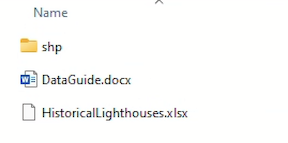

... and then double-click once more into the `shp` folder, which contains:

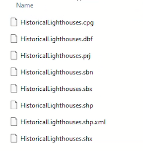

Ah! Here's your spatial data.

Each one of these files is a component of the **shapefile format**, hence the abbreviated folder name `shp`, short for "shapefile."

The shapefile is a format for storing and displaying spatial data, created in 1998 by the Environmental Systems Research Institute (often shortened to "ESRI" and now stylized as "Esri").

It's a somewhat misleading name because it is not a single file. At minimum, a shapefile must contain at least three **sidecar** files...

* a main `.shp` file
* an index `.shx` file
* a dBASE `.dbf` file

... but often, shapefiles contain more than that. Each file plays a [specific and important role](https://www.loc.gov/preservation/digital/formats/fdd/fdd000280.shtml) in the shapefile's overall configuration, such as the `.sbn` and `.shn` files ([spatial indexing](https://gistbok.ucgis.org/bok-topics/spatial-indexing)), the `.prj` file ([map projection and coordinate system](https://gistbok.ucgis.org/bok-topics/map-projections)), and the `.xml` file ([metadata](https://gistbok.ucgis.org/bok-topics/metadata) about the shapefile's creation). You'll rarely, if ever, need to interact directly with these sidecar files. ***You should never delete them.***

We'll download the shipwreck data later on.

## **Directory organization**

Right now, the spatial data you need is nested within a bunch of other artifactual junk folders: `HistoricalLighthouses` is inside `HistoricalLighthouses_UkData`, which is inside `854172_HistoricalLighthouses`. This is not ideal! And if you let these junk folders accumulate, they'll make it difficult to navigate your workspace down the road.

As usual, you should be following the "[hierarchical method](https://library.ucmerced.edu/node/66751)" of folder organization, which includes eliminating unnecessary sub-folders like the ones you have now. Go ahead and drag the `HistoricalLighthouses` folder directly into your `data` folder. Then, delete all the empty ones.

Your directory should now resemble:

    lab03_lighthouses/
    ├─ data/
        ├─ historicalLighthouses/
            ├─ shp/..
            ├─ DataGuide.docx
            ├─ HistoricalLighthouses.xlsx
    ├─ workspace/
    ├─ map/

## **Loading data into your project**

Go ahead and create a new ArcGIS Pro project file – name it something like `lab03.aprx` and save it in the `workspace` folder.

In ArcGIS Pro, navigate to the **Catalog** pane on the right-hand side of the screen. Refer to [this guide](https://pro.arcgis.com/en/pro-app/latest/get-started/user-interface.htm) if you need a refresher on the Pro interface. If you don't see the **Catalog** pane, click on the `View` tab on the banner, then click `Catalog Pane`. 

`Right-click` on `Folders` ➡️ `Add Folder Connection`:

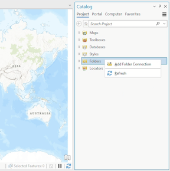

Add the `data` folder to your workspace and unfold your way to the `HistoricalLighthouses.shp` file. Add it to the map and you should see a bunch of dots display around the coast of England (feel free to *Pin* the **Catalog pane** at this point):

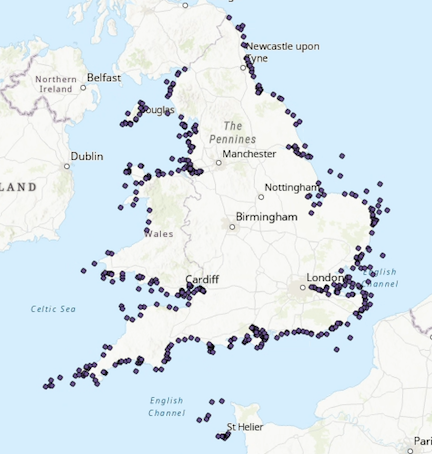

# **Making sense of the data**

Open the **Attibute table** and take a moment to examine the fields and records. Some, like `NAME`, are intuitive, while others, like `LH_1753`, are not.

Using the metadata `.docx` file that came with your data, answer the following questions:

| [![q]][l] 
|:- 
| 1. What does `LH` mean in the attribute table?
| 2. What does `REACH` mean in the attribute table?
| 3. According to the metadata, what coordinate system should this data be displayed in?
| 4. What are the linear units of the dataset's coordinate system?
| 5. What are the linear units of the `REACH` fields?

Already we can see some tensions emerging between the data's coordinate 

Now, in the **Contents** pane of your ArcGIS Pro project, `Right-click` on "Map" ➡️ "Properties." Examine the information in the *General* tab as well as the *Coordinate Systems* tab.

| [![q]][l] 
|:- 
| 6. What coordinate system is the map *actually* displayed in?
| 7. What kind of coordinate system is that – geographic, or projected? (**Hint:** If you can't remember the difference between these two terms, [refresh your memory here](https://www.esri.com/arcgis-blog/products/arcgis-pro/mapping/gcs_vs_pcs/).)
| 8. What *units* does this coordinate system use?

Now that we know what the fields actually mean, and have a greater understanding of the units being measured in the data, we can start our analysis.

# **A light density risk surface**

You're going to build a *light density surface*[^1] by calculating the `REACH` field of lighthouses along the coast. Then, you'll experiment with customize the style of this surface in two ways: first, creating [proportional symbols](https://pro.arcgis.com/en/pro-app/3.1/help/mapping/layer-properties/heat-map.htm) based on a field value; and second, using the **Buffer** tool. Both of these will require you to fuss with a bit of [color theory](https://gistbok.ucgis.org/bok-topics/color-theory) and [blending modes](https://pro.arcgis.com/en/pro-app/latest/help/mapping/layer-properties/apply-visual-effects.htm).

After you have a suitable light density surface, you're going to use the **Spatial Join** tool to determine how many shipwrecks occurred within the radius of each lighthouse's reach. In the end, you'll have a neat map of both light density and risk – a *light density risk surface,* perhaps? – that visualizes where ships have fallen victim to the rocky shoals of the English coast.

## **Displaying data as proportional symbols**

The easiest way to represent the distance of lighthouse reach is via the **Symbology** tab. To open this:

* Select the `HistoricalLighthouses` layer by clicking on it
* Click `Feature Layer` in the banner above your Map
* Click the **Symbology**  button

This will open the **Symbology** tab on the right side of the screen. Under the **Primary symbology** header, change "Single Symbol" to "Proportional Symbols", and set the parameters like so:

1. Field = `REACH_1831`
2. Normalization = `<None>`
3. Unit = `Miles`
4. Data represents = `Radius (1/2) width`

The *Map* should update dynamically as you make these changes until it resembles:

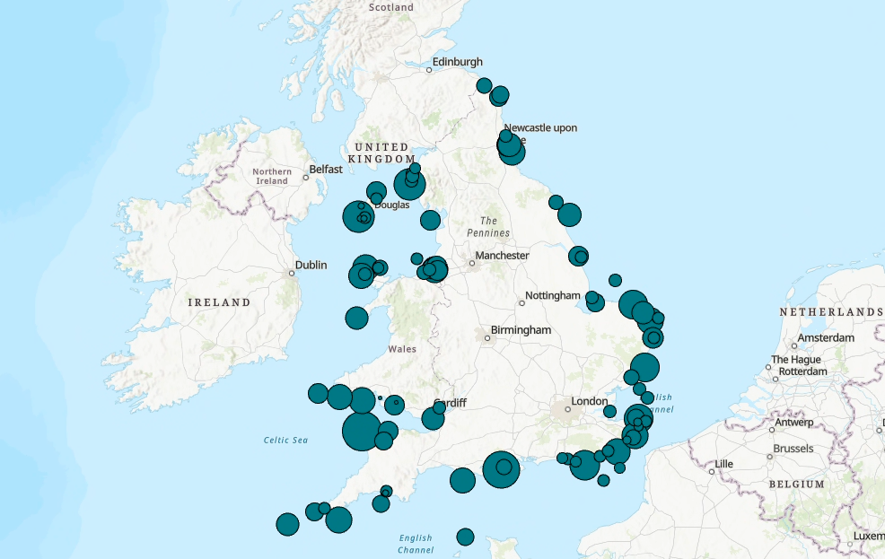

As explained in the data guide, the `REACH` field represents the night-time visibility range of lighthouses at certain years. The data guide also mentioned that the units were in miles, which the **Symbology** easily handles for us.

Now that we've got our points displayed as proportional symbols, let's make a couple of stylistic changes.

The way these symbols are displayed right now doesn't really let us visualize density. To do that, we can adjust the transparency settings of our features:

1. Click the color symbol next to *Color*
2. Select *Color Properties...*
3. Crank up that transparency to `75%` and click `OK`
4. Set *Outline color* to `No color`

This is starting to look kind of interesting – instead of a bunch of points that display lighthouse locations, we now have something resembling a light density surface, in which more areas represent locations of higher visibility, and lighter.

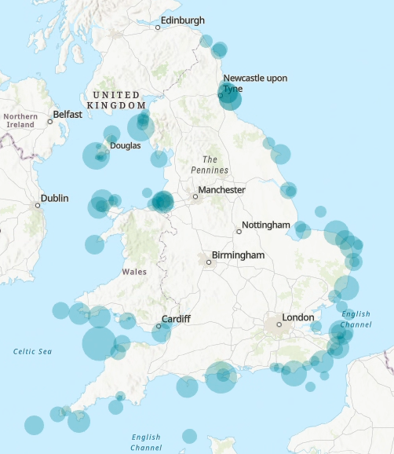

However, I don't like how the colors contrast on my map, so I'm going to make a few changes to the basemap using ArcGIS Pro's *layer blending.*

### **Introduction to layer blending**

|  |
| :-------------------------------------------------------------------------------: |
|                 *Comparing and blending two layers in ArcGIS Pro*                 |
|                                                                                   |

[Layer blending](https://pro.arcgis.com/en/pro-app/latest/help/mapping/layer-properties/apply-visual-effects.htm) is the process of, well, blending layers. Okay: it's a *bit* more complicated than that, but you get the general idea. It works by applying a formula to a feature layer in order to achieve certain visual effects in your map. For example, here's the **Overlay** blending mode, per [Esri's layer blending documentation](https://pro.arcgis.com/en/pro-app/latest/help/mapping/layer-properties/apply-visual-effects.htm#:~:text=Each%20blend%20mode%20follows%20a,on%20each%20color%20channel%20independently.):

| Mode name                                                                                                                                    | Formula                                                | Description                                                                                                                                                                |
| :------------------------------------------------------------------------------------------------------------------------------------------- | ------------------------------------------------------ | -------------------------------------------------------------------------------------------------------------------------------------------------------------------------- |
| Overlay  | `= 2ab (if a < 0.5); else (1 - 2 * (1 - a) * (1 - b))` | If the color value of the background is less than half (more black than white), its color is multiplied by the layer's color. Otherwise, the Screen blend mode is applied. |
|                                                                                                                                              |                                                        |                                                                                                                                                                            |

John Nelson from Esri has made [a lot of nice tutorials](https://www.esri.com/arcgis-blog/products/arcgis-pro/mapping/blending-a-balance-between-imagery-and-cartography-cartimagery/) on how to use blending modes for your basemaps, including a guide to [getting started with blending modes in general](https://www.esri.com/arcgis-blog/products/arcgis-living-atlas/mapping/demystifying-blend-modes-in-arcgis-with-a-handy-reference-graphic/). Check 'em out if you're so inclined.

Because this is a map of lighthouses, I want to make our proportional symbols pop out against a dark surface as if they were actually illuminating the area. I'm going to do something a little cheeky: blend the basemap into a dark blue project background. To achieve this effect:

1. `Right-click` on the "Map" in your **Contents** pane and select "Properties"
2. Set the background color to a dark blue. I fiddled with the "Color properties" until I found a [HEX code](https://en.wikipedia.org/wiki/Web_colors#Hex_triplet) that I liked – `#000056` – but you should feel free to choose a color that suits your taste.

    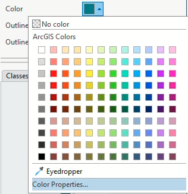

3. Let's replace the default topographic basemap provided with some satellite imagery. Click the **Map** tab on the banner at the top of your screen, click *Basemap*, and select "Imagery."
4. Now select the `World Imagery` layer in your **Contents** pane by clicking on it, and then click the **Tile Layer** button at the top of your screen.
5. Click the drop-down bar next to *Layer blend* and select "Overlay."

Congratulations! You've unlocked 🎉**Layer Blending**🎉. Now you should see something like this:

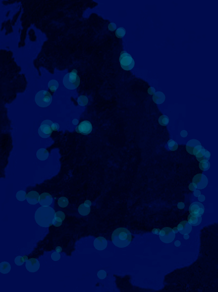

Pretty neat: the "Overlay" mode has done fancy color math to our basemap, giving it this cool midnight-ish appearance.

It's better, but we can probably make those proportional symbols pop a little bit more. 

Go back into the **Symbology** pane of your `HistoricalLighthouses` layer and give it a nice light yellow color. Again, I picked `#FFF2D1`, but you don't have to.

 

Sure, but, but...... sorry, but can't we make this pop just a *little bit more?!?!*

Here's where it gets really wild: in your **Contents** pane, go ahead and drag `HistoricalLighthouses` so that it's *underneath* the `World Imagery` layer. Doing so will produce a sort of "revealing" effect, where the the white-yellows of the semi-transparent proportional symbols and the blues of the background combine and neutralize within the blending mode.[^2] If you zoom in more closely, you'll see that the circles now reveal a photorealistic, "normal"-looking satellite image:

|                                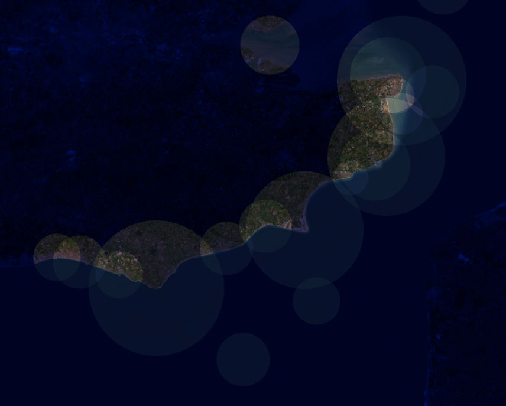                                |
| :-------------------------------------------------------------------------------------------: |
| *[Yes!!! Ha Ha Ha... Yes!!!!!](https://i.kym-cdn.com/photos/images/original/002/265/962/2b6)* |
|                                                                                               |

> **TIP:** You can hold down the `Shift` key and drag a box on the map to zoom to that view.

Feel free to continue tinkering with parameters here – try different basemaps, test out different colors, use other blending modes - until you get something that feels right to you.

## **Calculating `REACH` with the buffer tool**

As cool as this looks, our proportional symbols layer is not something that we can use to perform real spatial calculations. That is, we can't use it to count how many shipwrecks fall within a given circle. Now we'll turn to the **Geoprocessing Toolbox** to accomplish this task.

**Buffering**, a fundamental geoprocessing workflow, [creates "buffer" polygons around input features, to a specified distance](https://pro.arcgis.com/en/pro-app/latest/tool-reference/analysis/how-buffer-analysis-works.htm).

It helps visualize what kinds of features fall within the specified range, as a teen curator in a recent Leventhal Center exhibition did with [common community areas across Boston](https://www.leventhalmap.org/digital-exhibitions/getting-around-town/teen-curators/neveah/). More advanced analyses might use the buffer tool to determine a [risk area of oil spills from tankers or pipelines](https://www.frontiersin.org/articles/10.3389/fmars.2023.1141962/).

|  |
| :---------------------------------------------------------------------------------------------------------------------------: |
|               *The Buffer tool in action, including the option to dissolve the output into singlepart polygons*               |
|                                                                                                                               |

The **input features** can be points, lines, or polygons, but the output feature is *always* a polygon or set of polygons. The **specified distance** can be a stable number, like `10 miles` for all features, or a variable, such as the value of the `REACH` field for each feature.

Just to get the hang of it, let's buffer a couple different ways.

### **Buffering by distance**

In ArcGIS Pro, open the **Geoprocessing** toolbar by clicking `Analysis` ➡️ `Tools`. Search for "buffer" in the search bar, and select **Pairwise Buffer**.

You might notice that the toolbox offers both a **Buffer** *and* a **Pairwise Buffer**. The **Pairwise Buffer** tool uses [parallel processing](https://www.esri.com/arcgis-blog/products/analytics/analytics/parallel-geoprocessing-in-arcgis-pro/) to compute spatial data more quickly. Nice!

`Double-click` the **Pairwise Buffer** tool to open it; then, set the following parameters and click `Run`:

> [![imp]][q] Before you click `Run`, be sure that you've cleared the selection of any records from the attribute table – otherwise, the tool will only run on your selected records.

1. Input features = `HistoricalLighthouses`
2. Output feature class = click the folder  and save the output feature class as `lighthouseBuffer_10miles`. If you click in the text box itself, you should see a full file path resembling:

       ..\lab03_lighthouses\workspace\lab03.gdb\lighthouseBuffer_10miles

3. Distance = `10`, with `Linear Unit` set to `Statute Miles`
4. You can leave Method, Dissolve Type, and Maximum Offset Deviation at their default settings.

When it's finished, turn off your `HistoricalLighthouses` layer and you should see something like this:

As opposed to the proportional symbols you generated earlier from the `HistoricalLighthouses` point layer, this is a bona fide polygon layer, with bona fide geometry that we can use for spatial computation.

### **Data snooping**

Let's do a bit of data snooping to check your work.

Open the attribute table of your new layer, `lighthouseBuffer_10miles`. There should be four new fields: `BUFF_DIST`, `ORIG_FID`, `SHAPE_LENGTH`, and `SHAPE_AREA`.

| [![q]][l]                                                         |
| :---------------------------------------------------------------- |
| 9. What is the value of all the records in the `BUFF_DIST` field? |

That certainly doesn't look like ten miles! We can figure out what happened by manually measurin the buffers.

Under the *Map* tab, select the **Measure** 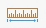 tool. Make sure the measure distance is set to `Planar` and `Metric`.

Then, zoom into one of the buffered lighthouses – preferably, one that doesn't have a bunch of other buffers overlapping it – and measure the radius of the circle by `Clicking` the lighthouse point and then `Double-clicking` the buffer's ring.

Mark down the value listed next to "Path net distance" by either typing it out or clicking the *Copy results* 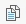 button. Then, click the *Clear*  button and measure the distance again, this time in miles.

| [![q]][l] |
| :-------- |
|    10. What did you measure for the radius of your buffers, in kilometers and miles? (It doesn't have to be exact.)       |

It turns out that the mysterious value in the `BUFF_DIST` field is *meters*. As you discovered in questions 7 and 8, our data is projected in `British National Grid`, which uses meters as the default unit of measurement.

Now we'll buffer against a dynamic variable, rather than a static value, using the `REACH_1831` field.

### **Buffering by variable**

Open **Pairwise Buffer** again. This time, your parameters should resemble:

1. Input features = `HistoricalLighthouses`
2. Output feature class = `lighthouseBuffer_1831`
3. Distance = set to `Field` and select `REACH_1831`
4. Again, you can leave Method, Dissolve Type, and Maximum Offset Deviation at their default settings.

Click `Run`. You shouldn't really see anything at all, except for a message in the **Geoprocessing** tab that says "Pairwise Buffer completed with warnings":

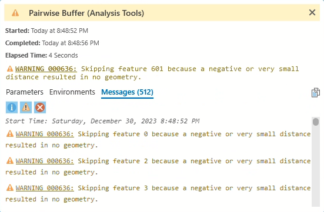

This is actually expected behavior; since there are a bunch of records in the `HistoricalLighthouses` layer with values of `0` in the `REACH_1831` column, buffering them is a mathematical impossibility and they're skipped.

But still, where's your buffer layer?

If you remove `lighthouseBuffer_10miles` from your **Contents** pane, you'll notice a bunch of tiny specks across the map. Go ahead and zoom into one of them.

The **Pairwise Buffer** tool lets you select a field as the specified buffer distance, but it *doesn't* allow you to select a unit of measurement. So, when you created `lighthouseBuffer_1831`, *ArcGIS Pro processed it in the default unit of measurement for this coordinate system*.

Oofa doofa. We'll need to do something about this.

> **CLEAN YOUR CATALOG:** Before proceeding, let's take a moment to clean up your **Catalog**.
>  
> To reiterate how ArcGIS Pro saves stuff: every time you run a geoprocessing function, it's saved by default to your **project geodatabase**, or a database that is designed to inherently handle all sorts of different spatial data. Your project geodatabase is automatically created in the same folder where you saved your ArcGIS Pro project; in this case, it should be in `workspace`.
>
> Open your **Catalog** pane, unfold the `workspace` folder, and delete these two files from your project geodatabase:
> * `lighthouseBuffer_10miles`
> * `lighthouseBuffer_1831`

### **Enter, the Field Calculator**

We need our `REACH` fields to display distance in *meters* instead of *miles*. In this endeavor, the **Field Calculator** is a good, good buddy.

This handy tool allows you to perform calculations both simple and complex on field values within an attribute table.

> [![imp]][q] You should always toggle on *[Editing mode](https://pro.arcgis.com/en/pro-app/3.1/help/editing/overview-of-desktop-editing.htm)* before making significant changes to a layer or feature class. It allows you to discard changes – from a field calculation, for example – in case you accidentally mangle a dataset beyond reproach. Which I have done many times. And so will you.
> 
> [Follow these instructions](https://pro.arcgis.com/en/pro-app/3.1/help/editing/enable-and-disable-editing.htm) to display the **Edit** button.

Turn on *Editing mode* by clicking the **Edit** button, and then crack open the Field Calculator by clicking the **Calculate** button in the attribute table of the `HistoricLighthouses` layer:

In our field calculation, we want to multiply the number of miles in the `REACH` columns by the number of meters in a mile. In other words, we're turning miles to meters.

This should be a simple process. However, because this is historical GIS work, it is not.

Recall that our data guide listed the units for `REACH` fields as miles...

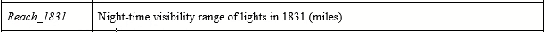

... but in their [academic article detailing the creation of this dataset](https://www.ncbi.nlm.nih.gov/pmc/articles/PMC7369582/), the authors specify that these are in fact *nautical* miles – a completely different unit of measure from the familiar U.S. survey (or *statute*) mile of 5,280 feet!

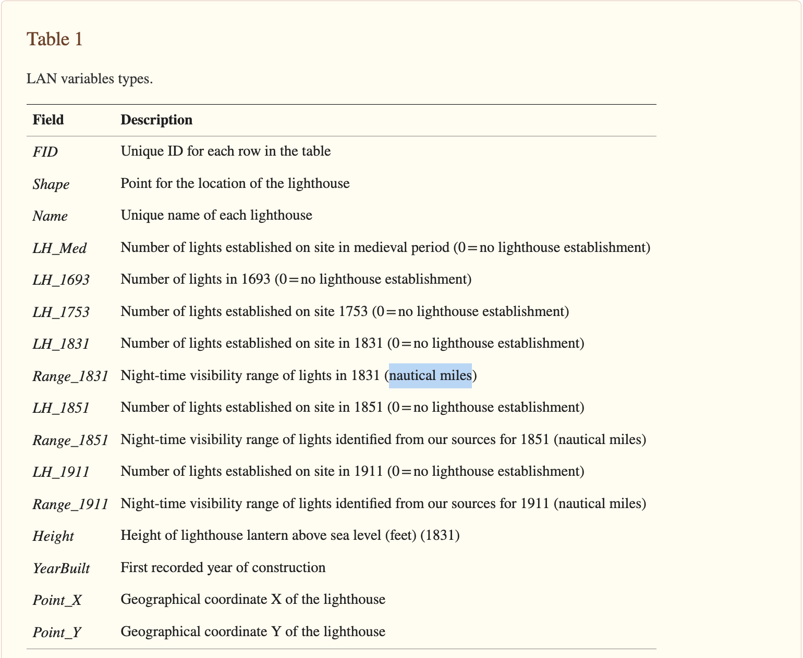

FYI: a [nautical mile](https://en.wikipedia.org/wiki/Nautical_mile) was historically defined as one-sixtieth a degree of latitude, but today it is [generally taken to be 6,080 feet](https://www.rmg.co.uk/stories/topics/nautical-mile).

After nobly plumbing the depths of the digital archive...

... I reasoned that the Magic Number for our meters-to-nautical miles conversion would be `1852`.

### **Field Calculator and Buffer *redux***

Open the Field Calculator again and set the following parameters...

1. **Input Table** = `HistoricLighthouses`
2. **Field Name** = type in `meter_1831`. This will create a new field with that title in the attribute table. (And when you're choosing field names, recall that shapefile field names are limited to 10 characters.)
3. **Field Type** = `Long (32-bit integer)`. I think some of our values from this calculation may exceed the limit of a [16-bit integer](https://pro.arcgis.com/en/pro-app/latest/help/data/geodatabases/overview/arcgis-field-data-types.htm#ESRI_SECTION2_9E18CD239E56411CACF9C7672FCFEACA), so we're choosing [32-bit](https://pro.arcgis.com/en/pro-app/latest/help/data/geodatabases/overview/arcgis-field-data-types.htm#ESRI_SECTION2_D0354E6FF7C34CD5817372DD3662B7A6) just to be safe.
4. **Expression type** = `Python 3`. The other option, [Arcade](https://developers.arcgis.com/arcade/), is a proprietary expression language for ArcGIS applications. It's mostly useful if you're building apps across the wider ecosystem of Esri software. We don't need to learn it right now, and moreover, you don't need to "know Python" in order to compose expressions in the Field Calculatorn – so if you're unfamiliar with programming and query languages, don't be too intimidated by this.
5. **Expression** = `Double-click` on the `REACH_1831` field. This will automatically add it to the expression dialog, braced by `!` characters, which tell ArcGIS Pro that the string actually refers to a field. Then, manually type in the Magic Number that I mentioned above.

        !REACH_1831! * 1852

6. **Code Block** should stay empty, and **Enforce Domains** should remain unchecked.

... and click `Apply`.

When your field appears, you can close the **Calculate Field** popup by clicking `OK` and exit *Editing mode* by clicking the **Edit** button.

Now [run that **Pairwise Buffer** tool again](#buffering-by-variable), but this time, set the Distance field as `meter_1831`. Note that if the **Pairwise Buffer** tool is still open from the last time you used it, you  may need to close and re-open it for the new `meter_1831` field to appear.

Click `Run`, and you should see something like this:

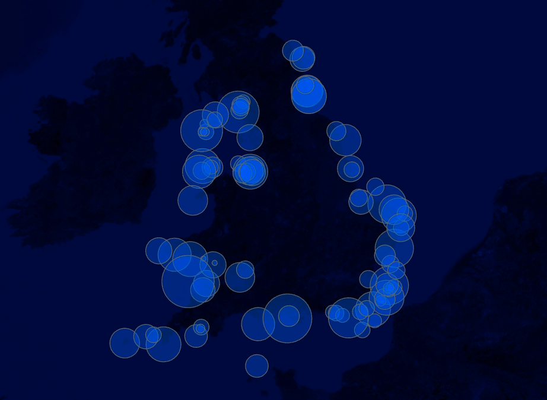

Alright! Now that's more like it!

Before moving on to the next section, replicate this workflow for the other two `REACH` fields, first calculating them from nautical miles to meters, and then buffering them by their new fields.

Don't forget to set the Field Type to `Long (32-bit integer)`!

When you're finished, you should have three layers in total: `lighthouseBuffer_1831`, `lighthouseBuffer_1851`, and `lighthouseBuffer_1911`.

Your map and attribute table should look something like this: 

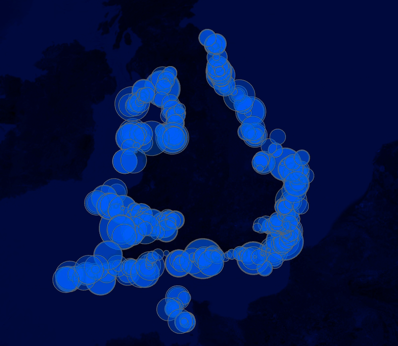
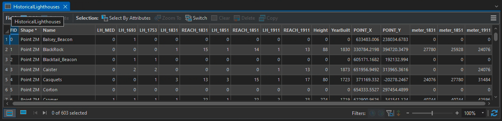

I recommend grouping your light density surfaces together by selecting all three ➡️ `Right-click` ➡️ "Group." I named my group `lightDensitySurfaces`.

# **Counting shipwrecks**

Now that we have three light density surfaces – one for each year that there was available data on reach – we can actually calculate stuff using them.

In this section, we're going to download some data on shipwrecks and figure out how many have occurred within the boundary of each light density surface layer.

In general, this is a super common GIS workflow. In our case, we're answering the question: which parts of the English coast are historically dangerous, despite being well-lit?

## **Download the data**

[Download the data](https://canvas.tufts.edu/courses/54475/files/7178472?wrap=1) from ~~the UK Hydropgraphic Office~~ Canvas and extract its contents to your `data` folder.

Then, load the `Points.shp` file that is buried within the `Wrecks_and_Obstructions_Shapefile` folder into ArcGIS Pro.

Jump scare! Points everywhere!

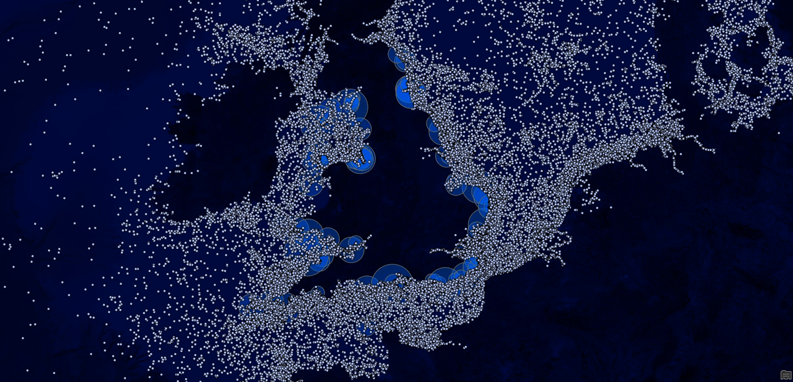

Let's rename this to something more intuitive, like `shipwrecks`.

| [![q]][l] |
| :-------- |
| 11. How many points are in the `shipwrecks` layer?          |

## **Clip-wreck data**

Set aside, for a moment, the harrowing reality that the English Channel and its entire environs is basically a maritime graveyard. On a practical note, we don't need all of these points, a they'll slow down general performance of the software if we don't clear them out first.

Thankfully, the **Clip** tool makes it pretty easy to get rid of unwanted points. This tool [extracts input features that overlay the clip features](https://pro.arcgis.com/en/pro-app/latest/tool-reference/analysis/clip.htm). It's another GIS classic. 🤟

And since we want to preserve shipwrecks that fall within *any* of our three light density surface layers, let's go ahead and **Merge** them together to create a clip layer. Try this Clip-Merge workflow:

1. **Geoprocessing** ➡ **Merge**
   1. Input Datasets = `lighthouseBuffer_1831`, `lighthouseBuffer_1851`, and `lighthouseBuffer_1911`
   2. Output Dataset = `lighthouseBuffers_merged`
   3. Leave everything in Field Map untouched
2. **Geoprocessing** ➡️ **Clip**
   1. Input Features or Dataset = `shipwrecks`
   2. Clip Features = `lighthouseBuffers_merged`
   3. Output Features or Dataset = `shipwrecks_clipped`

The **Clip** will take a bit longer to run, since it has to process so many points – but believe it or not, there's stuff going on under the hood of ArcGIS Pro that makes this much faster than it would be otherwise. While you're waiting, feel free to read about [spatial indexing](https://gistbok.ucgis.org/bok-topics/spatial-indexing). Or, you know, just zone out. 

When it's finished running, remove `shipwrecks` from your **Contents** pane. The output should resemble this:

|   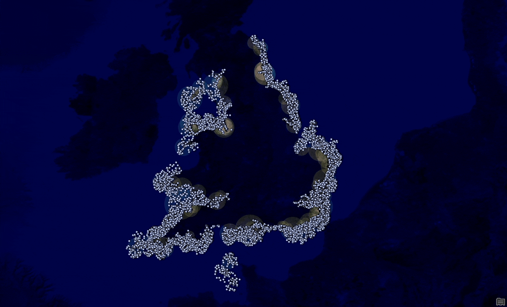   |
| :------------------------------: |
| *What a difference a clip makes* |
|                                  |

Open up the `shipwrecks_clipped` attribute table. There's a *ton* of data in here that you could do interesting stuff with, but we're only concerned with one field: `date_sunk`. (Just as a point of order, this data doesn't have any real meaningful field-by-field metadata associated with it, which kind of sucks, so we're stepping into a realm of greater uncertainty.)

Since our main light density surface layers are associated with specific years, we want to be able to select and filter these points based on year as well. Two things are stopping us:

* The `date_sunk` layer is filled out in `yyyymmdd` format, when we want `yyyy`
* The `date_sunk` layer is encoded as `Text` data, not `Integer`

Press the **Edit** button under the **Edit** tab, and we'll fix both of these issues:

1. Sort the `date_sunk` field in descending order by `Right-clicking` the header name ➡️ "Sort Descending," and then manually remove any records with no value in the `date_sunk` field by selecting and deleting them. This should leave you with 5,702 records.
2. Open the **Field Calculator**
   1. Input Table = `shipwrecks_clipped`
   2. Field Name = `year_sunk`
   3. Field Type = `Short`
   4. Expression Type = `Python 3`
   5. Set the expression dialog to

          !date_sunk![0:4]

      In Python, this is called a [substring](https://stackoverflow.com/questions/663171/how-do-i-get-a-substring-of-a-string-in-python). The first number specifies how many characters to remove from the left/front of the specified string, and the second number specifies how many characters to remove from the right/end. Since our dates are consistently formatted, we can use a simple substring to strip `mmdd` from the right, retaining only `yyyy` at the left.

   6. Again leave Code Block and Enforce Domains untouched.

Click **Apply** and check the attribute table to see if your calculation succeeded.

> **TIP:** If you hover your cursor over the `year_sunk` header, you should see a popup that tells you what kind of data type it is.
> 
> 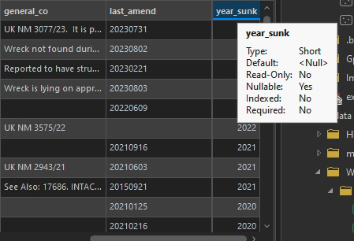

When things look right, go ahead and exit the Field Calculator, click the **Save** button to save your edits and the **Edit** to leave editing mode, and proceed to the next section.

## **Associate stuff with other stuff: A method**

We now have three light density surface layers for three different years, and one big cluster of points that falls within the same area. The task at hand: associate each point with its appropriate light density surface based on our new `year_sunk` column.

For this task, we'll rely on **Spatial joins**, which make stuff associated with other stuff according to the stuffs' location. You can read a smart explanation of the tool in [Esri's documentation](https://pro.arcgis.com/en/pro-app/latest/tool-reference/analysis/spatial-join.htm).

First, let's make use of that new `year_sunk` column.

### **The logic**

We want to avoid joining shipwrecks to a lighthouse that didn't exist when the wreck occurred – for example, it wouldn't make much sense to join a shipwreck that perished in 1850 with a lighthouse that didn't exist until 1911. So, we're going to join only those records that match the breaks in our data.

For the sake of this lab, here are the breaks we'll use:

* All `shipwrecks_clipped` records where `year_sunk` is greater than 1799 and less than 1851 will be joined to `lighthouseBuffer_1831`
* All `shipwrecks_clipped` records where `year_sunk` is greater than 1850 and less than 1911 will be joined to `lighthouseBuffer_1851`
* All `shipwrecks_clipped` records where `year_sunk` is greater than 1910 and less than 1914 will be joined to `lighthouseBuffer_1911`

My logic to terminate the break by 1914 is that the battles of World War I would skew our data significantly (e.g., ships aren't wrecking as much as they are being wrecked by others).

My logic to initiate the break at 1800 is I wanted to include a few more points on the older end, and this is just a learning lab, so I'm not super concerned that we might be attaching a few wrecks to lighthouses that don't yet exist.

### **Select by Attributes**

Click the **Select by Attributes** button at the top of your attribute table and compose a query where `year_sunk` is greater than `1799` and less than `1851`. It should look exactly like this:

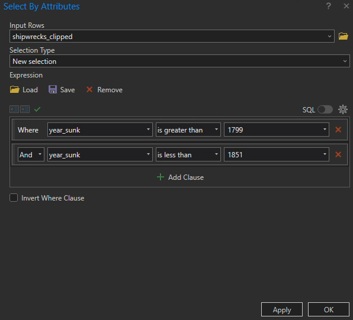

While you're here, toggle the **SQL button** just above the query builder.

SQL, short for [Structured Query Language](https://pro.arcgis.com/en/pro-app/3.1/help/mapping/navigation/sql-reference-for-elements-used-in-query-expressions.htm), is a standardized query language for retrieving data from a database, file, or in this case, a feature class. Eventually, you might find it easier and faster to make these sorts of queries by simply typing them out in SQL rather than clicking through the query builder.

Once you click **Apply**, a little message will pop up beneath the Input Rows:

> "The input has a selection. Records to be processed: 71."

Nice! Click **OK** to exit the **Select by Attributes** dialog, and let's process those records.

### **Spatial joins**

In your **Contents** pane, `Right-click` the `lighthouseBuffer_1831` layer ➡️ "Joins and Relates" ➡️ "Add Spatial Join":

1. Target Features = `lighthouseBuffer_1831`. This is the layer to which we are joining our desired features.
2. Join Features = `shipwrecks_cipped`. These are the desired features to be joined. It should say "The input has a selection. Records to be processed: 71." **If it doesn't say that, double back and run your selection query again.**
3. Match Option = `Completely contains`
4. Leave Search Radius empty, but unfold the **Fields** header and remove all the empty fields except for `year_sunk`

Click **OK** and you should see the attribute table for `lighthouseBuffer_1831` update. Look for a field called `Join_Count`. That field tells us how many shipwrecks landed in a given lighthouse buffer area.

Lastly, `Right-click` on the `lighthouseBuffer_1831` layer and select `Data` ➡️ `Export Features`. Then, save it in your project geodatabase as `lights1831_joined`. This final step actually saves the spatial join into the feature class itself, rather than saving it in memory on the ArcGIS Pro project.

### **Run it back**

Now complete this process again for `lighthouseBuffer_1851` and `lighthouseBuffer_1911`:

1. Query `shipwrecks_clipped` so that the `year_sunk` field reflects the appropriate breaks
2. Spatially join the selected features to their respective light density surface layers
3. Export the spatially joined layer as a new feature class

Pay close attention to the numbers you're using for greater/less than queries. When you're done, use the "Sort Descending" feature of the attribute table to determine the following questions:

| [![q]][l]                                                                                  |
| :----------------------------------------------------------------------------------------- |
| 12. What is the largest value in the `Join_Count` column in the `lights1831_joined` layer? |
| 13. What is the largest value in the `Join_Count` column in the `lights1851_joined` layer? |
| 14. What is the largest value in the `Join_Count` column in the `lights1911_joined` layer? | 

🎉 Congratulations! 🎉 That was a ton of work. These last steps, hopefully, will be more fun: you'll see your light density risk surface come together with a nice design.

# **Designing our light density risk surface**

Go ahead and drag your light density surfaces back underneath the `World Imagery` layer, if they're not already under it.

Starting with `lights1831_joined`, open the **Symbology** pane.

From the **Primary symbology** drop-down menu ➡️ "Graduated Colors" ➡️ set the following parameters:

1. Field = `Join_Count`
2. Normalization = `<None>`
3. Method = `Manual interval`
4. Classes = 4
5. Color scheme = pick a "Continuous" scheme that starts at white and ends at red (it's okay if there's orange in the middle). **Also, click on the gear next to the color palette drop-down menu and change the setting to "Apply to fill and outline."**
6. Set your classes to:
   1. Upper value ≤ 0
   2. Upper value ≤ 1
   3. Upper value ≤ 3
   4. Upper value ≤ 21 (for `lights1831_joined`), 249 (for `lights1851_joined`), and 12 (for `lights1911_joined`)

It should look something like this:

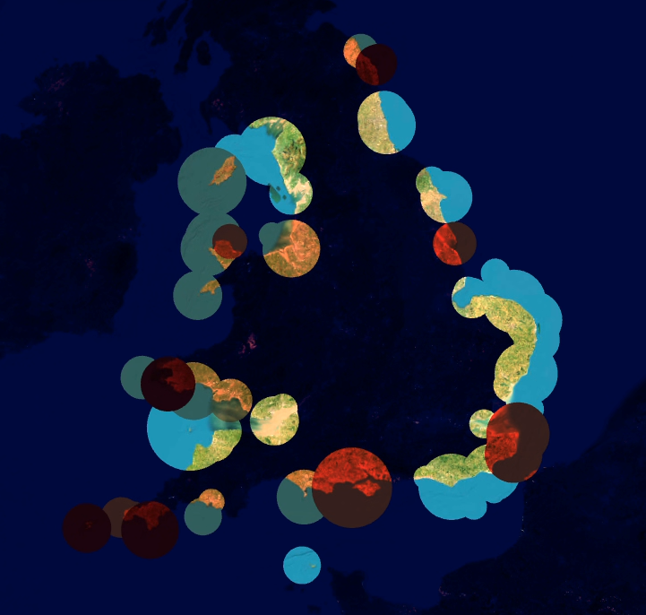

>  
> 
> [![imp]][l] When you're representing data that changes across time, you have to use the same class breaks for each layer. That's why we didn't choose "Quantile" or "Natural breaks" representation: it would have corrupted the data's representational integrity.

Now, click on the **color palette drop-down menu** and click "Format color scheme...", and change the transparency to `80%` on each of the little tick marks:

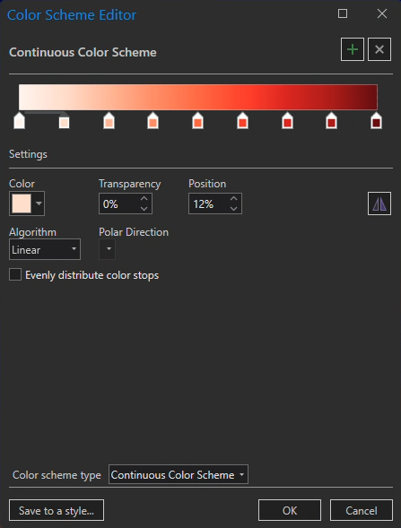

Click **OK** to make sure it resembles something like this:

Then open the "Format color scheme..." menu again, click "Save to a style...", and save your style as "Light density risk surface."

Now, you can replicate this formatting more easily in your other two layers, `lighthouseBuffer_1851` and `lighthouseBuffer_1911`. When you're finished adding the exact same formatting to those two layers, you should have a map that looks like this:

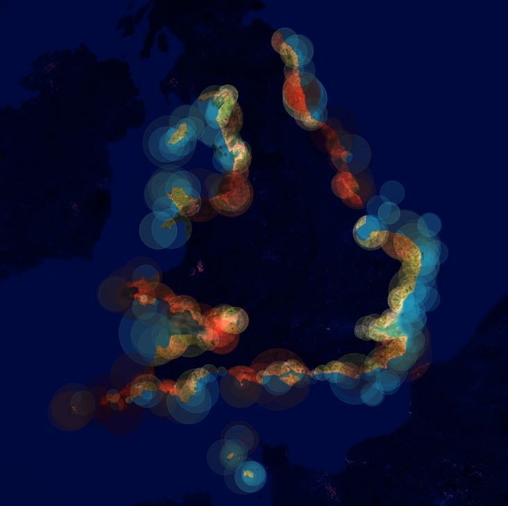

Here's what we're seeing: the darker the red, the greater the number of shipwrecks within a certain lighthouse range, and the brighter the color, the greater the number of lighthouses *at all*.

The way that we've composed this data does have a few flaws. For example, with this method, lighthouses that appear in 1831, 1851, and 1911 will add a "false" brightness to the map because they overlap themselves. We could solve this by adding [raster analysis with map algebra](https://pro.arcgis.com/en/pro-app/latest/help/analysis/spatial-analyst/mapalgebra/a-quick-tour-of-using-map-algebra.htm) into our workflow, but you've suffered enough: that's a task for another day.

And anyhow, I think this looks alright...

## **Finishing touches in ArcGIS Online**

... but it could look better!

We have one final set of steps for you to complete, and then you can go to bed or take a shower or watch *The Bachelor*, or whatever it is that you've been putting off because of this lab.

ArcGIS Online has a pair of functions – **Bloom** and **Blur** – that are critical to putting finishing touches on this map. They'll smooth out those hard edges on the circles, . And thankfully, it's a pretty quick and easy process.

### **Share as web map**

In order to upload this map to ArcGIS Online, you'll first need to [follow these instructions](https://sites.tufts.edu/gis/arcgis-online/) to make sure you're logged into the **tuftsgis** organization.

Then, in the **Contents** pane, `Right-click` on your "Map" ➡️ "Properties" ➡️ "Coordinate Systems" ➡️ change the coordinate system to `WGS 84 Web Mercator`. Unlike desktop GIS, online maps can usually only handle one coordinate system: the Google-developed [Web Mercator](https://desktop.arcgis.com/en/arcmap/latest/map/projections/mercator.htm#ESRI_SECTION1_AB3E85B510ED40698AB95BB94CB87374).

Once you've done that, you can open the **Share** tab and click "Web Map." Set the **Share As Web Map** parameters like so:

1. Give it a distinctive name
2. Write short summary of the map and the data
3. Skip tags
4. Configuration = `Copy all data: Exploratory`
5. Location = your root folder
6. Check the box to share with `Tufts University`

Click the **Analyze** button to ensure you're not missing any steps, and then click **Share** to send it to publish it in the Tufts ArcGIS Online organization! Note that you might need to rename some of your layers in the **Configuration** tab in order for the publication to process.

Once it's published, you can click "Manage the web map" to view it in a web browser. You might have to sign into your account again through the browser.

Once you're in, click "Open in Map Viewer" to see your map online.

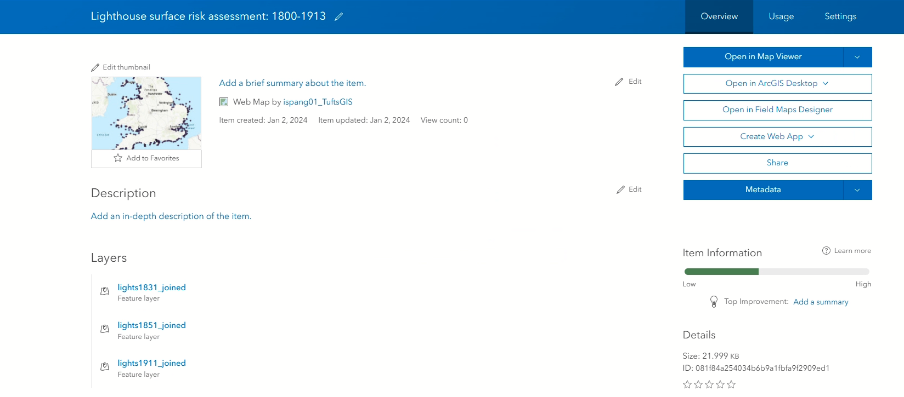

### **Add blur (and other stuff, if you want)**

If you've never used ArcGIS Online before, it's super intuitive and works quite similarly to Pro. You'll probably see something like this when you open the map:

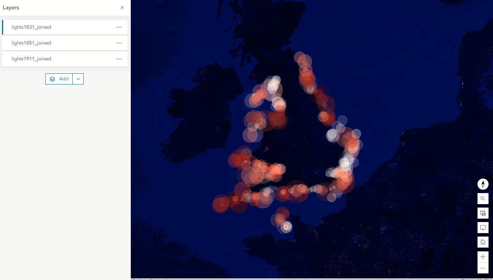

In ArcGIS Online, you can't place layers underneath a basemap. Thankfully, you can still add a satellite imagery layer easily.

1. Much like ArcGIS Pro, the left-hand side of the screen contains all your contents and layers, while the right-hand side houses the various "panes" – geoprocessing, symbology, and so on.
2. Click into the **Layers** tab at the top of the left-hand side of your screen – you should see `lights1831_joined`, `lights_1851_joined`, and `lights1911_joined` – and click the **Add** button beneath them.
3. Click where it says **My content**, select **Living Atlas**, and search for "Imagery."
4. "World Imagery" should be the first hit: select it and click "Add to map."
5. It will land on top and cover everything up, just like we want it to. Adding it should also have triggered the **Properties** tab to open from the right-hand side. 
6. Collapse the **Symbology** header, and that should reveal the blending options. Change it from "Normal" to "Hard light."

Voila! Your map is back.

Now you need to redo transparency on each of the `lights` layers. While you're at it, you can add **Bloom** and **Blur** features to perfect this map.

1. In the **Layers** tab on the left-hand side, click the `lights1831_joined` layer to select it. 
2. Under the **Appearance** header in the **Properties** tab on the right-hand side, toggle the transparency back up to `80%`.
3. Then, click on the **Effects** tab on the right-hand side of your screen. It should be just a few boxes down from **Properties**.
4. You should see a big list of "effects." Start by turning on Blur and cranking it up to `10`.
5. Now replicate this for the other two layers. The app should even be smart enough to remember that you picked `10`.

Now, you've got a proper map of lighthouses, with a lovely blur effect at the edges of the buffers that gives the viewer the sensation of natural light:

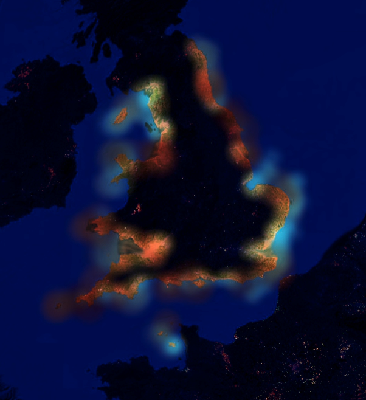

# **Submit**

Before you submit, feel free to play around a bit with the **Bloom** effect to see how it combines with **Blur.** You could also try changing the color to a different shade of blue (or maybe away from blue altogether). You might also find that in ArcGIS Online, the transparency doesn't need to be quite so high – maybe try setting it at `50`, or even leaving it at `0` to see what happens (I kind of liked leaving transparency at `0` and sorting the layers newest to oldest). Lastly – and especially if you leave the transparency at `0` – note that the layer ordering affects the final map quite a lot.

When you're ready to submit the map, click **Print** at the bottom of the sidebar on the left-hand side of the screen. Give it a decent title, set Page Setup to `A3 Portrait` and File format to `PNG32`, and click **Export.**

The exported file will appear in a new tab. Save a copy of it, name the file appropriately, and submit via Canvas, along with a Word document with answers to the questions throughout this lab.

# **Bibliography**

Putnam, George Rockwell. 1917. Lighthouses and Lightships of the United States. Houghton Mifflin.

Spence, Daniel Owen. 2015. A History of the Royal Navy: Empire and Imperialism. London: I.B. Tauris.

<!-------------------------------------[ Links ]
---------------------------------------->

[l]: #

<!---------------------------------[ Buttons ]--------------------------------->

[imp]: https://img.shields.io/badge/IMPORTANT!-red?style=plastic
[q]: https://img.shields.io/badge/Question-blue?style=plastic

[^1]: As far as I know, this isn't a real term in GIS world, but I thought it sounded impressive, so we're using it.

[^2]: I don't have a great explanation for why this works so well. Sorry! If anyone knows color theory better, please enlighten me!