# Lab 04: Reconstructing the geographies of Indo-Europeans <!-- omit in toc -->

> *The tutorial was written by Carolyn Talmadge on February 13, 2024 for ArcGIS Pro 3.1.4. It was edited by Ian Spangler on March 3, 2024.*

|  |
| :----------------------------: |
| *Present-day distribution of Indo-European languages in Eurasia, courtesy of [Wikipedia](https://en.wikipedia.org/wiki/Indo-European_languages)* |

> *This tutorial was modeled after Peter Nadel’s (Tufts DH NLP Specialist) GIS Project created Fall 2023 and uses much of his poster text. It also uses significant data, research, and hypotheses proposed by Heggarty et al. in their 2023 publication.* 

## What you should submit <!-- omit in toc -->

During this lab, you'll conduct a **suitability analysis** that introduces and/or reviews:

* Raster data models
* Raster (re)classification
* Zonal statistics
* Projections and projecting data
* Plotting XY data

Before **6:30pm on Tuesday, March 26**, submit to Canvas:

* A simple map layout, according to the instructions at the end of the document

## Table of contents <!-- omit in toc -->

- [Introduction and context](#introduction-and-context)
  - [A Historic Glance at the Proto-Indo-European Language?](#a-historic-glance-at-the-proto-indo-european-language)
  - [Ethical considerations](#ethical-considerations)
  - [Tutorial Goal and Data Sources](#tutorial-goal-and-data-sources)
- [Preparing your project and your data](#preparing-your-project-and-your-data)
  - [Downloading the GIS Data](#downloading-the-gis-data)
- [Symbolizing and Renaming your Data](#symbolizing-and-renaming-your-data)
- [Overview of the Raster Analysis](#overview-of-the-raster-analysis)
  - [Raster Analysis Considerations](#raster-analysis-considerations)
- [Factor 1: Distance to Equus Ferus (Wild Horse) Range](#factor-1-distance-to-equus-ferus-wild-horse-range)
  - [Reclassify (Scoring) Distances to Equus Range](#reclassify-scoring-distances-to-equus-range)
  - [Determining Appropriate Class Ranges and Using the Reclassify Tool](#determining-appropriate-class-ranges-and-using-the-reclassify-tool)
- [Factor 2: Terrestrial Ecoregions](#factor-2-terrestrial-ecoregions)
  - [Polygon to Raster Tool](#polygon-to-raster-tool)
  - [Reclassify the Ecoregions](#reclassify-the-ecoregions)
- [Factor 3: High Density of PIE Languages](#factor-3-high-density-of-pie-languages)
  - [Using Add XY data to PIE Language Data](#using-add-xy-data-to-pie-language-data)
  - [Symbolizing the PIE Language Data](#symbolizing-the-pie-language-data)
  - [Running Kernel Density on the PIE Languages](#running-kernel-density-on-the-pie-languages)
  - [Reclassifying Pie Language Density](#reclassifying-pie-language-density)
- [Combining the Factors using Raster Calculator](#combining-the-factors-using-raster-calculator)
  - [Unweighted Raster Calculator Equation](#unweighted-raster-calculator-equation)
  - [Weighted Raster Calculator](#weighted-raster-calculator)
- [Average Score per Hypothesis using Zonal Statistics](#average-score-per-hypothesis-using-zonal-statistics)
  - [Zonal Statistics as Table](#zonal-statistics-as-table)
  - [Joining the Zonal Stats as Table Results to the Hypothesis Polygons](#joining-the-zonal-stats-as-table-results-to-the-hypothesis-polygons)
  - [Submit](#submit)
- [Disclaimer, References, and Ethical Note](#disclaimer-references-and-ethical-note)
- [References](#references)

# Introduction and context

## A Historic Glance at the Proto-Indo-European Language?

About 6,000 years ago, a nomadic people of the lower Eurasian steppe, speaking a unique tongue, began to migrate, moving in their horse drawn vehicles into Anatolia (today’s [Asia Minor](https://en.wikipedia.org/wiki/Anatolia#/media/File:Map_of_the_geographic_region_of_Anatolia.png)), then the Iranian plateau and northern India, spreading their culture and their language. Their linguistic descendants now account for about half of all languages spoken today.

**These people spoke a language we now call [Proto-Indo-European](https://en.wikipedia.org/wiki/Proto-Indo-European_language) (PIE).** The homeland of the PIE-speaking people will always be a mystery. Evidence of the migration of PIE-speaking splinter groups exists mostly in the form of archaeological sites and the linguistic traces they left behind. However, experts have hypothesized about the location and the ecology of their homeland using linguistic and DNA evidence, as well as data about their environment and culture.

There are two widely recognized yet competing hypotheses about the location of their homeland. The most widely accepted proposal about the location of the Proto-Indo-European (PIE) homeland is the [*steppe hypothesis*](https://en.wikipedia.org/wiki/Kurgan_hypothesis), which puts the PIE homeland in the [Pontic–Caspian steppe](https://en.wikipedia.org/wiki/Pontic%E2%80%93Caspian_steppe) (approximately the northern shores of the black sea to the northern shores of the Caspian Sea) around 4000 C.E.

The alternative location is the [*Anatolian hypothesis*](https://en.wikipedia.org/wiki/Anatolian_hypothesis), which claims that the languages spread from Anatolia (Asia minor and much of current day Turkey) with the expansion of farming 8000 to 9500 years ago (Remco Bouckaert et al, 2012).

A third hypothesis proposed by [Paul Heggarty et al.](https://www.science.org/doi/10.1126/science.abg0818#abstract) (2023) is known as the hybrid hypothesis, suggesting a hybrid of the farming and Steppe hypotheses.

| 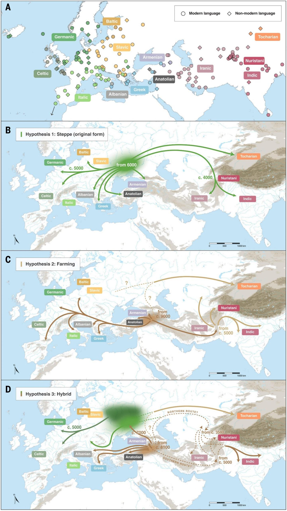 |
| :--------------------------------------------- |
| *These three maps display the three hypotheses for the first stages of Indo-European expansion (from Heggarty et al., 2023).*|

## Ethical considerations

Like many areas of scholarly research, the study of PIE comes to us from a complicated past, marred by pseudoscience and xenophobia. Beginning in the 1780s, European philologists began to see striking resemblances between Sanskrit and the ancient Mediterranean languages of Ancient Greek and Latin. This notion was adopted by the Romantic movement of the 1800s and began to be integrated into developing ideas of social Darwinism and national chauvinism. Scholars, especially those in German-speaking Central European universities, hypothesized that the people, who spoke this mythical language that connected Sanskrit, Ancient Greek and Latin, were the Aryans, a race of slim, tall, white, blonde-haired and blue-eyed supermen that once roamed the Earth and gave birth to all European societies. This theory fed flames of bigotry and bolstered the race science of dictatorships until the end of the Second World War and the dismantling of the Nazi state in Germany.

Conveniently, these theories leave out that languages of traditionally discriminated groups like the Jews, the Irish or the Poles are equally as Indo-European as German, English or French. Indeed, there is a certain beauty that, despite the generations of hate, Yiddish, Gaelic, and Polish hold an important a place in the shared linguistic history of the descendants of the Indo-European people. Today, scholars are very careful to point out the PIE is a [reconstructed language](https://en.wikipedia.org/wiki/Linguistic_reconstruction), *not* a people. The people who spoke it had a profound effect on our languages—and perhaps even our culture—but do not represent a purer or more primordial order of being.

## Tutorial Goal and Data Sources 

The goal of this tutorial—bearing in mind the inherent limitations in making *any* guesses about processes that unfolded thousands of years ago—is to learn how to conduct a raster suitability analysis to determine the most likely location of the Indo-European people's homeland.

You'll use **three factors** that experts have identified about their culture and environment to rank the three homeland hypotheses proposed above—steppe, Pontic-Caspian, or hybrid—from *most to least likely* as a candidate for the homeland of PIE speakers.

Here are the major factors we'll compare:

1. **Distance to Wild Horse Ranges.** Scholars believe that Indo-Europeans must have lived in locations that were home to both wild horses. Archeological evidence suggests that the Indo-Europeans were some of the first people in Europe and Asia to domesticate and train horses for long distance travel. Wild horse (*Equus ferus*) data was [georeferenced](https://itspangler.github.io/geospatial-humanities-s2024/week/07_archives-ii/assignments/parking-lot-cemeteries.html) from a map created by [Pernille Johansen Naundrup and Jens-Christian Svenning](https://journals.plos.org/plosone/article?id=10.1371/journal.pone.0132359).

    Given this history of wild horses and Indo-European culture, we will assume that the Indo-Europeans must have lived within or close to the estimated wild horse range from approximately 8000 years ago. Our analysis will use [Distance Accumulation](https://pro.arcgis.com/en/pro-app/3.1/tool-reference/spatial-analyst/distance-accumulation.htm) to calculate distances from the georeferenced wild horse range. We will then [reclassify](https://pro.arcgis.com/en/pro-app/3.1/tool-reference/spatial-analyst/reclassify.htm) the distances so that within the range is scored as highly suitable, close to the range is suitable, and far from the range is unsuitable.

2.  **Terrestrial Ecoregions**. Based on linguistic and archeological evidence, scholars believe that Indo-Europeans must have lived in temperate climates. We will use [Terrestrial Ecoregion](https://hub.arcgis.com/datasets/b1636d640ede4d6ca8f5e369f2dc368b/about) GIS polygon data from ESRI as a proxy for climate. We will **convert this polygon data to a raster** and then **reclassify** the data to determine which climates are highly suitable, suitable, and not suitable.

3.  **High Density of PIE Languages**. The Indo-European language family includes more than 400 languages, which are spoken by a significant portion of the world’s population (Heggarty et al., 2023; Hammarström, 2022). All derive from the same source language: Proto-Indo-European. **This analysis will examine 8 ancient languages that were directly ancestral to PIE**. Linguistic data is downloaded from Heggarty et al., 2023. You can explore the data with an [interactive map](https://iecor.clld.org/languages) showing the locations of these languages**.

    We will [import this dataset](https://pro.arcgis.com/en/pro-app/latest/help/mapping/layer-properties/add-x-y-coordinate-data-as-a-layer.htm) and then [calculate the kernel density](https://pro.arcgis.com/en/pro-app/3.1/tool-reference/spatial-analyst/kernel-density.htm) of these ancient languages to see where they are highly concentrated. Then we will reclassify the density to score areas of high density as highly suitable for their homeland, and areas of low density to be less suitable for their homeland.

# Preparing your project and your data 

Open ArcGIS Pro and start a new **Map**. Name your project with a helpful name, such as IndoEuropeans and save it in your `H: drive`, or another location of your choice.

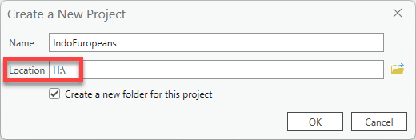

> ![imp]
> 
> This tutorial will go through the process of saving and storing data in the Tufts `H: drive`. As always, you can choose a location that works best for your situation. Wherever you plan to save, just remember to stay consistent, remember where it is saved, and give it a useful name from the start!

As always, consider setting up a directory structure that resembles the following:

    lab07_indoeuro/
    ├─ data/
    ├─ workspace/
    ├─ final_map/

## Downloading the GIS Data

Much of the data for this tutorial has been downloaded and pre-processed for you. To see the sources or originals, please refer to the [Tutorial & Data Introduction Section](#tutorial-goal-and-data-sources).

1.  Now that we have a project created and therefore a project folder, we will download the data you will use for this exercise.

    The GIS data is saved here: <https://tufts.box.com/v/PIE-RasterSuitability>

2.  Download this entire zip folder called **PIE_Analysis_Data.zip.** Depending on the browser you are using, it might ask if you want to save, put it in the downloads bar at the bottom, or save it directly into your Downloads folder.

    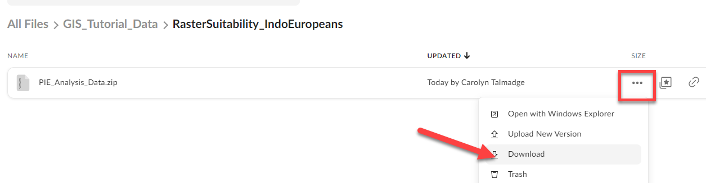

3.  After pasting the zip drive in your workspace, right click on the **zip** file Extract All. Confirm the location where it is extracting is correct and press **Extract**.

    

4.  **Now that you’ve unzipped the data, you can work with it in ArcGIS Pro.** As you know, you cannot see data inside ArcGIS Pro that’s zipped—you must always unzip it first.

    **Go back to your ArcGIS Pro project** and on the right side in **Catalog**, right click on your home folder and press **Refresh.** This will allow us to see any new files or folders added to this folder.

    > ![imp]
    > 
    > Whenever you add new files to a folder and the project is ALREADY open in ArcGIS Pro, you must **refresh** the folder in order to see what has been added.

5.  Double click on your home folder and then go into the **PIE_Analysis_Data** folder. There will be several different types of data for you to work with, including shapefiles and an excel table.

    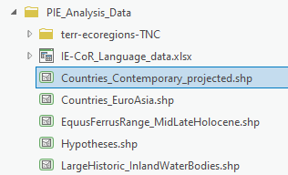

    You should also see a **geodatabase** (the silver cylinder), along with a`.tbx` (toolbox) file, a backup, and an `importLog` folder in your larger project folder. These are automatically created when you start a new ArcGIS Pro project. Any tools that we run will automatically save the new GIS files into the geodatabase.

6.  Load the following datasets into ArcGIS Pro:

    1.  `Countries_Contemporary_projected.shp` (source: Natural Earth)
    2.  `EquusFerrusRange_MidLateHolocene.shp` (source: Georeferenced Wild Horse Habitat Range in the Mid to Late Holocene period, approx. 7000-5000 years ago [Naundrup, 2015])
    3.  `Hypotheses.shp` (soure: georeferenced Homeland Hypothesis from Heggarty et al. 2023 publication)
    4.  `LargeHistoric_InlandWaterBodies.shp` (Source: Ancient World Mapping Center)
    5.  `Countries_EuroAsia.shp` (Source: Natural Earth)

    Don’t worry about Terr-ecoregions folder. We’ll get back to that.

# Symbolizing and Renaming your Data

1.  **Reorder** the layers so that `Hypotheses` is on top, then `EquusFerusRange`, then the water bodies, then the `Countries_Contemporary_projected`, then `Coutries_EuroAsia` at the bottom (and turn it off).

2.  **Rename** the layers so that there is no data speak in the **Contents Pane**.

3.  Symbolize (single symbol) the `Countries_Contemporary` layer with a neutral color, such as grey or tan, and the water bodies blue with no outline.

    Don’t worry aboout symbolizing the `Countries_EuroAsia` layer or renaming it.

    > ![imp]
    > 
    > Removing borders on natural features makes them feel less cluttered. It's often wise to do this for water and open space.

4.  Use **Symbology** single symbol for the Equus Ferrus range choosing a color that pops. Remove the border on the Equus Ferus data too. You can try some of the gallery options as well – my example used the transparent hatched fill and changed the color to orange.

5.  Open the attribute table for the Hypothesis layer and note which field has info on the hypothesis name. Use **Symbology Single Symbol** to make the hypothesis hollow (see through) with a thick (2pt) outline in color of your choice.

    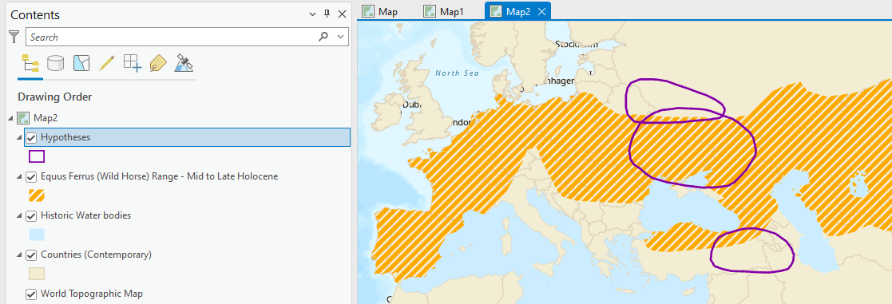

6.  Let’s make it easy to know which hypothesis is which by turning on the labels! While the layer is **selected** in your *Contents pane*, click on the **Labeling** tab and then "Label" all the way no the left to turn them on. Make sure the **Field Name** is set to the correct field in the *attribute table* that has info on the hypothesis name! Use the **Text Symbol** options to style them nicely, perhaps adding a halo.

    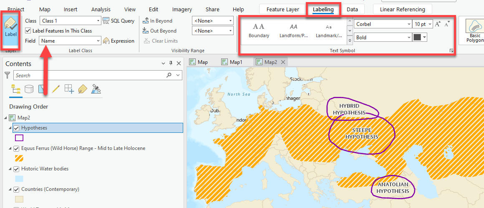

7.  In **Catalog**, within the PIE_Analysis_Data folder, expand the **terr-ecoregions-TNC folder.** Here you will also notice two files – the shapefile and the layer file. Load the shapefile. Everything appears the same color!

8.  **Open the attribute table** of the `terr-ecoregions-TNC.shp` layer. Explore the different attributes that are available to symbolize.**What field might we be interested in symbolizing by category?**

    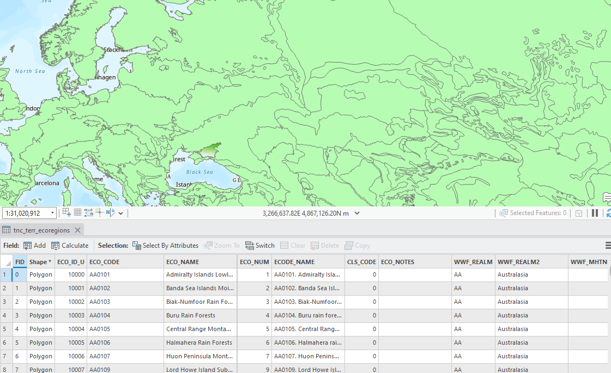

9.  Open **Symbology** for this layer and select **Unique Values**.

    

10. Now the symbology pane will open. Let’s **symbolize** the data so that it is mapping the **WWF_MHTNAM** field. There are 16 different symbol classes. While not impossible, we don’t want to waste time picking the perfect color for each.

    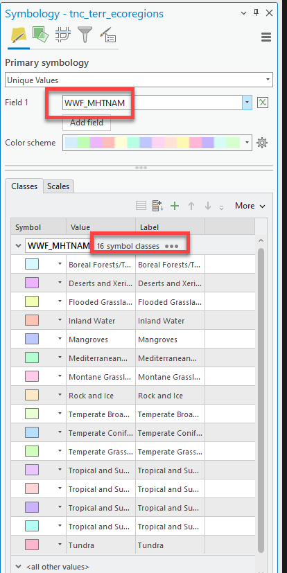

11. Luckily, this file also comes with a layer (`.lyrx`) file! A layer file is a pre-symbolized layer with the correct colors already chosen. Go back to **Catalog** and **pull in the layer file called tnc_terr_ecoregions.lyr.** You’ll notice a new "layer" is added to your map with excellent colors, but its not showing up and has a little red exclamation point. UGHHH.

    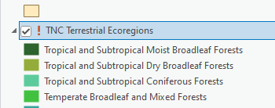

    Sometimes when you are moving data, or renaming data, the relationship between the `.lyrx` file and its data source file get broken. We just need to tell it that this layer is related to the `tnc_terr_ecoregions.shp` in the same folder.

12. Click on the `!`. Now it wants us to select the shapefile it’s connected to. Navigatge to your project folder `PIE_Analysis_Data` ➡️ `terr-ecoregions-TNC`. Select the `Tnc_err_ecoregions.shp` and press "OK." Voila! Now the layer works.

    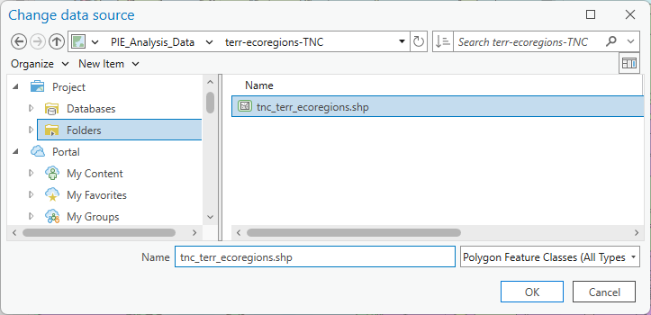

13. Pull it above the countries but below the water bodies and turn off the `tnc_terr_ecoregions` layer that you were working on (or remove the it altogether).

    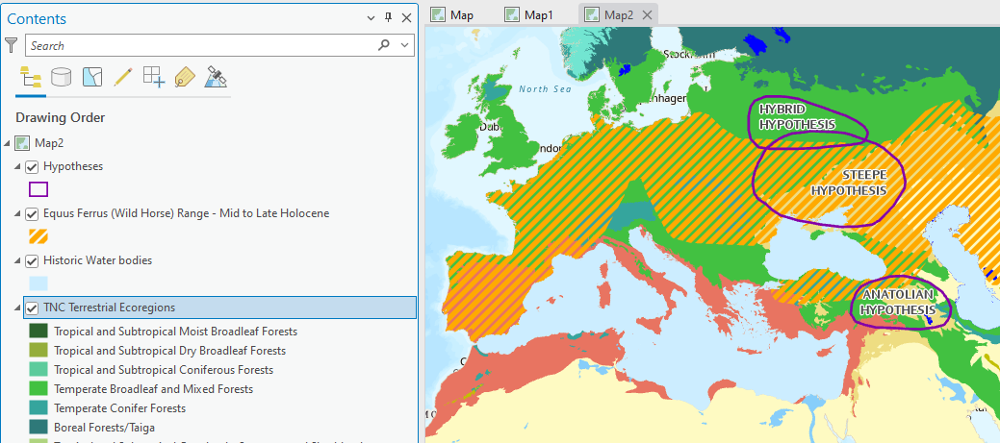

    Notice how in addition to having pre-symbolized unique values with appropriate colors, it also renames the layer to not include any data speak. Slay!

14. Now we have 2 of our factors that will be used to start our analysis: **the wild horse range and the ecoregions climate data**. We will circle back to some of the most crucial data later which is the ancient language data points.

# Overview of the Raster Analysis 

When we are running a raster suitability (or risk analysis, or creating any type of index), it’s important that all our "scored" criteria data that are being combined are rasters that cover the entire extent (aka our "area of interest").

Right now, **none of our data are rasters**. That’s okay! Tools we run will create rasters, which we will "score" with the reclassify tool, and combine with raster calculator to determine the overall suitability for every cell within our area of interest.

**Often times when you are doing raster analyses, you are starting with both raster and vector data**. We have only vector data (points, lines, and polygons) so far, but we can derive rasters from this vector data to conduct the analysis.

## Raster Analysis Considerations 

Things we need to consider when running tools that create rasters are:

1. **Size**. The cell size we tell the GIS to use when running tools - aka how much area (measured in L x W) is covered by one raster cell. Are the cells `10m` x `10m`, `1000m` x `1000m`, etc.

    For this analysis, we will use a raster cell size of `5000m` x `5000m`.

2. **Extent**. How much area should the tool rasterize when it runs? The entire world, your input dataset, or some other specified extent?

    For this analysis, *we will use the `Countries_EuroAsia.shp` as our extent.*

    Notice how this layer `Countries_EuroAsia` only has countries for Europe and northern Asia – we will tell the GIS to run tools only within this "extent" so that we don’t get any results in Africa or farther.

    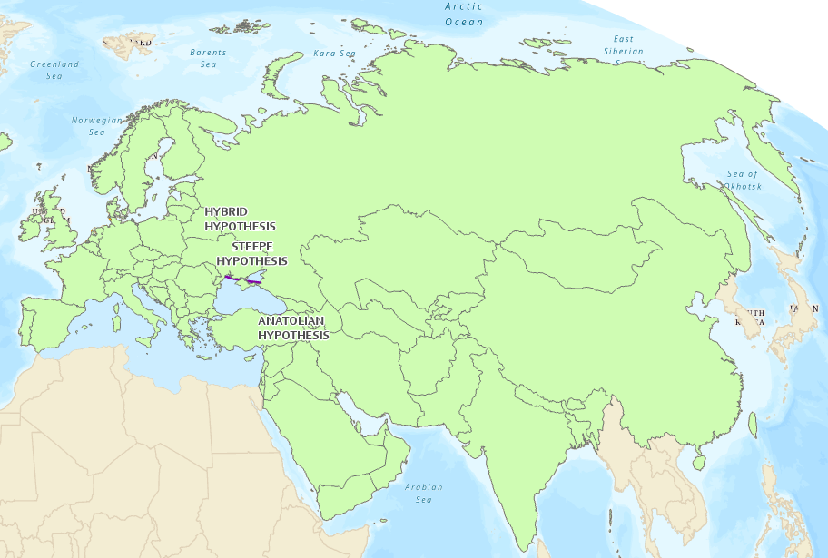

3. **Projection**. Choose a projected coordinate system that will ensure the tools run correctly and are in units we understand, like meters. **We will use Winkel Triple, the projection already utilized by our layers, which uses the units of meters.**

Let's dive into the analysis! Again, we want to rank the three "homeland hypotheses"— *above—steppe*, *Pontic-Caspian*, or *hybrid*—from *most to least likely* as a candidate for the homeland of PIE speakers.

# Factor 1: Distance to Equus Ferus (Wild Horse) Range

The first analysis factor we will work with will be Distance to the Equus Ferus (Wild Horse) Range. As mentioned in the overview, archeological evidence suggests that the Indo-Europeans were some of the first people in Europe and Asia to domesticate and train horses for long distance travel. Therefore, locations that were within the horse range or close to the horse range are more suitable for their homerange than locations that are far from the wild horse range.

1.  The first thing we should do whenever doing spatial analysis is confirm that are map and data are projected. Open the "Map Properties" by double clicking on the "Map" layer and going to "Coordinate Systems".

2.  Here we can see the different projections currently being displayed, both the *geographic coordinate system* (`WGS 1984`) and the *projected coordinate system* (`Winkel Tripel`). If you can expand both, you can see which layers are projected into which projection (remember WGS is a geographic coordinate system, NOT a projection). It’s important to realize the ecoregions are NOT projected (we will fix that later).

    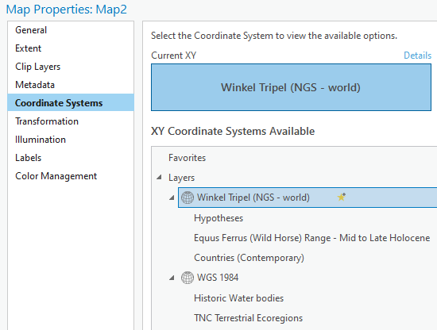

3.  Make sure Winkel Tripel is still selected and set to the "current XY". Then close the properties. This means our map IS projected and several of our layers, excluding the ecoregions, share the same projection. Yay.

4.  The next thing is to actually calculate the distances from the Wild Horse range outwards. We will use a tool called "Distance Accumulation" to do so. For more info about the Distance Accumulation tool, click here: <https://pro.arcgis.com/en/pro-app/latest/tool-reference/spatial-analyst/how-distance-accumulation-works.htm>

    This tool calculates "as the crow flies," straight line distance from the wild horse range polygon to any given location (in the form of a cell). The results of the Distance Accumulation Tool are a raster grid where any given cell tells you how close—in `meters`, because that’s the distance unit used by the layer’s projection—that location is to the wild horse range. This is one reason it is so important for our wild horse data to be projected: so those units are in meters as opposed to decimal degrees.

5.  Go up to the **Analysis tab** and click **on Tools. In the pan on the right, click on Toolboxes, then scroll to Spatial Analyst tools.** We will be using mostly the Spatial Analyst tools for raster analysis.

6.  Double-click on "Distance" and find **Distance Accumulation.** *Notice how if you hover over it, it tells you what the tool does!*

    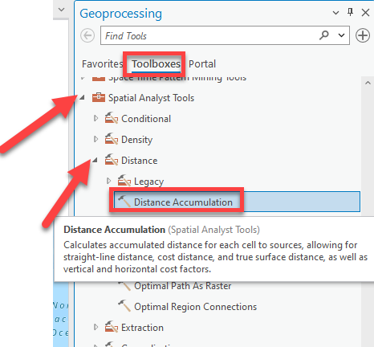

7.  Fill out the tool as shown below, leaving everything blank except the input and output fields:

    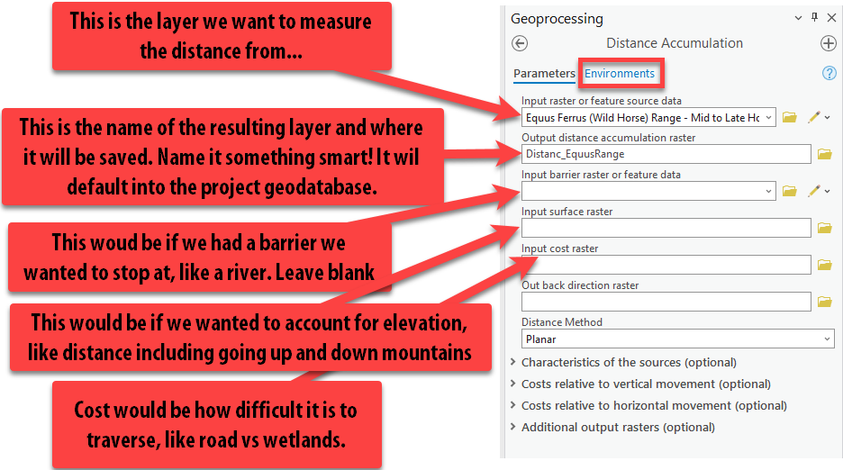

8.  Lastly, click on the **Environments** at the top of the tool. Here, we can set some really important parameters about the tool, such as the coordinate system and the extent as mentioned in the Raster Analysis Considerations. Set the parameters like so:

    1. "Output Coordinate System" = "Current Map" (which should autofill to `Windel Tripel`).
    2. "Procesing Extent" = `Countries_EuroAsia`
    3. "Cell Size" = `5000`
    4. "Mask" = `Countries_EuroAsia`

    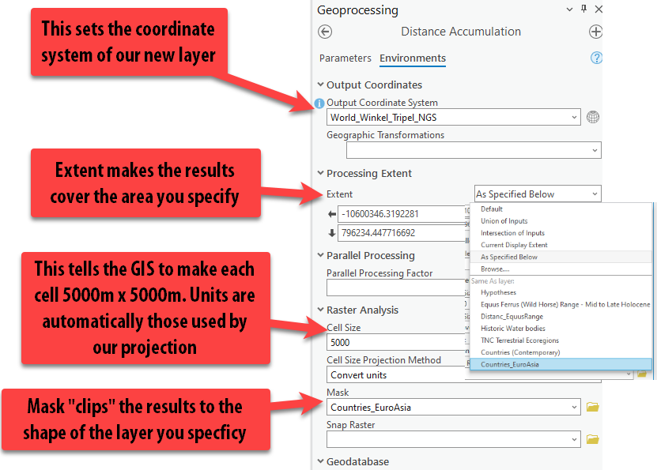

    **Pro Tip:** The Environments can be set within the tool settings, each time you run a tool, or you can set the Environments for the *entire project* before completing your analysis, under the **Analysis** tab ➡️ "Environments." Usually, setting it for the project is easiest, but today we will set them each time we run the tool to enforce understanding about what the parameters do.

9.  **Press Run.** You might get a warning about masked cells not being processed... that’s fine.

10. **Make sure to pull your layer up above the countries to right under the wild horse range, so you can see it!** Turn on and off the wild horse range layer so you can see what it looks like under the polygon.

11. Using the **Explore button,** click on a few different cells so a pop up appears showing the distance value in meters.

    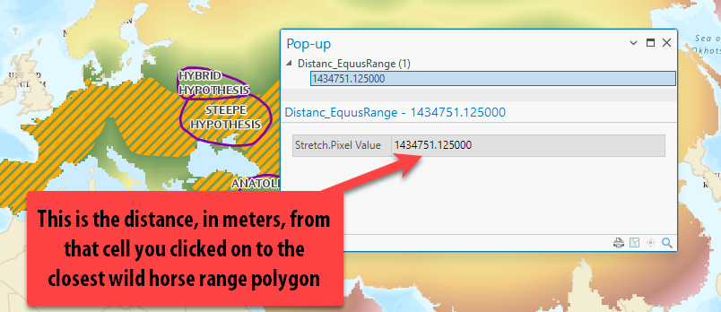

12. If you zoom in, you can see the individual raster cells that cover an area of `5000m` x `5000m`. They are very obvious this zoomed in, but if we look at our whole "extent," it does not appear pixelated (a.k.a. low resolution).

    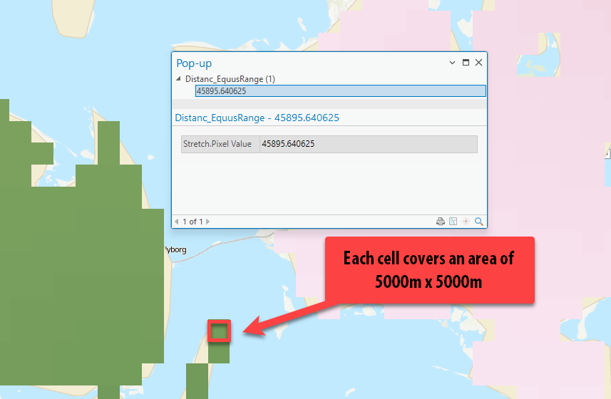

## Reclassify (Scoring) Distances to Equus Range

Now that we have our distance matrix showing the distances at each cell to the Equus wild horse range, we — the "experts" — need to decide how far from the wild horse range should be considered the Indo-Europeans' home range.

We'll use the **Reclassify** tool, which changes the values of cells in a raster according to a user-determined parameter, to accomplish this. There are [many reasons](https://pro.arcgis.com/en/pro-app/3.1/tool-reference/spatial-analyst/understanding-reclassification.htm) you might want to reclassify a raster. In our case, we are *reclassifying values to a common scale*, but first, we need to determine how many scored "classes" there will be and how to score them. For example, should we use scores from `1` (low suitability) to `5` (high suitability)? `1` to `10`? And so on.

Things to consider:

- Too many scores/classes and it’s a lot of work for us to determine how values should be scored
- Too few scores and the analysis isn’t detailed or very complex
- When [creating a suitability scale](https://pro.arcgis.com/en/pro-app/latest/help/analysis/spatial-analyst/suitability-modeler/the-general-suitability-modeling-workflow.htm), you should transform values *relative to one another within the scale*. That is, a location assigned a suitability value of `5` is half as preferred as a location assigned a suitability value of `10`, and a suitability value of `10` is 10 times as preferred than a location assigned a suitability value of `1`.

In this tutorial, we will classify our factors into *five scored classes* ranging from `1` (the least likely) to `5` (the most likely). By scoring everything with a reclassified value (e.g., `1` through `5`), we can more easily compare different raster datasets across this *common scale*. Once all the factors are scored with the Reclassify too, we will add them together using the **Raster Calculator**.

## Determining Appropriate Class Ranges and Using the Reclassify Tool

Before we actually score any data and run the reclassify tool, it is really helpful to visualize the different distance classification distances ranges in the map using symbology to understand and potentially alter how we are going to score the data.

1.  Right click on the new distance accumulation raster layer in the contents pane called `Distance_EquusRange` and go to **Symbology**.

    **Pro tip**: Right clicking is another quick way to get to symbology. When in doubt, right click.

2.  The symbology is currently set to "stretched," which displays the values in a smooth color ramp with only the lowest and highest value identified. In this symbology method, there are no "classes" or ranges of values — it's all just "stretched" along your chosen color scheme in order to show areas that are brighter than others. Ultimately, we want to *classify* the data (in the symbology pane) into different ranges or classes, with the end goal of *reclassifying* the data itself (in its attribute table).

3. Change the *primary symbology* to **Classify.**

4. We have decided that there will be five classes in our scoring system with `1` being low suitability and `5` being high suitability this was the home range based on this distance to Equus Range factor. **Set the number of classes to `5`.**

5. Then, click on the **Histogram** tab to understand the distribution of the distance values. Remember, these values are meters!**

    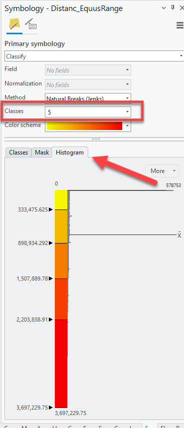

6.  We change the "break values" to visualize distance ranges that we deem appropriate for the analysis, rather than just using a classification method like "natural breaks."

    Using what we know about Indo-Europeans, the highest suitability should go to the places only WITHIN the range the wild horse range.
    
    Set the first break value to `0` by double clicking on the number. Press tab to get off of the number and have the map update.
    
    Now our first range is `0` - `0` meters, totally within the range. If you turn on and off your equus range polygon, you can see that.

    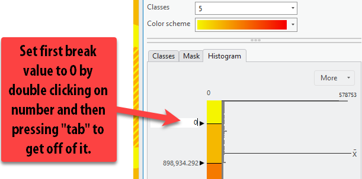

7.  Then, we have to decide the 2nd most appropriate range of highly suitable distances, remembering to insert our value in meter. *We know that these people had to be relatively close to wild horses in order to start to train and tame them.* For the sake of this tutorial, we will say that 0-100 miles from the horse range is the next most suitable location, as these are places on the outskirts of the wild horse range.

    Double-click on the second break value and insert `160,934`, as that is the value, *in meters*, of 100 miles.

8.  Use the following break values to update the symbology classification ranges. Then click the classes tab to put it back to the ranges view.

    - 0 Miles = 0 Meters (Most Suitable, within range)
    - 100 Miles = 160,934 Meters
    - 250 Miles = 402,336 Meters
    - 500 Miles = 804,672 Meters
    - 500+ = Leave the max value already there.

    We could even update the **Label** column too to have the values labeled in miles so it’s easy to understand in our legend. This is great habit to get into because it saves you steps during the final process of laying out your map.

    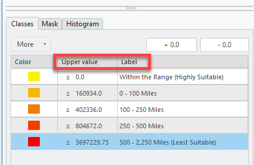

9.  Now that we know how to score or reclassify the distance values, we can actually run the **Reclassify** tool.

    **Reclassify** creates a new raster layer based on a chosen input layer. It will assign each pixel in the output layer a value of `1` to `5`, according to your specifications. The output raster does not "remember" the original distance. Running this tool does *not* change the distance accumulation raster.

    Here is more info on the tool: <https://pro.arcgis.com/en/pro-app/latest/tool-reference/spatial-analyst/reclassify.htm>

10. Go up to the **Analysis** tab ➡️ "Tools" ➡️ "Toolboxes" ➡️ "Spatial Analyst" ➡️ "Reclass" ➡️ **Reclassify**.

Open the **Reclassify** tool.

11. Drag the `Distance_EquusRange` layer into the Input Raster field (or use the drop down menu).

    **Pro Tip:** Dragging layers from the contents pane into the tool is a fast and easy way to select the right layer for the tool!

12. Because we took the time to **symbolize** our data into appropriate ranges, notice how the table populates the ranges we specified. Nice! This is a time-saver.

    Now the most important thing is confirming that the ranges are assigned the correct value! Read the guidelines in the screenshot below and update your tool to match these inputs.

    

13. Once you are sure that the 0-0 class is assigned a new value of `5`, and the farthest distance assigned a `1`, press "Run."

14. Our new reclassified (scored) raster is complete! Because this is just an *intermediary* step in the analysis — that is, our reclassified raster is a necessary part of the analysis, but not a layer that we will include in our final map — we don't need to deal with changing its symbology.

15. One tip for good data management is to group all this data for this factor. In the **Contents** pane, while holding down the `ctrl` button, click on the `Reclass` layer, the distance accumulation raster, and the horse range polygon. Then right-click one of those layers ➡️ "Group." A "New Group Layer" appears and we can rename it to **Wild Horse Range Data** by clicking twice (slowly) on the text. Now you can turn all the data in the group on and off at once.

    
    

Huzzah! Now that we have our first factor reclassified to a common scale, we can proceed to reclassifying our other factors to that same common scale.

Turn "Wild Horse Range Data" group off, and move on to factor two.

# Factor 2: Terrestrial Ecoregions 

Based on linguistic and archeological evidence, scholars believe that Indo-Europeans lived in a temperate climates. We will use [Terrestrial Ecoregion](https://hub.arcgis.com/datasets/b1636d640ede4d6ca8f5e369f2dc368b/about) GIS polygon data from ESRI. We will **convert this polygon data to a raster** and then **reclassify** the all the unique terrestrial ecoregions based on how suitable it was for the Indo-Europeans hypothesized lifestyle and climate needs.

1. Turn on the `TNC Terrestrial Ecoregions` and review the list of different ecoregions and see where they are in the map. Remember, this is a *global* dataset, so it’s all the ecoregions throughout the world – not just the ones found within our study area of Eurasia.

2.  **Note that this polygon does cover our area of interest**, and that is one of the requirements with raster analysis – the data must cover the entire area. Of course, another requirement of raster analysis is that we need to work with rasters, which this polygon data is not. Thankfully, we can easily convert it to raster using the **conversion tools** using one of the layers attribute field.

3. Open the attribute table of the `TNC Ecoregions layer`. We need to remember the name of the attribute field currently being symbolized. We see that the field is set to `WWF_MHTNAM`.

## Polygon to Raster Tool 

1.  In the **Analysis** tab, scroll up to "Conversion Tools To Raster" ➡️ "Polygon to Raster."

2.  Pull in the ecoregions layer into input features and select the `WWF_MHTNAM` as the field that we are going to create a raster on (it is very important to choose the right field!). Under **output raster dataset**, give it a good name. Follow the screen shot below then click **Environments**.

    

    > ![imp]
    > 
    > Note that you can check a box to "Build raster attribute table." While some raster data *can* have an attribute table, it's not as common as with vector data. The data model doesn't lend itself to a table of values. For *discrete* rasters, however it may be useful to build an attribute table. In this case, the output will be a table of 16 records. Once the tool has run, try opening the attribute table to see what characteritics are included. Read more about building attribute raster tables here: <https://pro.arcgis.com/en/pro-app/3.1/tool-reference/data-management/build-raster-attribute-table.htm>.

3.  We need to go back to setting the environments so that we can specify the cell size, projection, and extent. **Follow the screenshot, setting the coordinate system, processing extent, and cell size.** Then press "Run."

    

Hurray! Now our data looks exactly the same, but it is a raster and not a polygon, so we can use it in our raster analysis.

## Reclassify the Ecoregions

The next step is scoring this data appropriately so its on our 1-5 scale and can be easily combined with our other reclassified factors.

1. Go up to the **Analysis** Tab ➡️ "Tools" ➡️ "Toolboxes" ➡️ "Spatial Analyst" ➡️ "Reclass" ➡️ **Reclassify**. Open the **Reclassify** tool.

2. Add the `Ecoregions_Raster` as the Input Raster. Since this is categorical data, and not quantitative, we will assign each ecoregion type an appropriate score of 1 (not suitable) to 5 (highly suitable) based on how likely an Indo-European is to live in that climate. Obviously, this takes so research and expertise on the topic. We will use the following scores for each ecoregion as a best guess given the scholarship and information on the topic:

   | Ecoregion                                        | Score |
   |--------------------------------------------------|-------|
   | Tropical and Subtropical Moist Broadleaf Forests  | 2     |
   | Tropical and Subtropical Dry Broadleaf Forests    | 2     |
   | Tropical and Subtropical Grasslands, Savannas, and Shrublands | 3     |
   | Temperate Grasslands, Savannas, and Shrublands    | 5     |
   | Flooded Grasslands and Savannas                   | 3     |
   | Montane Grasslands and Shrublands                 | 4     |
   | Deserts and Xeric Shrublands                      | 1     |
   | Mangroves                                         | 1     |
   | Temperate Broadleaf and Mixed Forests             | 5     |
   | Tropical and Subtropical Coniferous Forests       | 2     |
   | Tundra                                           | 1     |
   | Temperate Conifer Forests                         | 5     |
   | Inland Water                                      | 3     |
   | Mediterranean Forests, Woodlands, and Scrub       | 4     |
   | Boreal Forests/Taiga                              | 5     |
   | Rock and Ice                                      | 1     |

    Under the "New" column, type in the appropriate value for each ecoregion. Then make sure to give the output raster a good name. Press "Run."

    

3.  Once again, the reclassified layer comes out with random colors – again just an intermediary step. Holding down `ctrl`, select the three ecoregions layers — polygon, raster, reclassified layer – right-click and "group". Rename the group "Ecoregions Data". **Turn off the group.**

We've finished preparing the raster data for our second factor. Let’s move on to our last and most complicated factor, the PIE Language data!

# Factor 3: High Density of PIE Languages

You might notice that we have yet to bring in any data on the Proto Indo-European Language data yet.

1. In Catalog, look through the data in the `PIE_Analysis Data` folder. Notice how there does not see to be a shapefile with any similar name, but there is a file `IE-CoR_Language_data.xlsx`. This file has an extension of `.xslx`, meaning it's an Excel workbook.

2. Hover over the excel file. Notice when you do that, a box appears telling you the name, type and path of the file. This is a quick way to get to where the file is stored. **Click the path and then open the excel file.**

    

3. This is very nicely organized data on the different languages. There are fields on the `Clade` (the original language name), `Name`, `Historical`, `Meanings`, and `Lexemes` (word stems – so this is a count of how many words have this stem).

    Which fields have geographic information that we can turn into spatial data?

    

4. We will use the `Latitude` and `Longitude` fields to import this spreadsheet into ArcGIS Pro. Whenever you see lat/long data, you can get excited that this can map easily with relatively low effort.

    Let’s also double check in abides by the rules for GIS friendliness that we discussed in previous weeks, including:
    
    1. No spaces in the name fields? ✅ 
    2. All fields must have names? ✅
    3. Second row must be the start of the data? ✅ 
    
    Looks really good! Let’s do it!

5.  ![imp] **Close the excel file.** Keeping an Excel file open while you're working with it in ArcGIS Pro will create all sorts of mysterious problems.

## Using Add XY data to PIE Language Data

1.  In the **Catalog** pane, find the Excel sheet again but double-click to reveal its contents (don’t try to pull in the entire excel workbook!). Pull in `Sheet1$` to the map.

    
    
    Notice how in the contents, it’s now under **standalone tables.**

    

2.  Right-click on `Sheet1$` and choose "Display XY data". Fill out the tool.
    1.  Output Feature Class = a smart name with no spaces
    2.  X Field = `Longitude` 
    3.  Y Field = `Latitude` 
    4.  Coordinate System = `GCS_WGS_1984`
    
    

Yay, our points are in! So easy.

## Symbolizing the PIE Language Data

1.  Open the attribute table for the **PIE_Languages**. It looks just like the excel table! We want to map the points with different colors to represent the different ancient languages. Which field has that information? The **Clade** field.

2.  Open **Symbology** for this PIE_Languages data. Change the primary symbology type to **Unique Values and set it to the `Clade` field**. There are a lot of values, many which are similar (i.e. Balto-Slavic, Baltic, Baltic East and Balto-Slavic, Baltic, Baltic West, etc).

3.  We will group these similar values so there are less different color points! Click in the first Balto-Slavic value field, hold CTRL, then click all the different values that start with "Balto-Slavic". Then right click **Group**.

    

4.  Scroll to the right to find the **Label** column. Double-click and keep only the "Balto-Slavic" text. Now all those 5 different points are grouped under just Balto-Slavic. 

    

5.  Repeat this process with all the other languages that have the same common first word or two, so we minimize all the different points into 10 symbols.

    

6.  Choose a different color ramp that makes these points pop a bit more. You can also click on "More" ➡️ "Format all symbols". This will allow you to pick a point type (circle, triangle, etc) and a size. I am going to make them larger points (pt 6). Press "Apply."

7.  Now our PIE Languages are symbolized by the Clade.

8.  Rename the layer so there is no data speak and close the attribute table.

## Running Kernel Density on the PIE Languages

The goal in this next step is to create a density raster that covers our entire area of interest (`Countries_EuroAsia`). We will create a **kernel density layer** showing the magnitude and density of the PIE points. The kernel density tool creates a "heat map" and you can read more about it here: <https://pro.arcgis.com/en/pro-app/3.1/tool-reference/spatial-analyst/kernel-density.htm>

1.  Go to the **Analysis** tab and click **Tools** ➡️ **Spatial Analyst Tools** ➡️ **Density** and then select **Kernel Density**.

    

2.  This tool creates a raster that shows the magnitude per cell of the points or lines that were inputted.

3.  Fill out the tool as follows, making sure to give the output raster a good name with no spaces.

    

4.  You might notice that the cell size is a decimal, which seems confusing and surely can’t be right – but it is.

    Cell size is determined by the units of our projection. We brought in this data using a *geographic* coordinate system, which uses decimal degrees, so this cell size is in decimal degrees too.
    
    We want it in meters, or feet, or something we understand, so we will force it into the Winkel Triple projection by setting the environments! **Click on the Environments tab at the top.**

5.  **Here, we can set the Output Coordinate System** to be the same as the Current Map (aka Winkel Tripel). Notice there are lots of other options too. Click on the back arrow shown in the screen shot. Notice how are cell sizes are now large numbers ~26,469! Now they are in *meters*. We know they are in meters because the Winkel Triple projection uses meters as its units. **Go ahead and press run while remembering that each cell is going to cover, approx. `26000m` x `26000m`.**

    

6.  The raster layer will probably appear in the bottom on the contents pane. Pull it to the top but under the points. Turn off your ecoregions layer if it’s still on.

    

    We are now looking at the magnitude of the points using this "heat map" style. Notice how it is pretty pixelated. That is because our cell size was *huge* – `26000`m x `26000`m. Too big. Finding the "right" pixel size can be an interactive process in geospatial analysis, especially when you don’t have any data that starts as rasters which you can use as a reference.

    The table below provides basic distinctions between large and small pixel (cell) size.
    
    | Large pixels         | Small pixels       |
    | :------------------- | ------------------ |
    | Low resolution       | High resolution    |
    | Doesn't look awesome | Looks really sharp |
    | Small file size      | Big file size      |
    | Quick to process     | Slow to process    |

7.  It is also important to know that the kernel density layer comes out with its own symbology of transparent to dark – so while it doesn’t look like there is data everywhere, there is and it’s just transparent. Additionally, it always uses an "equal interval" symbology classification methods, which isn’t always the best way to visualize it.

8.  Before we run the tool again with some improved parameters, let’s play with the symbology of this data. Right click on the layer and select "Symbology."

9.  Notice how the data is set to 10 classes and classified using equal interval. Change the color ramp to something that doesn’t start transparent.

    

10. See how the data is actually in the shape of a rectangle. The tool runs and creates a raster only as far as the **bounding box**, or a box extending to minimum lat/long pair and maximum lat/long pair, of the point dataset. This means the tool stops processing at the most northern, southern, eastern, and western points. This is the *raster extent*. It is also something we can set in the environments to make sure it covers our entire area of interest. 
    
    

11. Try changing to different classification methods. See how it changes the message of the density raster.

12. Let’s re-run this tool again. Go up to **Analysis Tab** and find **History** on the left. This is such a great trick for seeing which tools you’ve run, and if need be, running them again. Double-click on the "Kernel Density" and it will open up the tool again exactly as we ran it.**

13. First, change the name of the output raster. You can do this in whatever way makes sense for you, but I recommend giving it a new name that is meaningful. This time, we're going to process the **output cell size** at `5000`m, so I'm going to name the output layer `PIE_KernelDensity_5k`. 

    Make sure you actually change the output cell size to `5000` meters, since that is what we have been using through this tutorial.

    **Pro Tip**: This process we’ve gone through is a good way to figure out an appropriate cell size if you have no idea what to choose starting off and you have no data that are already rasters. The cell size is greatly determined by the *scale*, or the overall extent, of your analysis.

14. Notice how we can also specify a **search radius** in the tool. We left that blank last time and allowed the computer to choose what it thought was the best radius. We will do that again this time.

15. Click on the **Environments** tab. Set the Processing Extent to `Countries_EuroAsia` and the "Mask" to `Countries_EuroAsia` as shown in the screenshot. Then press "Run."

    

16. Once again, pull the results up to the top of your contents pane but under your points. See how the cell size is far more granular, and it’s clipped (masked) to the shape of the countries. The cell size could even go a little smaller, but for this assignment, it’s fine.

    

    Take a moment to look at the numbers produced by the kernel density tool can be very confusing. They don't represent something as simple as "points per square kilometer," but rather a complicated output created by the [kernel smoothing equation](https://pro.arcgis.com/en/pro-app/latest/tool-reference/spatial-analyst/how-kernel-density-works.htm). Because this isn't a spatial statistics course, we can just think of these values just in terms of higher and lower density.

17. Let’s go to **symbology** of this new layer. Change the color again to something **without** transparency to better understand it. Also, let’s set the classes to 5, since we are using 1-5 for our scoring. REMEMBER, kernel density also comes out in the "equal interval" classification method, which isn’t the best way to visualize this.

    

    Take a minute to look at the data and how it relates to the hypotheses. Isn’t it a bit odd that the prevailing theory, the Steppe hypothesis, is actually in an area with low density of these PIE language descendants? Something to just ponder... we might need to do some research as to why.

18. Since the numbers don’t make a lot of sense to us, we will just visually assess the message communicated by this map. Make sure your points are on top of the kernel density so we can see how the density should look. Now, change the Method from **Equal Interval to Natural Breaks. See how much that changes the message of the data. Now try Quantiles.**

    

19.  We will use **Quantiles** as the method for visualizing the density of the PIE languages, remembering that values from `0.000001` – `0` are low density (low suitability and values from `0.000008` - `0.000022` are high density (high suitability).

## Reclassifying Pie Language Density

1.  Let’s open the Reclassify tool once more to score our final factor.

    **Pro Tip**: you can search for Reclassify in the toolbox too, if you don’t want to find it in the list.

2.  Fill out the tool so your `5000`m kernel density layer is the input raster. Fill out the tool as the screenshot shows:

    

3.  Press **Run**.

    > ![imp]
    > 
    > We do not need to set the environments when reclassify because they are already rasters and will keep the same properties. The environments are most important when running tools on vector data (points, lines, polygons) that are creating rasters!

4.  We have our final reclassified factor scored 1-5. Hooray! Group the 3 PIE datasets together.

# Combining the Factors using Raster Calculator

We are now ready to start combining these factors to come up with a final suitability score for the region determining how likely the locations are to be the home range of the Indo-Europeans!

We can combine these 3 factors using many different techniques, both unweighted and weighted.

1.  Open the **Analysis** ➡️ **Tools** ➡️ **Spatial Analyst Tools** ➡️ **Map Algebra** ➡️ **Raster Calculator**.

2.  Hover over the question mark to learn about the tool.

    

## Unweighted Raster Calculator Equation

We will build a very simple expression adding the three reclassified factors together so that the lowest possible score is a 3 (1+1+1) and the highest possible score is a 15 (5+5+5). This is the **unweighted** equation where all three factors are given the same weight, or significance, in the equation.

1.  Use the **Rasters** in the list on the left and add them to the expression box by **double-clicking** on them. Add the **+ sign** between them by **double-clicking** on it in the right under the "**Tools**".
2.  Give the output rasters a smart name such as `likelihood_calc_add` so we remember these are the results that were added together and unweighted. Press **Run**.

    

3.  These results are wild! And the color ramp isn’t helping us!

    

4.  Open **symbology** and pick a better color ramp that isn’t random or meant for unique values!

    

5.  Right click on the layer and open the **Attribute Table**. There are only 3 columns. The `ObjectId` (e.g., unique identifier assigned when the tool is run), the `Value` which is the "final score" and the `Count`, which is the number of cells in the raster that scored in each of those final values.

6.  We can see the **attribute table** in this raster because these values are **integers**. **All the numbers are whole numbers and do not have any fractions,** since we simply added these reclassified rasters together.

    

7.  Take a look at the map and consider what this unweighted raster calculator results suggest.

    It’s interesting, for example, that the places with the most **consecutive, highest possible scores** are not in the areas of the **3 hypotheses**. There are some cells with high scores in the hypothesis polygons, but they are not all bright yellow with a score of 15 throughout the whole area. This means that in these 3 polygons, there were locations that did not score highly in all 3 factors – but without looking at the individual factors one by one, we do not know which factors scored high and low.

## Weighted Raster Calculator 

We will go through the same steps with raster calculator, but this time building a **weighted expression** where the factors are worth different weights in the analysis based on their importance.

1.  Before we can write the equation, we need to **decide which of the factors are the most important** and assign our weight percentages appropriately. **These weight percentages need to add up to 100%.**

    These factors influence how we'll decide the weights:

    - There is strong evidence that the wild horses were a large part of Indoeuropean culture, so that should be weighted pretty high: let's say `45%`.
    - Obviously, the PIE language data is significant, but also limited in the amount of data points available – we will weight this at `35%`.
    -   This leaves a remaining `20%` for the Ecoregions, which seems appropriate given that 1) these ecoregions are not from 5000 BCE and therefore not perfectly representative of the climate at that point in time and 2) we are making our best guess at appropriate ecoregions, with less historical evidence around this factor.

2.  Now that we know the weight percentages for each factor, we will write this equation so that each factor is multiplied by the weight and then added together. It will look like:

        (Wild Horse Reclass * .45) + (PIE Language Reclass * .35) + (Ecology Reclass * .2) = Weighted Results

3.  Once again, go to **Analysis** ➡️ **Tools** ➡️ **Spatial Analyst Tools** ➡️ **Map Algebra** ➡️ **Raster Calculator**.

4.  Using **the raster buttons** on the left and the **tool** buttons on the right, let’s build this equation. **You will have to type in the parenthesis `( )` using your keyboard buttons.**

    

5.  Make sure to give the **output raster** a smart name! Press **Run**.

6.  Notice how the results of this raster calculator range from 1 – 5, not 3-15. This is because we **multiplied each factor by a fraction, which scaled down the values - and then added those values together. So therefore, our results can only range from 1 – 5.**

    

7.  Try to open the **Attribute Table.** What the heck? Why is it grayed out?!

    

8.  This is because unlike the unweighted results, these **weighted results can contain many fractions**. There are not merely 12 possible integer values; instead, there are *countless* possible value combinations created by this equation when you multiple by a fraction. That doesn't translate well to an underlying table.

9.  Double click on the weighted raster calculation layer get to it’s **properties**. Go to the **Source** tab and expand **Raster information**. Under **Pixel Type,** it is listed as a **floating point**.

    

    A [floating point type](https://pro.arcgis.com/en/pro-app/latest/help/data/geodatabases/overview/arcgis-field-data-types.htm#ESRI_SECTION2_2A8E097FEF9F4512AC26EDF05751127D) is a number with *fractional values*. Because they contain too many potential values, you can't build an attribute table with floating point rasters.

10. Use **symbology** to select the **same color ramp** as your other raster calculator so we can compare the two layers a bit easier.

11. Make sure both layers are on and the **weighted** raster calculator is **selected** in the Contents pane and go to **Raster Layer.**

12. **Click on Flicker.** Now the 2 layers flicker on and off so we can watch and compare the difference. You can also just turn the top layer and off to compare, or use the **Swipe** function as well.

    **What do you notice?** It seems that the weighted results offer more "highly suitable" locations within the hypotheses, given the difference in how we weighted the factors. Making the wild horse range data most important and the ecological data least important did impact the potential results.

    **This is one way researchers create different "scenarios" or "projections" for the future using the same variables but different weights – such as future climate change projections.**

# Average Score per Hypothesis using Zonal Statistics 

If we look at both our results within the hypothesis polygons, we can see there are lots of cells with a range of scores observed, which makes it hard to understand overall which one is the most likely homeland. However, we can use a tool called **Zonal Statistics** or **Zonal Statistics as Table** to get the average suitability score per each hypothesis.

1.  Once again, go to **Analysis** ➡️ **Tools** ➡️ **Spatial Analyst** ➡️ **Tools Zonal**.

    In this folder of tools, there are lots of different tools for finding the area, average values, etc of different "zones."

2.  Hover over on **Zonal Statistics** to read about the tool, then open it.

3.  First, we select the "zone" data we want to use – e.g., our polygons of hypotheses – for the "Input raster or Feature Zone Data."

4.  Next, we have to tell it how we want to identify each Zones using one of the **attribute fields**. The computer is smart and defaulted to **Name**, which is the field we want to use, but you want to choose this field wisely when you run this tool as it does not usually default to the best choice.

5.  Now, under "Input Raster," this is where we want to add one of our raster calculators. First, we will do it with the **Unweighted Raster Calculator** results. Pull that layer in or select it from the drop down.

6.  Under Output Raster, give it a descriptive name such as `Zonal_Unweighted`.

7.  Lastly, select the statistic you care about visualizing. In this case, we want the **Mean score per each hypothesis.**

    Since Zonal Statistics creates a raster output, it can only calculate one statistic about the dataset (mean, in this case), since with rasters each cell only holds one value.

8.  Double check your tool looks like the screenshot, and then run it!

    

9.  **Turn off your other Raster Layers** so the results are easier to see. They come out in a black to white color scheme, which isn’t the easiest to understand. But if we look at the range, we can see that it ranges from an average lowest score of 11.85 and a highest average score of 13.00.

    

10. Open up the **Symbology** of this layer. Choose a different color ramp that is spans only one or two colors and is light to dark. With only 3 polygons, we don’t want to pick a color ramp with too many colors because then it also is not meaningful. I choose this green to blue, where darkest is the highest score.

    

    Just visually accessing these results, based on our three factors we can see that contrary to the leading Steppe hypothesis, the Anatolian Hypothesis actually has the highest overall average score within the homeland polygon.

11. Using the **Explore** button, click around in each of the 3 polygons to see their exact scores. You might need to pull the zonal layer to the top, or else the pop up will pull information from the polygon and not the raster.

    Notice how all the cells inside one polygon, no matter where you click, all have the same value compared to the raster calculator results where there were many different cell values within one polygon.

12. We can see that the hybrid hypothesis scored the lowest at `11.85`, then the Steppe hypothesis with a close average score of `11.92`, and the Anatolian Hypothesis with the highest score of `13`.

## Zonal Statistics as Table

Zonal Statistics is a great way to visualize one statistic about a raster dataset within a zone. But it can also be limited since we only are able to select one statistic at a time.

Zonal Statistics as Table is the same tool, but the results are a table we could **JOIN** back to the polygon layer instead of the results being a raster layer. The benefit to this is that we can get *all* the statistics when we run the tool, instead of just the mean.

1.  Once again, go to **Analysis** **Tools Spatial Analyst Tools Zonal Zonal Statistics as Table.**

2.  Fill out the tool the same way as above, but under the **input raster**, use the **Weighted Raster Calculator** rather than our unweighted results. Under **statistics** **type**, leave it at **All**. Run.

    

3.  The results are a table that appears under the Standalone tables. Right click and **Open**, like you would an attribute table.

    

4.  This gives us much more information about the scores rather than JUST the mean score per hypothesis.

    

5.  In addition to the Mean scores (which now range between 3.8 – 4.25), we can see the following:

    | Metric | Description                                               |
    | ------ | --------------------------------------------------------- |
    | Count  | Number of pixels in each hypothesis polygon               |
    | Area   | Area in square meters of each hypothesis homeland polygon |
    | Min    | Lowest scored cell in the zone (hypothesis)               |
    | Max    | Highest scored cell in the zone (hypothesis)              |
    | Range  | Number of values between the min and max values           |
    | Mean   | Average score for the whole zone (hypothesis)             |
    | STD    | Standard deviation for the mean                           |
    | Sum    | Sum of all the scores added together (dependent on area)  |
    | Median | Middle value of the cells                                 |
    | PCT90  | Mean values of those in the 90th percentile               |

6.  **What is this data telling you, without even seeing it mapped?**

    Even though we used our **weighted** results, the Anatolian hypothesis still scored the highest, followed by the Steppe and then Hybrid – consistent with our results for the unweighted analysis.
    
    However, the Anatolian hypothesis actually had the largest *range* of scores, including some of the lowest scores observed in the home range, along with the largest standard deviation. The Steppe hypothesis had a more narrow range of scores and smallest standard deviation (e.g., data points are clustered near the mean).

    **We would not have realized this if we had only run Zonal Statistics and not Zonal Statistics as table. These additional stats help give more insight into the results.**

## Joining the Zonal Stats as Table Results to the Hypothesis Polygons

We are almost done! The last step is just a refresher on joins so that we can visualize these statistics in the map too, since right now they are only in table format.

1.  Right click on the Hypothesis layer and go to **Joins and Relates** ➡️ **Joins**.

2.  We will join based on the `Name` field, which is why it was important to select it as the field when running zonal stats as table.

3.  Change the Join Table to the results of the **zonal_weighted** (don’t leave it as `Sheet1`, as those were our PIE language points!).

4.  Make sure the **Join Table Field is also set to Name.** Press Ok.

5.  Now, if we open the Hypotheses attribute table, we can see the statistics table joined to the polygons.

6.  Remember, a join isn't permanent until you **Export Features** and save it as it’s own feature class. Right-click on hypotheses Data Export Features (this is the "Save As" of data).

7.  Give it a good name – remember this will save into your project geodatabase – and press "OK."

    

8.  Now a new layer is added to the contents pane (it probably is see through if that is how you symbolized the other, so you are probably seeing the results of a different layer).

9.  To view the Mean Score of the weighted analysis, open **Symbology Unique Values.** Set the field to Mean and choose the same color ramp. **You could even clean up the Label field with the format labels options or by hand to remove so many decimal places.**

    **Note:** If there were many different polygons, I would use graduated colors, but since we’re only looking at 3 polygons, unique values work so each color is given a value rather than a "range" of values.

10. Save!

Congratulations! 🎉🎉🎉 You have completed a full Raster Suitability Analysis and have determined the most likely hypothesis home range for the Indo-Europeans!

If you were completing this analysis for real, your next steps might be to:

-   Refine your scoring (reclassifying) values based on additional research.

-   Include additional factors to make your analysis more robust, such as Elevation, Slope, distance to water bodies, distance to Honeybee Range, etc – other factors that might impact where these people could have lived based on additional research.

-   Try different "weighting" methods for your factors.

-   Investigate the results and locations within these home ranges and compare to other publications and researchers methods.

-   Include labels of key locations in the map, such as water bodies, mountain ranges, other key locations, regions, cities, etc.

**Lastly, you might want to create some final layouts of your analysis factors along with a final layout or two mapping the Weighted or Unweighted Results and the Zonal Stats by Hypothesis.**

*Check out the final layout example below for ideas on how to present this information.*

## Submit

Before **6:30pm on Tuesday, March 26**, submit to Canvas:

* A simple map layout including:
  * Title
  * Cartographer information
  * Appropriate legends
  * A map layout including, at minimum, the mean suitability score per hypothesis (you can include more detailed layouts if you want)
  
Be sure to export your map in `PNG` format!

# Disclaimer, References, and Ethical Note

Tutorial Disclaimer: This tutorial is written for **educational purposes only** to learn GIS raster suitability analysis and should not serve as a source for research on the homeland of Indo Europeans. The tutorial author is not an expert on Indo Europeans and all ranking/scoring of data was based on an educational "best guess" by reading a handful of sources below. *These results should not be considered accurate and are meant only as a GIS demonstration* on how to complete a raster suitability analysis for a Geospatial Humanities course at Tufts University.*

**To learn more from experts on the topic and see the results of real scientific analyses, please consult the references below; especially the Heggarty et al 2023 publication, as it was a significant source of information and data for this GIS tutorial.**

# References

Anthony, D.W. et a. "The Horse, the Wheel, and Language: How Bronze-Age Riders from the Eurasian Steppes Shaped the Modern World." Princeton University Press. 2007, https://www.jstor.org/stable/j.ctt7sjpn

Heggarty, Paul, et al. "Language trees with sampled ancestors support a hybrid model for the origin of Indo-European languages." *Science*, vol. 381, no. 6656, 28 July 2023, https://doi.org/10.1126/science.abg0818.

Bouckaert, Remco, et al. "Mapping the origins and expansion of the indo-european language family." *Science*, vol. 337, no. 6097, 24 Aug. 2012, pp. 957–960, https://doi.org/10.1126/science.1219669.

H. Hammarström, R. Forkel, M. Haspelmath, S. Bank, Glottolog 4.7 (Max Planck Institute for Evolutionary Anthropology, 2022); <https://glottolog.org/>.

Naundrup, Pernille Johansen, and Jens-Christian Svenning. "A geographic assessment of the global scope for rewilding with wild-living horses (Equus ferus)." *PLOS ONE*, vol. 10, no. 7, 15 July 2015, https://doi.org/10.1371/journal.pone.0132359.

<!-------------------------------------[ Links ]
---------------------------------------->

[l]: #

<!---------------------------------[ Buttons ]--------------------------------->

[imp]: https://img.shields.io/badge/IMPORTANT!-red?style=plastic
[q]: https://img.shields.io/badge/Question-blue?style=plastic